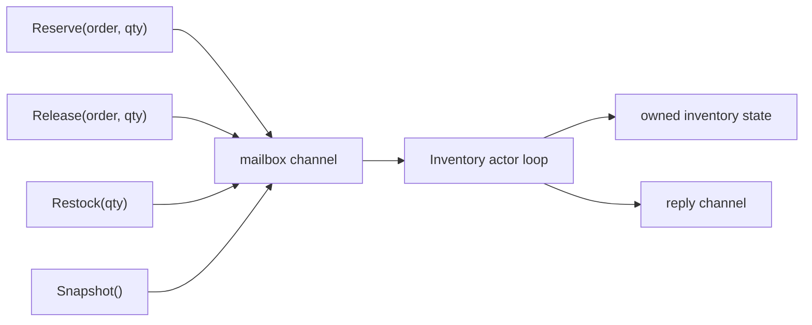

# Actor Pattern

Go does not ship with a first-class actor framework, but you can implement the actor model cleanly with goroutines and channels.

The actor idea is simple:

- one actor owns one piece of mutable state,
- other goroutines send messages instead of taking locks on that state,
- the actor processes messages sequentially.

## When this pattern fits

- you have hot mutable state with lots of concurrent callers,
- you want one clear owner for that state,
- the state transitions are richer than a tiny mutex-protected field,
- command messages read more naturally than shared-memory mutation.

## Example scenario

`examples/actor` models an inventory reservation actor for a flash-sale SKU.

That is a good actor use case because overselling is unacceptable, and reservation updates are naturally serialized commands.



## What the implementation is doing

The exported API in [`examples/actor/actor.go`](https://github.com/jaeyoung0509/golang-handbook/blob/main/examples/actor/actor.go) hides the event loop behind method calls:

```go
func (actor *InventoryActor) Reserve(ctx context.Context, orderID string, quantity int) (StockSnapshot, error) {
    return actor.request(ctx, reserveCommand{orderID: orderID, quantity: quantity})
}

func (actor *InventoryActor) loop(state *inventoryState) {
    for {
        select {
        case <-actor.stop:
            return
        case envelope := <-actor.commands:
            envelope.reply <- envelope.command.run(state)
        }
    }
}
```

## Simplified mailbox sketch

```go
type envelope struct {
    cmd   Command
    reply chan Result
}

func loop(state *State, mailbox <-chan envelope) {
    for env := range mailbox {
        env.reply <- env.cmd.Apply(state)
    }
}
```

This is the minimum useful actor shape: one mailbox, one owner loop, one state machine.

The safety comes from one rule: only the actor loop mutates `inventoryState`.

That means:

- no external mutex is needed for the owned state,
- concurrent callers can race to send commands, but not to mutate state,
- business invariants like "do not reserve more than available stock" live in one serialized location.

## What the tests prove

The tests in [`examples/actor/actor_test.go`](https://github.com/jaeyoung0509/golang-handbook/blob/main/examples/actor/actor_test.go) verify:

- concurrent reservations do not oversell stock,
- release and restock commands preserve a coherent snapshot,
- commands fail cleanly after the actor stops.

## Actor vs mutex

| Tool | Better when |
| --- | --- |
| Mutex | The critical section is small and local |
| Actor | State transitions are command-oriented and ownership should be explicit |

A mutex protects memory. An actor defines a protocol.

That protocol-oriented design is the real advantage when the state has domain rules, retries, audit events, or multi-step transitions.

## Actor vs worker pool

They solve different problems:

- a worker pool limits parallelism across many independent jobs,
- an actor serializes mutation for one owned state machine.

You can even combine them: a worker pool might talk to many actors, or one actor may dispatch background jobs into a worker pool.

## Caveats

### Failure pattern: exposing owned state back to callers

```go
func (actor *InventoryActor) UnsafeState() *inventoryState {
    return actor.state // breaks the ownership boundary
}
```

The whole actor guarantee collapses if outside code can mutate or even rely on internal pointers without going through the mailbox.

### Mailboxes need backpressure

If callers can enqueue faster than the actor can process, you need a bounded mailbox, rejection policy, or upstream throttling.

### One actor can become a bottleneck

That is often acceptable because serialization is the point. But if the state can be partitioned, use multiple actors by key.

### Supervision is manual

Go does not give you Erlang-style supervisors out of the box. Restart policy, mailbox durability, and lifecycle orchestration are your responsibility.

### Reply channels need lifecycle discipline

If the caller can abandon a request, the reply path must not wedge the actor loop. This is why bounded or one-shot reply channels are often safer than ad hoc shared response paths.

## Practical takeaway

Use an actor when you want state ownership to be obvious and invariants to be enforced in one serialized place.

For the theoretical roots of Go's more channel-centric style, read [CSP Theory in Go](/advanced/csp-theory).
