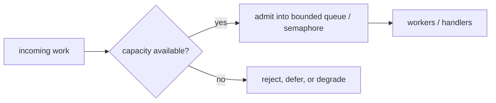

# Backpressure and Load Shedding

Many concurrency bugs are really overload bugs.

The program is "correct" in the small, but under sustained pressure it:

- accumulates too many goroutines,
- grows queues without bound,
- blows out latency,
- fails too late to be useful.

## Backpressure vs load shedding

They are related but not identical:

| Concept | Meaning |
| --- | --- |
| Backpressure | slow producers down or block admission when consumers cannot keep up |
| Load shedding | reject, defer, or degrade work when serving everything would harm the system |

Good systems often do both.

## Where Go developers usually go wrong

The common anti-pattern is an unbounded queue backed by "goroutines are cheap".

That usually means:

- each incoming request spawns more work,
- downstream latency rises,
- queues grow,
- cancellations arrive late,
- memory and tail latency become the real outage.

## Practical tools in Go

You do not need one magical primitive. You need a deliberate policy.

Common building blocks are:

- bounded buffered channels,
- `select` with `default` for try-send rejection,
- worker pools with finite queues,
- semaphores for admission control,
- request deadlines and context cancellation,
- degraded responses instead of full failure when possible.

## Simplified admission sketch

```go
func TryEnqueue(job Job) error {
    select {
    case queue <- job:
        return nil
    default:
        return ErrOverloaded
    }
}
```

That tiny pattern is often more honest than silently accepting work your system has no realistic chance of serving on time.



## Design questions you should answer explicitly

1. What is bounded: goroutines, queue length, memory weight, or downstream QPS?
2. What happens when capacity is exhausted: block, timeout, reject, or degrade?
3. How does cancellation propagate to queued work?
4. Which metrics will tell you the system is operating near the limit?

## Pattern fit in this repository

- [Worker Pool](/patterns/worker-pool): bounds active workers.
- [Weighted Semaphore](/advanced/weighted-semaphore): bounds resource weight.
- [Structured Concurrency](/advanced/structured-concurrency): keeps canceled work from lingering.
- [Singleflight](/advanced/singleflight): reduces duplicate backend pressure for the same key.

## Failure pattern

```go
go handle(job) // one goroutine per incoming unit, no bound, no queue policy
```

This is the classic overload trap. The code looks responsive at first because admission is instant. Under pressure it converts load into goroutine count, memory growth, and tail-latency collapse.

## Practical takeaway

Concurrency patterns without admission control are incomplete.

If your system cannot say "no" early, it will often fail later in a much more expensive way.
