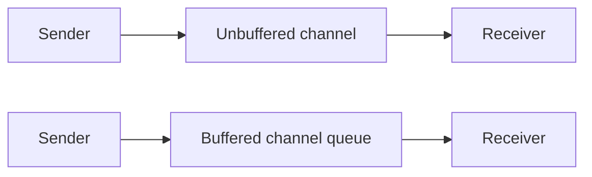

# CSP Theory in Go

Go's concurrency story is heavily influenced by CSP, short for Communicating Sequential Processes.

The original idea, associated with Tony Hoare, is that independently executing processes communicate through explicit channels instead of sharing memory freely.

## The slogan and the real meaning

Go popularized the phrase:

> Do not communicate by sharing memory; instead, share memory by communicating.

That does **not** mean shared memory is forbidden in Go. It means communication-first designs are often easier to reason about because synchronization is part of the protocol.

## Core CSP ideas that show up in Go

| CSP idea | Go equivalent |
| --- | --- |
| Independent process | Goroutine |
| Communication channel | `chan T` |
| Synchronous communication | Unbuffered channel send/receive |
| Choice between communications | `select` |
| Composition of processes | Pipelines, worker networks, fan-out/fan-in |

## Where Go is not pure CSP

Go is inspired by CSP, not limited to it.

Go also gives you:

- shared memory,
- mutexes,
- atomics,
- buffered channels,
- runtime scheduling behaviors that are practical rather than mathematically pure.

That is why Go feels like a pragmatic systems language instead of a research language.

## Rendezvous vs buffered communication

Pure CSP is often explained with synchronous rendezvous: sender and receiver meet at the same communication event.

In Go:

- unbuffered channels are the closest match,
- buffered channels relax the rendezvous by inserting a queue,
- both still give you useful synchronization semantics.

## Why this matters in practice

The patterns in this repository become easier to classify once you see the CSP influence:

- worker pool: a network of goroutines coordinated by channels,
- pipeline: staged process composition,
- fan-out / fan-in: one-to-many and many-to-one process communication,
- context cancellation: explicit control signals crossing process boundaries.

## CSP vs actor model

They are related, but they center different ideas.

| Model | Primary focus |
| --- | --- |
| CSP | Communication between concurrent processes |
| Actor | Ownership of state and message-driven entities |

In Go terms:

- CSP-like designs usually start from channels and process composition,
- actor-like designs usually start from state ownership and mailboxes.

Neither model is universally better. They optimize for different clarity.

## Why Go can support both

Because goroutines and channels are flexible enough to express:

- dataflow-style communication graphs,
- mailbox-driven state machines,
- structured cancellation patterns,
- shared-memory fallbacks when that is the simplest tool.

## One subtle but important point

CSP gives you a way to think about composition. It does not remove the need for engineering judgment around:

- backpressure,
- shutdown,
- error propagation,
- memory visibility,
- observability.

Those are the places where production systems either stay clean or become fragile.

## Practical takeaway

If you understand CSP, Go's channel-based idioms stop looking like random style choices. They become a coherent way to model process boundaries and synchronization.

Then you can choose more deliberately between a pipeline, a worker pool, or an [Actor Pattern](/advanced/actor-pattern).

If you want to compare that directly with Rust's future-and-executor style, continue to [Go CSP vs Rust Tokio](/extras/go-csp-vs-rust-tokio).
