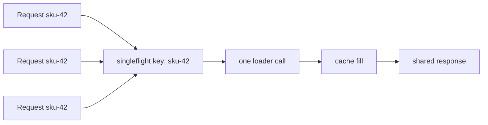

# Singleflight

Singleflight suppresses duplicate in-flight work for the same key.

If 100 requests ask for the same missing value at the same time, you usually do not want 100 identical database or API calls.

## What it is and what it is not

`golang.org/x/sync/singleflight` is:

- duplicate suppression for in-flight work,
- keyed by string,
- useful for cache miss coalescing and shared fetches.

It is **not**:

- a cache by itself,
- a rate limiter,
- a permanent memoization layer.

## Example scenario

`examples/singleflightcache` models a price service:

- check local cache first,
- if missing, use singleflight to coalesce concurrent fetches for the same SKU,
- write the successful result into cache.

## Why `DoChan` is sometimes better than `Do`

The example uses `DoChan` instead of plain `Do` so a follower request can still stop waiting if its own context is canceled.

That is an important practical detail:

- the leader's function decides the shared work,
- followers may still need independent timeout behavior while they wait.

## What the tests prove

The tests verify that:

- concurrent misses for one key trigger only one loader call,
- a follower can time out while the leader continues,
- failed loads are not silently cached as success.

## Important tradeoff: whose context drives the load?

Singleflight does not automatically merge multiple caller contexts into one perfect shared context.

You still need a policy.

Common choices are:

- leader context drives the load,
- a detached service context drives the load,
- followers can stop waiting, but the shared work continues.

Each choice is defensible in different systems. The important part is to make it explicit.

## Common mistakes

### Assuming singleflight replaces caching

It only suppresses duplicate *in-flight* work. Once the call finishes, future callers will invoke the function again unless you also store the result somewhere.

### Forgetting key cardinality

If your keys explode in cardinality and every request uses a unique key, singleflight buys almost nothing.

### Hiding stampedes but not overload

Singleflight helps a thundering herd on the same key. It does not protect you from a thundering herd across many distinct keys.

## Practical takeaway

Singleflight is one of the cleanest tools in Go for request coalescing.

Use it when the same expensive lookup is frequently requested concurrently, especially around cache misses or shared metadata fetches.
