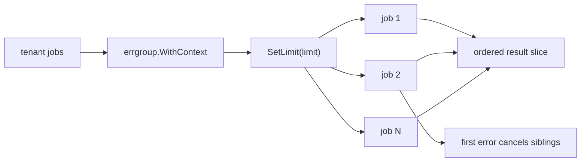

# Structured Concurrency

Structured concurrency means child goroutines should belong to a clear parent task and should not outlive it accidentally.

In Go, the most common practical tool for this is `golang.org/x/sync/errgroup`.

:::tip Quick takeaway
This pattern is about lifetime discipline. If work should succeed, fail, and cancel together, it should usually be represented as one structured subtree instead of a pile of unrelated goroutines.
:::

## Why this pattern matters

Without structure, goroutines are easy to start and easy to forget.

That leads to:

- leaked work after request cancellation,
- partial failures that keep burning CPU,
- ad hoc error aggregation,
- difficult lifecycle reasoning.

## The `errgroup` model

`errgroup` combines three useful ideas:

- start multiple goroutines,
- cancel siblings on the first error when using `WithContext`,
- wait for all of them with one `Wait`.

Recent versions also support `SetLimit`, which makes structured concurrency practical even for larger finite task sets.

## Simplified implementation sketch

```go
group, ctx := errgroup.WithContext(parent)
group.SetLimit(limit)

for _, tenant := range tenants {
    tenant := tenant
    group.Go(func() error {
        return backfillTenant(ctx, tenant)
    })
}

if err := group.Wait(); err != nil {
    return err
}
```

That is the core shape: one parent context, one bounded task set, one wait point.

## Example scenario

`examples/errgroupbatch` runs tenant backfills for a fixed batch:

- each tenant job is independent,
- one failure should stop the batch,
- concurrent work should be limited.



## Why use this instead of a worker pool

Use a worker pool when you want a reusable job-dispatching shape with explicit channels.

Use structured concurrency when:

- the task set is already known,
- you want lifetimes tied tightly to one parent,
- you want cancellation and wait semantics without manual queue plumbing.

## What the example proves

The tests show that the example:

- preserves deterministic result ordering,
- respects the configured concurrency limit,
- cancels sibling work when one job fails.

## Important details

### `SetLimit` is a lifetime control, not a queue abstraction

`SetLimit` blocks additional `Go` calls until active goroutines fall below the limit.
That is different from building a separate jobs channel and worker fleet.

### The limit must not change while work is active

The package source is explicit about this. Treat the limit as part of group construction, not a live knob.

### Captured loop variables still matter

Even with nice helpers like `errgroup`, you still need the standard Go pattern of rebinding loop variables inside the loop before launching goroutines.

## Failure patterns

### Mixing structured and unstructured lifetimes

```go
group.Go(func() error {
    return runPrimary(ctx)
})

go fireAndForgetAudit(ctx) // outside the group
```

Now cancellation stops only part of the real workflow. That defeats the main benefit of the pattern.

### Forgetting loop-variable rebinding

```go
for _, tenant := range tenants {
    group.Go(func() error {
        return backfillTenant(ctx, tenant) // risky if tenant is not rebound
    })
}
```

`errgroup` improves lifetime control. It does not remove the standard Go closure rules.

## Practical takeaway

Structured concurrency is not a different scheduler. It is a design discipline for goroutine lifetime.

When a whole subtree of concurrent work should succeed or fail together, `errgroup` is usually the clearest expression of that contract.
