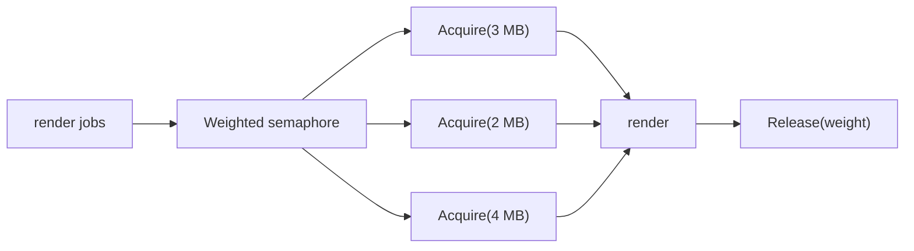

# Weighted Semaphore

Some workloads are not limited by "how many goroutines are running". They are limited by memory, file descriptors, external quota units, or some other weighted cost.

That is where a weighted semaphore becomes useful.

## Why not a plain worker pool

A worker pool treats all jobs as roughly equal.

That breaks down when:

- one render uses 50 MB and another uses 500 MB,
- one job opens 1 file and another opens 20,
- one task hits one API call and another fans out to many.

In those cases you want to limit *resource weight*, not just worker count.

## Example scenario

`examples/weightedsemaphore` renders assets where each job requests a memory budget in megabytes.



The example combines:

- `errgroup.WithContext` for structured cancellation,
- `x/sync/semaphore` for weighted admission control.

## Simplified implementation sketch

```go
sem := semaphore.NewWeighted(int64(capacityMB))

for _, job := range jobs {
    job := job
    group.Go(func() error {
        if err := sem.Acquire(ctx, int64(job.WeightMB)); err != nil {
            return err
        }
        defer sem.Release(int64(job.WeightMB))

        return render(job)
    })
}
```

The semaphore answers one narrow question: may this job consume that much budget right now?

## What the tests prove

The tests verify that:

- peak in-flight weight never exceeds capacity,
- one render failure cancels sibling renders,
- impossible jobs are rejected early instead of hanging forever.

## Important source-level detail

The `x/sync/semaphore` implementation keeps a waiter queue and deliberately avoids letting smaller requests jump ahead of a large blocked request.

That is a fairness tradeoff:

- it avoids starving large requests,
- but it can leave some capacity idle temporarily.

That is usually the right tradeoff for resource budgeting.

## When this pattern fits

Use a weighted semaphore when:

- cost per job varies materially,
- the dominant bottleneck is not CPU thread count,
- you want a small and explicit admission-control layer.

## Common mistakes

### Forgetting validation for impossible requests

If a request needs more capacity than the system can ever provide, fail early. Do not let it sit around waiting for an impossible condition.

### Treating a semaphore like a whole workflow

A semaphore answers "may this job proceed?" It does not answer "how should I aggregate errors?" Pair it with structured concurrency or explicit cancellation.

### Failure pattern: acquiring without guaranteed release

```go
if err := sem.Acquire(ctx, weight); err != nil {
    return err
}

if err := render(job); err != nil {
    return err // leaked budget if Release is forgotten
}
```

If every successful acquire does not have a matching release on every path, your limit slowly turns into a dead system.

## Practical takeaway

Worker count is a coarse limit. Weighted semaphores let you express the real bottleneck.

That makes them one of the most useful advanced patterns for memory-heavy or quota-heavy Go services.
