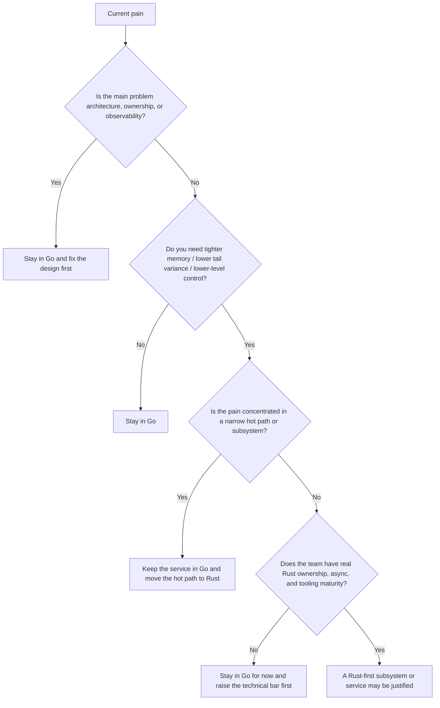

# Go vs Rust Decision Guide

This page is not about declaring a winner.

It exists because teams often ask the wrong question:

- bad question: “Is Rust better than Go?”
- useful question: “What kind of problem am I actually solving, and where does each language pay for itself?”

:::tip Quick takeaway
Default to Go for service orchestration, APIs, control planes, internal tooling, and most network services. Move a narrow subsystem to Rust when you need tighter memory footprints, lower tail-latency variance, stronger compile-time ownership guarantees, or lower-level control than Go gives you comfortably.
:::

## Decision tree

## The default stance

Go should remain the default unless the problem proves otherwise.

That is not conservatism. It is cost accounting.

Go gives you a very favorable default stack for:

- direct-style concurrent services,
- simple deployment and cross-compilation,
- runtime-integrated goroutines and netpoll,
- fast team onboarding,
- operational simplicity.

Rust gives you a different bargain:

- stronger compile-time ownership guarantees,
- lower-level control over allocation and layout,
- no GC-driven latency trade,
- better fit for some systems and data-plane workloads.

## Keep Go by default when

Go is usually the better default for:

- HTTP and gRPC APIs,
- control planes,
- Kubernetes operators and platform services,
- queue consumers and background workers,
- internal tooling and CLIs,
- service glue where most complexity is I/O and coordination rather than raw compute.

If the system is dominated by network waits, business rules, orchestration, and integration work, Go usually wins on total engineering throughput.

## Move a subsystem to Rust when

Rust starts paying for itself when one or more of these are true:

- memory footprint per connection or per object really matters,
- GC-related tail variance is materially hurting the product,
- the hot path needs zero-copy or very tight buffer control,
- the code is a parser, proxy, codec, storage engine, execution engine, or other data-plane component,
- you need stronger compile-time ownership and aliasing guarantees than code review can reliably enforce in Go,
- you are building a library or component that must interoperate tightly with C, C++, kernel, or embedded constraints.

The important point is that this is often a subsystem call, not a whole-company call.

## Good reasons that are not actually reasons

Do not move to Rust just because:

- someone on social media says it is faster,
- a Go service has bad p99s but you have not fixed queueing or backpressure,
- memory is high but the profile shows obvious waste you have not removed,
- goroutines leak because shutdown ownership is poor,
- deadlines, pooling, and retries are currently undisciplined,
- the team has no operational story for Rust builds, debugging, profiling, or incident response.

Those are often architecture and discipline problems, not language-limit problems.

## Comparative mental model

| Axis | Go advantage | Rust advantage |
| --- | --- | --- |
| Team throughput | simpler service code, easier onboarding, fast iteration | more invariants enforced at compile time once the team is fluent |
| Concurrency ergonomics | goroutines, channels, netpoll, direct style | explicit ownership and async boundaries |
| Latency profile | very good for most services, with GC trade-offs | better fit when GC variance is unacceptable |
| Memory control | good enough for many backends | stronger control over layout, borrowing, and allocation |
| Systems integration | easy deployment and static binaries | stronger fit for low-level libraries, kernels, parsers, and FFI-heavy components |
| Operational cost | usually lower for common service work | can pay off for narrow high-performance components |

## What the official models emphasize

Rust's official book explicitly frames “fearless concurrency” as making incorrect concurrent code fail to compile earlier. Tokio's runtime docs describe a runtime with an I/O driver, scheduler, and timer, and its fairness guarantee assumes tasks do not block the runtime thread indefinitely.

Go's official guidance emphasizes direct concurrency composition and the CSP-style idea of sharing memory by communicating. That makes Go particularly attractive for service code where communication structure matters more than memory layout tricks.

## Use-case matrix

### Stay in Go

- API gateways and internal APIs
- control planes and operators
- job workers and pipeline services
- most microservices
- teams optimizing for feature velocity and operability

### Consider Rust for a subsystem

- protocol parsers and codecs
- high-throughput proxies
- storage and indexing engines
- memory-sensitive agents
- embedded or edge components
- hot loops where allocation shape dominates cost

### Consider Rust more broadly

- the product is fundamentally a data-plane or systems product,
- the team already has Rust and async experience,
- the debugging, CI, packaging, and incident tooling are already in place,
- the gain is not theoretical but measured.

## Split architecture is often the best answer

A lot of teams should not ask “Go or Rust?” at the service boundary.

They should ask:

- can the control plane stay in Go,
- can the hot parser / engine / proxy / native module move to Rust,
- can the boundary between them stay observable and operationally boring?

That gives you:

- Go where coordination dominates,
- Rust where tight control dominates.

## Migration checklist

Before moving a subsystem to Rust, verify all of these:

1. The bottleneck is measured and real.
2. The bottleneck survives obvious Go-side fixes.
3. The target scope is narrow and explicit.
4. The team can build, profile, test, and debug Rust in production.
5. The runtime model and shutdown model are understood, not copied from tutorials.
6. The interface between Go and Rust is simpler than the problem you are trying to solve.

## Where this connects to the rest of the site

- Read [Go CSP vs Rust Tokio](/extras/go-csp-vs-rust-tokio) for a runtime-model comparison.
- Read [Go Runtime and Scheduler](/fundamentals/go-runtime-scheduler) and [Garbage Collector and Green Tea GC](/fundamentals/garbage-collector) before blaming Go for every latency problem.
- Read [Backpressure and Load Shedding](/advanced/backpressure-load-shedding) and [Large-Scale Go Systems](/production/large-scale-go-systems) before concluding the language is the bottleneck.

## Official reading

- [Fearless Concurrency in the Rust Book](https://doc.rust-lang.org/book/ch16-00-concurrency.html)
- [Tokio spawning tutorial](https://tokio.rs/tokio/tutorial/spawning)
- [Tokio runtime docs](https://docs.rs/tokio/latest/tokio/runtime/)
- [Effective Go: concurrency](https://go.dev/doc/effective_go#concurrency)
- [Go concurrency patterns: pipelines](https://go.dev/blog/pipelines)

## Practical takeaway

Rust is not a status upgrade over Go.

It is a different cost structure.

Keep Go as the default for service orchestration. Move a narrow subsystem to Rust when measured constraints demand tighter control than Go gives you comfortably.
