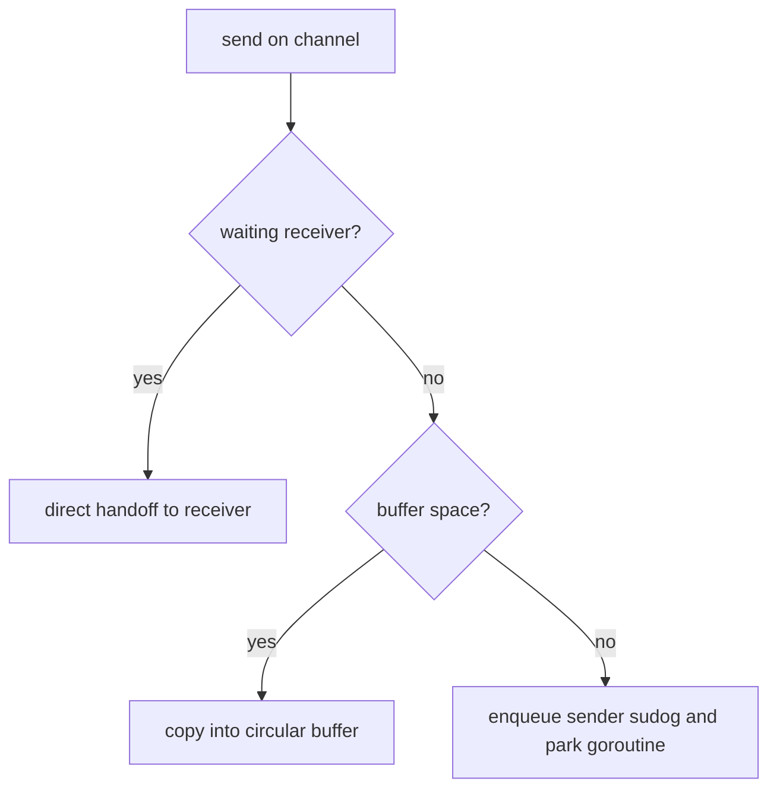
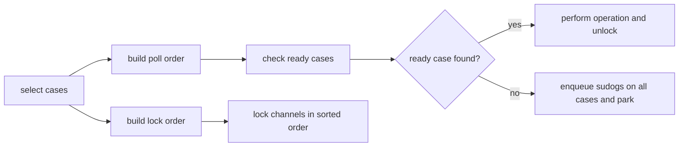

# Channel Internals

Channels look simple at the surface, but the runtime work behind them is careful and nontrivial.

This page is about *why* channel-based code behaves the way it does, not just how to use `chan T`.

:::info Version note
This page is aligned with the Go 1.26 runtime sources `runtime/chan.go` and `runtime/select.go`.
:::

## The core runtime object: `hchan`

At runtime, a channel is represented by an `hchan` structure.

Important fields include:

| Field | Role |
| --- | --- |
| `qcount` | number of elements currently buffered |
| `dataqsiz` | circular buffer capacity |
| `buf` | pointer to the buffer storage |
| `sendx` / `recvx` | circular buffer indices |
| `recvq` / `sendq` | wait queues of blocked receivers and senders |
| `closed` | irreversible closed-state flag |
| `lock` | internal mutex protecting channel state |

The lock matters. Channel operations are not magic lock-free fairy dust. Fast paths avoid locking when possible, but the full protocol is guarded carefully.

## Send has three meaningful paths

When you execute `c <- v`, the runtime tries these cases in order:

1. a waiting receiver already exists,
2. buffer space is available,
3. otherwise, the sender must block.

### Direct handoff

If a receiver is already waiting, the runtime can bypass the buffer and copy the value directly to the receiver's destination.

That is especially important for unbuffered channels, where communication is rendezvous-style rather than queue-style.

### Buffered enqueue

If the buffer has room, the runtime copies the element into `buf[sendx]`, advances the circular index, and increments `qcount`.

### Blocking path

If the channel is full and blocking is allowed, the goroutine is represented as a `sudog`, linked into the wait queue, and parked.

That parked goroutine will later be readied by another goroutine completing the matching operation.

## Receive is symmetric, but not identical

Receiving also has multiple cases:

1. data already buffered,
2. waiting sender exists,
3. channel is closed and empty,
4. otherwise block.

For a buffered full channel with a waiting sender, receive can consume from the head of the circular queue and place the sender's value into the tail in one locked operation.

That detail is part of why buffered channel behavior stays coherent even under heavy contention.

## `sudog` is the parked-goroutine record

When a goroutine blocks on a channel, the runtime does not just "sleep the goroutine somehow".

It allocates or reuses a `sudog` record that links:

- the goroutine,
- the channel,
- the element pointer involved in the handoff,
- select-related metadata when the block comes from a `select`.

That is why channel internals are tightly coupled to stack safety and parking logic.

## Unbuffered channels can copy across goroutine stacks

One of the most interesting implementation details in `runtime/chan.go` is that unbuffered send/receive can involve one running goroutine writing data to another goroutine's stack slot.

The runtime has special direct-send and direct-receive paths for this, with barrier handling to keep the garbage collector's assumptions correct.

This is one reason channel internals are much more subtle than "just enqueue a value."

## Close is a broadcast-like lifecycle event

Closing a channel is not just setting a Boolean.

Under the channel lock, `closechan`:

1. marks the channel closed,
2. releases waiting receivers,
3. releases waiting senders,
4. drops the lock,
5. readies all affected goroutines.

Why the order matters:

- receivers on a closed-and-empty channel get the zero value plus `ok=false`,
- blocked senders wake and panic with `send on closed channel`,
- goroutines are readied only after dropping the channel lock to avoid deadlock risk.

## Why only one side should close

This implementation detail explains the user-facing rule:

- the owner of the sending side should usually close the channel,
- receivers should almost never close it,
- multiple possible closers are a protocol smell unless carefully synchronized.

The runtime cannot infer your lifecycle contract for you.

## How `select` works internally

`select` is also more sophisticated than it looks.

At a high level, `runtime/select.go` does three important things:

1. randomizes polling order among cases,
2. sorts channels into a lock order by channel address,
3. if nothing is ready, enqueues the goroutine on all relevant wait queues and parks it.

Why each step matters:

- randomized polling reduces deterministic bias,
- sorted lock ordering avoids deadlocks when multiple channel locks are involved,
- multi-queue parking allows one wakeup to win while the losing cases are cleaned up afterward.

## What buffered channels are good at and bad at

Buffered channels are excellent for:

- smoothing short producer/consumer mismatches,
- decoupling stage latency a little,
- representing bounded mailboxes or token pools.

They are not a substitute for:

- true backpressure policy,
- queue monitoring,
- admission control,
- careful shutdown protocols.

A bigger buffer can hide overload for a while. It cannot remove overload.

## Practical implications for application code

These internals explain several surface-level best practices:

- keep channel ownership obvious,
- keep close responsibility explicit,
- treat `select` fairness as approximate,
- use context cancellation so blocked goroutines have a clear escape path,
- prefer bounded queues when overload matters.

## Practical takeaway

Channels are efficient, but they are not simplistic. They combine queueing, synchronization, parking, wakeup, and lifecycle signaling in one abstraction.

That power is exactly why channel-based designs can be elegant or dangerous depending on whether the protocol is clear.

Next, read [Mutex and Runtime Semaphore Internals](/fundamentals/mutex-semaphore-internals) to compare Go's communication-first story with its shared-memory blocking primitives.
