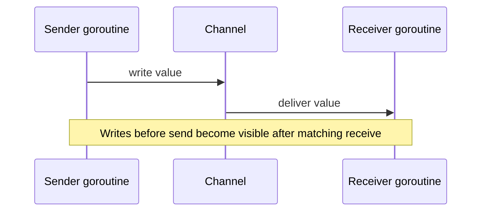

# Channels, Select, and the Memory Model

Concurrency is not just about making things run at the same time. It is about making the result correct when things run at the same time.

Go's memory model explains when one goroutine is guaranteed to observe writes from another goroutine. The language gives you synchronization events that create those guarantees.

## The rule that matters most

If two goroutines access the same memory concurrently and at least one access is a write, you need synchronization.

In Go, the common synchronization boundaries are:

- channel send/receive,
- channel close observation,
- mutex unlock/lock,
- `sync.Once`,
- atomic operations,
- goroutine creation plus later synchronized communication.

## Channels are coordination and synchronization

An unbuffered channel send does two jobs:

- it transfers a value,
- it synchronizes sender and receiver.

Buffered channels still synchronize, but the handoff point is the buffer slot, not an immediate rendezvous.

## What `select` actually gives you

`select` is Go's way to wait on multiple communication possibilities.

It is useful for:

- cancellation with `ctx.Done()`,
- timeouts,
- multiplexing inputs,
- trying a non-blocking send or receive with `default`.

What it does **not** guarantee:

- strict fairness,
- deterministic case ordering,
- correctness by itself.

`select` chooses among ready cases. Your protocol still has to be valid.

## Channel close as a signal

Closing a channel is a broadcast-style event for receivers:

- future receives can detect closure,
- it is usually a lifecycle signal, not a data value,
- only the sender side that owns the channel lifecycle should close it.

This ownership rule is why the examples in this repository keep channel creation and channel closing close to the producer or coordinator.

## Mutexes and channels are not enemies

Go is inspired by CSP, but Go is not "channels only."

Sometimes a mutex is the clearest tool:

- protecting a small in-memory cache,
- guarding a short critical section,
- updating data where no communication protocol is needed.

Sometimes a channel is clearer:

- distributing work,
- streaming stage outputs,
- managing actor mailboxes,
- signalling cancellation or shutdown.

## The actor pattern depends on this too

An actor works because one goroutine owns the mutable state and other goroutines communicate with it through a mailbox channel.

The safety does not come from mythology. It comes from:

- serialized access inside the actor loop,
- synchronization through channel operations,
- a clear ownership model for state mutation.

## Practical checklist

When reading concurrency code, ask:

1. Where is the happens-before edge?
2. What exactly synchronizes shared state visibility?
3. Who owns channel closing?
4. If the collector returns early, can another goroutine still block forever?

## Common misunderstanding

### "I used channels, so there cannot be a race"

False.

If the same state is also read or written outside the synchronized channel protocol, you can still have a data race. Channels help only when the state transition protocol is actually built around them.

## Practical takeaway

Correct Go concurrency depends on explicit synchronization, not just goroutine count.

If you want the runtime-level mechanics, continue with [Channel Internals](/fundamentals/channel-internals) and [Mutex and Runtime Semaphore Internals](/fundamentals/mutex-semaphore-internals).

The next layer up is theory: [CSP Theory in Go](/advanced/csp-theory) explains the ideas Go borrowed, while [Actor Pattern](/advanced/actor-pattern) shows a different but related model for state ownership.
