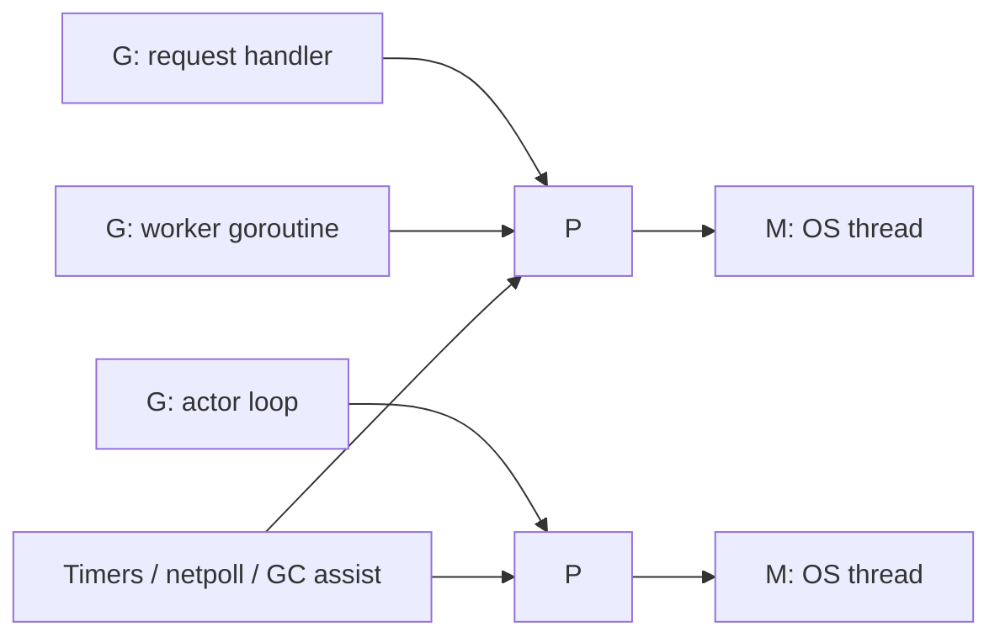

# Go Runtime and Scheduler

If you want to know why Go concurrency patterns are practical, start with the runtime.

:::tip Quick takeaway
If you only remember one thing from this page, remember this: the runtime makes goroutines cheap and schedulable, but it does not know your service limits, queue policy, or failure semantics. That part is still your job.
:::

Go can afford patterns such as worker pools, pipelines, actors, and request-scoped fan-out because:

- goroutines are cheaper than OS threads,
- the scheduler multiplexes them across available processors,
- the runtime cooperates with timers, network I/O, garbage collection, and stack growth.

:::info Version note
This page is aligned with the Go 1.26 runtime sources, especially `runtime/proc.go`.
:::

## The real mental model: G, M, and P

The scheduler is usually described as `G-M-P`:

- `G`: goroutine, the logical unit of concurrent work,
- `M`: machine, an OS thread,
- `P`: processor, the runtime token required to execute Go code.

The crucial point is that Go code runs on an `M` only while that `M` owns a `P`.
An `M` can exist without a `P`, for example while blocked in a syscall, but it cannot execute ordinary Go code until it has one again.

## Run queues and locality

The scheduler does not keep all runnable goroutines in one giant global queue.

That would scale badly.

Instead, Go keeps:

- a per-`P` local run queue for most runnable goroutines,
- a global run queue for overflow and balancing,
- additional sources of work such as timers, netpoll readiness, and GC work.

Why this matters:

- local queues preserve cache locality,
- most scheduling decisions stay cheap,
- global coordination happens only when necessary.

## Work stealing and spinning threads

When a `P` runs out of local work, the runtime does not immediately give up.

It may:

1. check the global run queue,
2. look for timer or netpoll work,
3. steal runnable goroutines from another `P`.

This is why bursty concurrent workloads often self-balance reasonably well.

The comments in `runtime/proc.go` also explain an important optimization: the runtime tries to avoid excessive thread park/unpark churn by tracking "spinning" worker threads. That is part of why Go can respond to new work quickly without thrashing OS threads.

## Why blocking I/O does not destroy concurrency

If every blocked goroutine pinned a thread forever, Go servers would collapse under network waits.

The runtime avoids that by integrating:

- the netpoller for file descriptor readiness,
- timer infrastructure for deadlines and sleeps,
- scheduler transitions when threads block in syscalls.

So when a goroutine waits for socket readiness, the runtime can often park that goroutine and run other work instead of wasting a valuable execution slot.

## Syscalls, cgo, and lost processors

One subtle point that matters in production systems:

- when a goroutine enters a blocking syscall, its `M` may stop running Go code,
- the runtime can detach the `P` and let another `M` continue scheduling Go goroutines,
- cgo calls complicate this further because the runtime has less control than it does over pure Go blocking points.

That is why "it is just I/O bound" is not a complete performance argument. Syscall-heavy or cgo-heavy code still changes scheduler behavior.

## Sysmon, preemption, and fairness

Go has a background monitor thread, usually called `sysmon`, that helps with:

- preemption,
- timer wakeups,
- retaking processors from long syscalls,
- general runtime housekeeping.

Modern Go also supports asynchronous preemption. That means a CPU-heavy goroutine is less likely to monopolize the process simply because it does not hit a channel receive or mutex wait quickly.

That helps fairness, but it does **not** remove the need for design discipline:

- CPU-heavy work still needs explicit bounds,
- scheduler fairness is good, not perfect,
- preemption does not fix unbounded goroutine creation or poor backpressure.

## Goroutine stacks and why small stacks matter

Goroutines start with small stacks that grow as needed.

That is one of the main reasons Go can spawn large numbers of goroutines in ordinary server code. The cost profile is radically better than a thread-per-task model.

But there is a tradeoff:

- stacks can grow and shrink,
- stack copying requires runtime coordination,
- channel and select internals are careful about parking and stack safety because blocked goroutines may still have pointers into their stacks.

This is one reason runtime code around channels is so careful about lock ordering and parking points.

## `GOMAXPROCS` is not a concurrency limit

`GOMAXPROCS` controls how many `P` instances may run Go code simultaneously.

That means:

- it affects CPU parallelism,
- it does not cap goroutine count,
- it does not replace application-level concurrency control,
- it does not solve downstream saturation by itself.

If your service should only hit an external API with 8 concurrent calls, `GOMAXPROCS` is the wrong tool. Use a worker pool, semaphore, or structured concurrency limit.

## How this connects to the patterns in this repository

| Pattern | Runtime property it depends on |
| --- | --- |
| Worker pool | Cheap goroutines plus explicit bounded parallelism |
| Pipeline | Blocking and rescheduling across staged communication |
| Fan-out / fan-in | Fast spawning of many independent concurrent operations |
| Structured concurrency | Shared cancellation and bounded goroutine lifetime |
| Actor pattern | One goroutine cleanly owning a mutable state machine |

## Common misunderstandings

### "Goroutines are basically free"

They are cheap enough to use heavily. They are not free.

Every goroutine still carries:

- stack memory,
- scheduling overhead,
- references that may keep heap objects alive,
- shutdown complexity if lifecycle boundaries are unclear.

### "The scheduler will figure out the right parallelism for me"

The scheduler decides *when* runnable goroutines execute.
It does not know your external service limits, memory budget, latency SLOs, or backpressure policy.

## Practical takeaway

The runtime makes Go concurrency patterns viable, but the runtime does not choose your ownership model or failure policy for you.

That is still application design.

Next, read [Channels, `select`, and the Memory Model](/fundamentals/channels-memory-model), then go one level deeper into [Channel Internals](/fundamentals/channel-internals).
