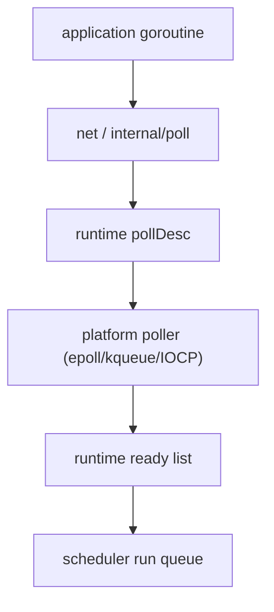

# Netpoller, Timers, and Syscalls

One of the deepest reasons Go can make `goroutine-per-connection` practical is that network I/O is not handled as "park one OS thread forever per blocked socket."

The runtime has an integrated network poller.

:::tip Quick takeaway
The netpoller is the bridge between I/O readiness and goroutine scheduling. It is one of the main reasons Go can let application code *look* blocking while the runtime keeps the process moving.
:::

## Mental model

Think of the stack like this:



Your code calls `Read`, `Write`, `Accept`, or waits on a deadline. Underneath, the runtime arranges for readiness notifications and goroutine wakeups.

## The central runtime object: `pollDesc`

`runtime/netpoll.go` uses `pollDesc` to track read and write waiters, deadlines, and descriptor state.

Important ideas:

- there are separate wait states for read and write,
- goroutines park against those states,
- deadlines are represented with timers attached to the poll descriptor,
- stale readiness events must be filtered because file descriptors can be reused.

That is why `pollDesc` carries sequence numbers and timer state, not just "fd is readable."

## Simplified internal sketch

This is the rough control flow you should imagine:

```go
func runtimePollWait(pd *pollDesc, mode int) error {
	for {
		if ready(mode, pd) {
			return nil
		}
		if deadlineExpired(pd, mode) {
			return ErrTimeout
		}
		parkCurrentGOn(pd, mode)
	}
}

func netpollLoop() {
	readyList := platformNetpoll()
	for g := range readyList {
		injectIntoRunQueue(g)
	}
}
```

The exact runtime code is more subtle because it must avoid lost wakeups, stale fd reuse, deadline races, and platform differences.

## Why deadlines live here too

Deadlines are not an unrelated feature.

If a goroutine is blocked waiting on read readiness, the runtime needs one of two things to wake it:

- a readiness event from the OS,
- a timer event that says the deadline expired.

That is why timers and netpoll are closely related in the scheduler's world.

## What happens in a blocking syscall

Not every blocked operation uses the netpoller.

If a goroutine enters a true blocking syscall:

- its current `M` may stop running Go code,
- the runtime may detach the `P`,
- another `M` can pick up that `P` and keep scheduling goroutines.

This distinction matters:

- network I/O often goes through the poller path,
- arbitrary syscalls and cgo calls can behave differently and cost more scheduler flexibility.

## Why goroutine-per-connection works

This design gives Go a powerful illusion:

- application code can be written in direct style,
- waits on I/O do not necessarily waste a whole thread,
- readiness events become runnable goroutines again.

That does **not** mean every I/O-heavy system scales automatically. You still need:

- backpressure,
- connection limits,
- bounded downstream fan-out,
- timeout and cancellation discipline.

## Common operational consequences

### Deadlines are not optional decoration

Without deadlines, a goroutine can remain parked on I/O indefinitely.

When this happens at scale, goroutine count, memory retention, and shutdown complexity all get worse.

### cgo and foreign blocking points are different

The runtime cannot manage external blocking points as elegantly as it manages Go's own pollable file descriptors.

If a service spends serious time in cgo or opaque syscalls, scheduler behavior changes.

### Traces expose this clearly

`go tool trace` can show goroutines blocking on network, syscalls, timers, and scheduling transitions. If you only look at wall-clock latency without a trace, you miss a lot of root-cause detail.

## Runtime source walk

Start here:

- [runtime/netpoll.go](https://github.com/golang/go/blob/go1.26.0/src/runtime/netpoll.go)
- [runtime/netpoll_epoll.go](https://github.com/golang/go/blob/go1.26.0/src/runtime/netpoll_epoll.go)
- [runtime/netpoll_kqueue.go](https://github.com/golang/go/blob/go1.26.0/src/runtime/netpoll_kqueue.go)
- [runtime/time.go](https://github.com/golang/go/blob/go1.26.0/src/runtime/time.go)
- [internal/poll/fd_unix.go](https://github.com/golang/go/blob/go1.26.0/src/internal/poll/fd_unix.go)

Read the top comments in `runtime/netpoll.go` first. They explain the contract between the platform-specific pollers and the scheduler.

## How to observe it in practice

- `go test -trace=trace.out ./...`
- `go tool trace trace.out`
- `GODEBUG=schedtrace=1000,scheddetail=1`
- service-level connection and timeout metrics

Use traces when you want to answer questions such as:

- Are goroutines blocked on netpoll or on locks?
- Are timeouts waking goroutines or are requests just stalling?
- Is the process limited by downstream I/O or by CPU?

## Failure pattern

The netpoller makes blocked I/O scalable, but it does not rescue a server with no deadline or overload policy:

```go
for {
	conn, _ := ln.Accept()
	go func(c net.Conn) {
		defer c.Close()
		buf := make([]byte, 4096)
		_, _ = c.Read(buf) // bad: a dead peer can park this forever
		handleSlowRequest(buf)
	}(conn)
}
```

Without deadlines and admission limits, slow or stalled clients still consume file descriptors, heap, and scheduler attention.

## Networking track continuation

If you want the socket-level lifecycle that sits on top of netpoll, continue with [TCP, DNS, and Connection Lifecycles in Go](/fundamentals/tcp-dns-connection-lifecycles).

If you want the OS-facing side of readiness and fast-copy behavior, continue with [Kernel I/O Paths: netpoll, epoll/kqueue, and Zero-Copy](/internals/kernel-io-paths).

## Practical takeaway

The netpoller is a core part of Go's concurrency model, not an implementation footnote.

It is the mechanism that turns OS-level readiness into runnable goroutines and lets direct-style code coexist with scalable I/O.

Continue with [Map Internals and Swiss Tables](/fundamentals/map-internals) or [Garbage Collector and Green Tea GC](/fundamentals/garbage-collector) to see how the rest of the runtime supports the same goal: practical concurrency at production scale.
