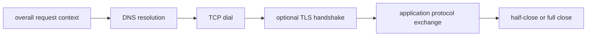
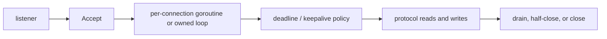

# TCP, DNS, and Connection Lifecycles in Go

Most production network bugs in Go are not caused by forgetting syntax.

They come from having the wrong lifecycle model:

- not knowing when DNS happens,
- assuming `DialContext` protects later reads and writes,
- treating `net.Conn` like a message API instead of a byte stream,
- forgetting that listeners, deadlines, and shutdown all have different owners.

:::tip Quick takeaway
Think in phases, not in one blob: resolve -> dial -> handshake -> exchange -> drain or half-close -> full close. Each phase has its own timeout, ownership, and failure mode.
:::

## Mental model



For inbound traffic, the shape is similar but starts at the listener:



The details matter because each phase is implemented by a different layer:

- DNS by `net.Resolver`,
- socket establishment by `net.Dialer`,
- connection I/O by `net.Conn`,
- deadline enforcement by `SetDeadline`,
- scheduler wakeups by netpoll,
- connection teardown by explicit close or kernel state transitions.

## Production sketch

This is the shape you want in real code:

```go
func exchange(ctx context.Context, endpoint string, request []byte) ([]byte, error) {
	dialer := net.Dialer{
		Timeout:   150 * time.Millisecond,
		KeepAlive: 30 * time.Second,
	}

	conn, err := dialer.DialContext(ctx, "tcp", endpoint)
	if err != nil {
		return nil, err
	}
	defer conn.Close()

	if err := conn.SetDeadline(time.Now().Add(200 * time.Millisecond)); err != nil {
		return nil, err
	}

	if _, err := conn.Write(request); err != nil {
		return nil, err
	}

	reply := make([]byte, 4096)
	n, err := conn.Read(reply)
	if err != nil {
		return nil, err
	}
	return reply[:n], nil
}
```

The deliberate separation is the point:

- `DialContext` budgets resolution plus connect,
- `KeepAlive` controls idle TCP behavior at the socket layer,
- `SetDeadline` covers later reads and writes after the socket already exists.

## Listener ownership is the first boundary

`Accept` loops are often written casually and then inherited by critical services for years.

The real boundary is not `Accept` itself. The real boundary is:

- who stops the loop,
- who closes the listener,
- who owns per-connection goroutines,
- who puts deadlines on sockets,
- who drains or abandons partially processed clients.

Simplified shape:

```go
for {
	conn, err := ln.Accept()
	if err != nil {
		if shuttingDown(err) {
			return nil
		}
		continue
	}

	go func(c net.Conn) {
		defer c.Close()
		_ = c.SetDeadline(time.Now().Add(30 * time.Second))
		handleConn(c)
	}(conn)
}
```

That works only if the surrounding system also defines shutdown, admission, and deadline policy. Otherwise you just created a goroutine leak boundary.

## `net.Conn` is a byte stream, not a message queue

This is the easiest place to get a wrong mental model.

`Read` and `Write` are allowed to complete partially. That means:

- one `Read` may return half a logical frame,
- one `Write` may accept only part of your buffer,
- the other side may close only the write direction,
- EOF is not the same thing as an application-level “done” message.

If you need message semantics, define them explicitly with framing. The [`examples/tcpprotocol`](https://github.com/jaeyoung0509/golang-handbook/tree/develop/examples/tcpprotocol) package added in this track shows a length-prefixed protocol that keeps read and write ownership explicit.

## Half-close is real and often useful

For TCP, Go exposes half-close through `*net.TCPConn`:

- `CloseRead`
- `CloseWrite`

That matters when your protocol has a “no more request bytes are coming, but I still expect a response” phase.

A common example is a client that streams a request body, closes the write side, and then waits for the server's final decision. Full `Close` would discard that shape.

## DNS is part of request latency

Many teams still treat resolution as invisible setup.

In Go it is explicitly part of dialing:

- `DialContext` may resolve hostnames before any connect attempt,
- `Resolver` may use the pure Go resolver or cgo/native resolution depending on environment and settings,
- under cgo resolution pressure, blocked lookups can consume OS threads.

The most useful rules are:

- treat DNS time as part of the request budget,
- do not assume a connect timeout means “the network after DNS,”
- use `GODEBUG=netdns=go+2` when you need to confirm resolver choice and lookup behavior,
- prefer stable address values like `netip.AddrPort` once resolution is complete.

## Dial budget is not I/O budget

This distinction is important enough to repeat.

`DialContext` ends when the connection exists or fails. It does not automatically govern future reads and writes on the already-open socket.

That is why the existing [`examples/dialbudget`](https://github.com/jaeyoung0509/golang-handbook/tree/develop/examples/dialbudget) example separates:

1. per-attempt connect budget,
2. post-connect exchange deadline.

If you collapse those phases into one giant timeout, your traces and failure handling become much harder to read.

## Keepalive is not a generic health policy

`net.Dialer.KeepAlive` enables TCP keepalive behavior, but it is not a substitute for:

- protocol heartbeats,
- request timeouts,
- application-level liveness checks,
- idle connection eviction policy in higher-level transports.

Kernel keepalive helps detect dead peers eventually. It does not tell you whether a dependency is healthy enough for your SLA.

## Runtime and stdlib source pointers

Read these with the lifecycle model above in mind:

- [`net/dial.go` `DialContext`](https://github.com/golang/go/blob/go1.26.0/src/net/dial.go#L526)
- [`net/lookup.go` `Resolver`](https://github.com/golang/go/blob/go1.26.0/src/net/lookup.go#L134)
- [`net/tcpsock.go` `TCPConn`](https://github.com/golang/go/blob/go1.26.0/src/net/tcpsock.go#L112)
- [`net/tcpsock.go` `CloseRead`](https://github.com/golang/go/blob/go1.26.0/src/net/tcpsock.go#L186)
- [`net/tcpsock.go` `CloseWrite`](https://github.com/golang/go/blob/go1.26.0/src/net/tcpsock.go#L198)
- [`internal/poll/fd_poll_runtime.go`](https://github.com/golang/go/blob/go1.26.0/src/internal/poll/fd_poll_runtime.go)

The useful insight is that the standard library is already separating concerns for you:

- resolution,
- dialing,
- socket operations,
- deadline integration with netpoll.

Your job is to keep those boundaries visible in application code.

## Failure patterns

### Assuming `DialContext` protects later reads and writes

```go
conn, _ := dialer.DialContext(ctx, "tcp", addr)
_, _ = conn.Read(buf) // bad: now unbounded without a read deadline
```

### Treating `Read` as one-message-per-call

```go
n, _ := conn.Read(buf)
handleMessage(buf[:n]) // bad: may be only part of one frame
```

### Listener accepts forever during shutdown

```go
for {
	conn, _ := ln.Accept()
	go handle(conn)
}
```

This hides the stop contract entirely.

### Forgetting half-close when protocol shape needs it

Some request/response protocols become awkward or racy if you only ever use full `Close`.

## How to observe and debug it

- Use [`Netpoller, Timers, and Syscalls`](/fundamentals/netpoller-timers-syscalls) when you need the runtime side of blocked sockets.
- Use `GODEBUG=netdns=go+2` to inspect resolver choice.
- Measure DNS, connect, TLS, and application exchange as separate spans or metrics.
- In tests, use `net.Pipe` to prove framing and deadline behavior deterministically.
- In production, keep socket metrics, timeout counts, and connection churn separate.

## Production consequence

If you cannot name the boundary between resolution, connect, handshake, application I/O, and teardown, you will eventually debug the wrong phase.

The services that stay understandable under load are the ones that budget and observe each phase separately.

## Practical takeaway

Learn the lifecycle first, then layer protocols on top.

Continue with [Protocol Design with `net.Conn` and `bufio`](/stdlib/protocol-design-net-conn-bufio) to make byte-stream protocols safe, or with [Debugging Go Network Services in Production](/production/debugging-go-network-services) to see how these phases appear during incidents.
