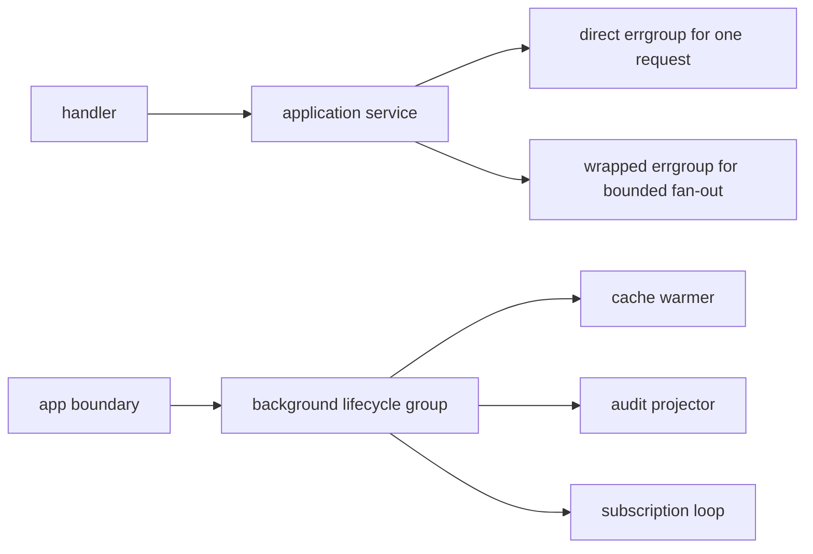

# Application-Layer Parallelism

In a real Go service, the application or use-case layer often has to call several downstreams in parallel:

- partner config,
- risk rules,
- balances,
- inventory,
- pricing,
- entitlement or policy checks.

The problem is not whether goroutines are allowed.

The real problem is choosing the right lifetime contract for that parallel work.

:::tip Quick takeaway
Use direct `errgroup` for one request with a small finite sibling set. Use a thin `errgroup` wrapper when the team wants explicit `Go(ctx)` semantics, shared limit policy, tracing, or helper methods. Use a thin `WaitGroup` or lifecycle wrapper for long-lived background loops and shutdown ownership.
:::

If you want concrete code, see [`examples/appparallel`](https://github.com/jaeyoung0509/golang-handbook/tree/develop/examples/appparallel).

## Mental model



The application layer is where you decide:

- which calls should succeed or fail together,
- which calls should cancel siblings on the first error,
- which goroutines are request-scoped,
- and which goroutines belong to the process itself.

That is why concurrency policy belongs in the application layer, not hidden inside arbitrary helpers.

## Why large codebases wrap `errgroup` and `WaitGroup`

Large Go codebases do not wrap these primitives because they are bad.

They wrap them because the raw primitives are intentionally small and do not encode local service policy.

Raw `errgroup` gives you:

- child goroutine start,
- parent-derived cancellation,
- one `Wait`,
- optional bounded parallelism through `SetLimit`.

Raw `sync.WaitGroup` gives you:

- a counter,
- and almost nothing else.

What raw primitives do not encode:

- explicit context ownership,
- admission control after shutdown begins,
- standard logging and tracing hooks,
- panic policy,
- spawn-and-wait helper shapes,
- stop-signal conventions,
- and the difference between request lifetime and service lifetime.

That is why wrappers appear in real systems.

## Open-source source pointers

Three good examples:

- [CockroachDB `ctxgroup`](https://github.com/cockroachdb/cockroach/blob/master/pkg/util/ctxgroup/ctxgroup.go): a wrapper over `errgroup` that makes context passing explicit with `GoCtx(func(ctx context.Context) error)` and adds helper shapes such as `GoAndWait`.
- [CockroachDB `stop.Stopper`](https://github.com/cockroachdb/cockroach/blob/master/pkg/util/stop/stopper.go): a heavier lifecycle wrapper that rejects new work during quiescing, waits for tasks, and treats goroutine management as part of service shutdown.
- [Kubernetes `wait.Group`](https://github.com/kubernetes/apimachinery/blob/master/pkg/util/wait/wait.go): a thin wrapper over `sync.WaitGroup` with `Start`, `StartWithContext`, and `StartWithChannel` so goroutine startup follows one consistent convention.

The important point is not the exact API.

The important point is that each project encodes its own invariants once instead of asking every call site to remember them forever.

## Scenario 1: direct `errgroup` for one request

This is the default for request-scoped fan-out.

Use it when:

- the task set is finite,
- the tasks belong to one request or one use case,
- one failure should cancel siblings,
- all child work should finish before the handler returns.

The example package uses direct `errgroup` for `LoadCheckoutSnapshot`, which fans out to partner config, risk, and balance reads.

```go
func LoadCheckoutSnapshot(ctx context.Context, req CheckoutRequest, deps Dependencies) (CheckoutSnapshot, error) {
	group, groupCtx := errgroup.WithContext(ctx)

	var partner PartnerConfig
	var risk RiskDecision
	var balance BalanceSnapshot

	group.Go(func() error {
		result, err := deps.PartnerConfigs.LoadPartnerConfig(groupCtx, req.PartnerID)
		if err != nil {
			return fmt.Errorf("load partner config: %w", err)
		}
		partner = result
		return nil
	})

	group.Go(func() error {
		result, err := deps.Risk.EvaluateRisk(groupCtx, req)
		if err != nil {
			return fmt.Errorf("evaluate risk: %w", err)
		}
		risk = result
		return nil
	})

	group.Go(func() error {
		result, err := deps.Balances.LoadBalance(groupCtx, req.UserID)
		if err != nil {
			return fmt.Errorf("load balance: %w", err)
		}
		balance = result
		return nil
	})

	if err := group.Wait(); err != nil {
		return CheckoutSnapshot{}, err
	}

	return CheckoutSnapshot{
		UserID:    req.UserID,
		PartnerID: req.PartnerID,
		Partner:   partner,
		Risk:      risk,
		Balance:   balance,
	}, nil
}
```

Why this is the right default:

- the lifetime is obvious,
- cancellation is automatic,
- the handler cannot accidentally return before the work is done.

If your use case is just “call three downstreams and join the results,” do not invent a framework first.

## Scenario 2: wrap `errgroup` when the team wants one standard request fan-out shape

This is where large services start wrapping `errgroup`.

Common reasons:

- avoid `group, ctx := errgroup.WithContext(ctx)` shadowing mistakes,
- standardize `SetLimit` policy,
- pass the derived context explicitly into every task,
- add tracing, metrics, logging, or panic normalization,
- expose helper shapes such as `RunAll`, `GoCtx`, or `GoAndWait`.

The example package uses a thin wrapper called `TaskGroup`.

```go
type TaskGroup struct {
	ctx   context.Context
	group *errgroup.Group
}

func NewTaskGroup(ctx context.Context, limit int) (*TaskGroup, error) {
	group, childCtx := errgroup.WithContext(ctx)
	group.SetLimit(limit)

	return &TaskGroup{
		ctx:   childCtx,
		group: group,
	}, nil
}

func (g *TaskGroup) Go(fn func(context.Context) error) {
	g.group.Go(func() error {
		return fn(g.ctx)
	})
}
```

That wrapper does not change the underlying model.

It changes the call-site discipline.

The batch example uses it for bounded partner fan-out:

```go
group, err := NewTaskGroup(ctx, limit)
if err != nil {
	return nil, err
}

for index, partnerID := range partnerIDs {
	index := index
	partnerID := partnerID

	group.Go(func(ctx context.Context) error {
		summary, err := fetch.FetchPartnerSummary(ctx, partnerID)
		if err != nil {
			return fmt.Errorf("fetch partner %s: %w", partnerID, err)
		}
		results[index] = summary
		return nil
	})
}

if err := group.Wait(); err != nil {
	return nil, err
}
```

Best fit:

- request-scoped batch reads,
- bounded fan-out over many IDs,
- one team-wide concurrency shape for use cases,
- shared instrumentation and limit policy.

This is the same core idea you can see in CockroachDB `ctxgroup`: keep the `errgroup` semantics, but make the context and helper contract harder to misuse.

## Scenario 3: wrap `WaitGroup` for long-lived background tasks

`sync.WaitGroup` is not a request fan-out primitive.

It has no:

- error propagation,
- derived context,
- shutdown contract,
- admission control,
- or cancellation semantics.

That is why raw `WaitGroup` is usually the wrong tool inside request-scoped application code.

Where it does fit is long-lived background work that belongs to the process:

- cache warmers,
- audit projectors,
- subscription loops,
- periodic refreshers,
- controller or watcher loops.

In those cases the real need is lifecycle management, not fail-fast error aggregation.

The example package uses `BackgroundGroup`, a thin wrapper around `WaitGroup` plus owned cancellation.

```go
type BackgroundGroup struct {
	ctx    context.Context
	cancel context.CancelFunc

	mu     sync.Mutex
	closed bool
	wg     sync.WaitGroup
}

func (g *BackgroundGroup) Go(fn func(context.Context)) error {
	g.mu.Lock()
	if g.closed {
		g.mu.Unlock()
		return ErrClosed
	}
	g.wg.Add(1)
	g.mu.Unlock()

	go func() {
		defer g.wg.Done()
		fn(g.ctx)
	}()

	return nil
}

func (g *BackgroundGroup) Shutdown(ctx context.Context) error {
	g.mu.Lock()
	if !g.closed {
		g.closed = true
		g.cancel()
	}
	g.mu.Unlock()

	done := make(chan struct{})
	go func() {
		defer close(done)
		g.wg.Wait()
	}()

	select {
	case <-done:
		return nil
	case <-ctx.Done():
		return ctx.Err()
	}
}
```

This is the same design pressure that leads Kubernetes to add `StartWithContext` around `WaitGroup`, and CockroachDB to build a much heavier `Stopper` around service quiescing.

## Scenario matrix

| Scenario | Best default | Why |
| --- | --- | --- |
| One request, three to six sibling downstream calls | direct `errgroup.WithContext` | Fail-fast cancellation and one wait point are exactly the contract you want. |
| One request, many IDs, but still one bounded batch | thin `errgroup` wrapper with `SetLimit` | Same fail-fast model, but the wrapper makes context, limits, and instrumentation uniform. |
| Background worker owned by the process | lifecycle wrapper around `WaitGroup` | The important contract is start, stop, reject-new-work, and wait-for-exit. |
| Service startup components that must quiesce cleanly | lifecycle wrapper or stopper-style abstraction | Shutdown policy and admission control matter more than raw counting. |
| Partial-success fan-out where one failure must not cancel the rest | result collector or worker-pool style orchestration | Raw fail-fast `errgroup` is the wrong semantics. |
| Best-effort side effects triggered by a request | durable queue, outbox, or owned background subsystem | Detached request goroutines are easy to leak and hard to reason about. |

## Failure patterns to avoid

### 1. Raw `WaitGroup` in request fan-out

```go
var wg sync.WaitGroup
var risk RiskDecision
var balance BalanceSnapshot

wg.Add(2)
go func() {
	defer wg.Done()
	risk, _ = riskClient.EvaluateRisk(ctx, req)
}()
go func() {
	defer wg.Done()
	balance, _ = balanceClient.LoadBalance(ctx, req.UserID)
}()
wg.Wait()
```

This compiles, but now you have no first-error policy, no automatic sibling cancellation, and no clear rule for how failures are returned.

### 2. Fire-and-forget inside the application layer

```go
go auditSink.Write(context.Background(), event)
```

Now the work is no longer request-scoped and not clearly process-scoped either.

That is how “just one goroutine” turns into leaks and mystery shutdown bugs.

### 3. Mixing request and process lifetimes in one abstraction

Do not use the same helper type for:

- request fan-out that must finish before the handler returns,
- and background loops that outlive any one request.

Those are different lifetime contracts.

## What to say in an interview

A strong answer is:

1. “For one request with a finite set of sibling calls, I use `errgroup.WithContext` directly.”
2. “If the team repeatedly needs the same bounded fan-out shape, I wrap `errgroup` so context passing, limits, and instrumentation are standardized.”
3. “For long-lived goroutines owned by the service, I do not treat `WaitGroup` as a request primitive. I wrap it with shutdown ownership and rejection of new work.”

That answer is usually better than naming five packages without explaining lifetime semantics.

## Related pages

- [Clean Go Service Basics](/guide/clean-go-service-basics)
- [Structured Concurrency](/advanced/structured-concurrency)
- [Graceful Shutdown](/patterns/graceful-shutdown)
- [Leak, Shutdown, and Timeout Testing](/testing/leaks-and-shutdowns)
