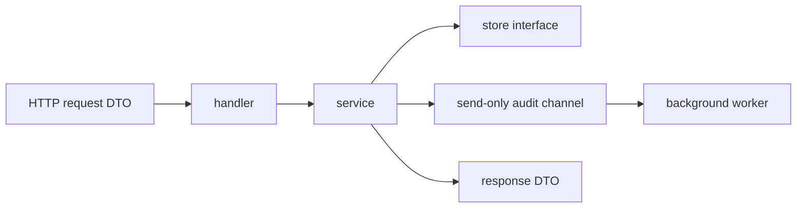

# Clean Go Service Basics

If you are coming from FastAPI, Spring, or NestJS, the cleanest Go backend style is not “find the closest big framework and copy its magic.”

The cleanest style is usually:

- explicit wiring,
- small interfaces near their consumer,
- DTOs only at the transport edge,
- plain services with ordinary Go types,
- graceful shutdown as part of the main program, not an afterthought.

:::tip Quick takeaway
For interviews, a strong default answer is: `handler -> service -> store`, DTOs at the edge, `context.Context` through the call chain, one owner per channel, and `http.Server.Shutdown` for graceful exit.
:::

## Mental model



If you want a concrete version of this shape, see [`examples/cleanservice`](https://github.com/jaeyoung0509/golang-handbook/tree/develop/examples/cleanservice).

## 1. Keep DTOs at the transport edge

One of the most common design mistakes is passing HTTP or JSON-shaped structs through the entire application.

Cleaner boundary:

- request DTO in the handler,
- domain or service input inside the service,
- response DTO back at the edge.

```go
type CreatePaymentRequest struct {
	PartnerID string `json:"partner_id"`
	Amount    int    `json:"amount"`
	Currency  string `json:"currency"`
}

type Payment struct {
	ID        string
	PartnerID string
	Amount    int
	Currency  string
	CreatedAt time.Time
}
```

Why this is better:

- transport concerns stay at the edge,
- service code stops depending on JSON tags,
- tests get simpler because they use plain types.

## 2. Place interfaces near the consumer

In Go, you usually define the interface where it is consumed, not where it is implemented.

```go
type PaymentStore interface {
	Save(context.Context, Payment) error
}

type Service struct {
	store PaymentStore
}
```

This is more idiomatic than creating a giant shared `repository` package full of speculative interfaces.

Interview answer worth remembering:

“In Go, small interfaces usually belong to the consumer package because the consumer owns the dependency shape.”

## 3. Pass `context.Context` through the call chain

The clean default is:

- request handler gets `r.Context()`,
- service accepts `ctx` as its first parameter,
- store and outbound calls receive that same context.

```go
func (s Service) CreatePayment(ctx context.Context, req CreatePaymentRequest) (PaymentResponse, error) {
	// validation
	// store.Save(ctx, ...)
	// outbound calls with ctx
}
```

Do not hide request lifetime behind globals or `context.Background()` in request-scoped code.

## 4. Use channel direction to show ownership

Channel direction is small, but it makes APIs easier to reason about.

```go
type Service struct {
	audit chan<- AuditEvent
}

func drainAudit(events <-chan AuditEvent, sink AuditSink) {
	for event := range events {
		_ = sink.Write(context.Background(), event)
	}
}
```

This communicates intent immediately:

- the service may only send,
- the worker may only receive.

That is much cleaner than passing `chan AuditEvent` everywhere and hoping ownership remains obvious.

## 5. Keep handlers thin

HTTP handlers should mostly do four things:

1. decode and validate the request DTO,
2. call the service,
3. map service errors to HTTP status,
4. encode the response DTO.

That is enough.

If the handler also performs business branching, persistence logic, retries, and background coordination, the boundary is already too wide.

## 6. Graceful shutdown belongs in the app boundary

Graceful shutdown is usually not the service layer's job. It is the application's job.

The clean shape is:

```go
ctx, stop := signal.NotifyContext(context.Background(), os.Interrupt, syscall.SIGTERM)
defer stop()

go func() {
	<-ctx.Done()

	shutdownCtx, cancel := context.WithTimeout(context.Background(), 10*time.Second)
	defer cancel()

	_ = server.Shutdown(shutdownCtx)
}()
```

In the [`examples/cleanservice`](https://github.com/jaeyoung0509/golang-handbook/tree/develop/examples/cleanservice) package, shutdown also drains an audit worker after the HTTP server stops accepting new work.

Read [Graceful Shutdown](/patterns/graceful-shutdown) next if you want the deeper concurrency version.

## 7. Validate early, map errors at the edge

Good Go service code usually validates near the boundary and returns ordinary errors upward.

```go
var ErrPartnerIDRequired = errors.New("partner_id is required")

switch {
case errors.Is(err, ErrPartnerIDRequired):
	writeJSON(w, http.StatusBadRequest, map[string]string{"error": err.Error()})
default:
	writeJSON(w, http.StatusInternalServerError, map[string]string{"error": "internal server error"})
}
```

That gives you:

- readable business errors in the service,
- clean protocol mapping in the handler,
- less framework-style hidden behavior.

## 8. Prefer explicit construction over framework magic

Go services stay clean when dependencies are visible:

```go
app := NewApp(":8080", Dependencies{
	Store:     store,
	IDs:       ids,
	AuditSink: auditSink,
	Now:       time.Now,
})
```

This is one reason Go services often feel “lighter” than framework-heavy systems. Construction is boring and obvious, which is usually a feature.

## Suggested package shape

For a modest API service, a simple shape is enough:

```text
internal/
  payments/
    service.go
    handler.go
    dto.go
    store.go
cmd/api/
  main.go
```

You do not need a huge hexagonal folder tree on day one.

You need:

- a clear edge,
- a clear service boundary,
- explicit dependency wiring,
- tests that prove the important behavior.

## Interview checklist

If someone asks how you structure a Go backend service, a strong answer is:

- DTOs live at the HTTP or message boundary.
- Business logic lives in a service layer with plain Go types.
- Interfaces are small and defined near the consumer.
- `context.Context` is passed through every request-scoped dependency.
- Channels use direction when ownership matters.
- Graceful shutdown uses `http.Server.Shutdown` with a deadline.
- Errors are wrapped in the service and mapped to protocol status at the edge.

## Practical takeaway

You do not need a Go equivalent of FastAPI magic to make a service feel clean.

You need sharper boundaries, smaller interfaces, and explicit lifecycle ownership.
