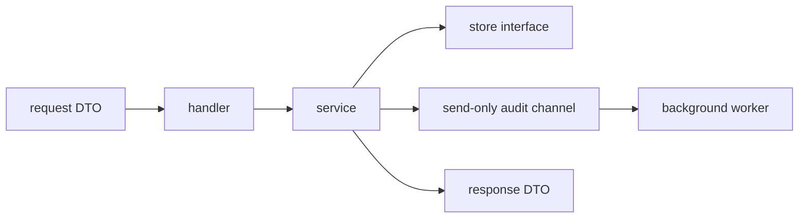

# Clean Go Service Basics

If you are coming from FastAPI, Spring, or NestJS, the cleanest Go backend style is usually not “find a huge framework and hide everything.”

The cleaner default is:

- explicit wiring,
- DTOs only at the edge,
- thin handlers,
- plain services,
- small interfaces near their consumer,
- graceful shutdown in the app boundary,
- channels with obvious ownership.

:::tip Quick takeaway
For interviews, a strong default answer is: `handler -> service -> store`, DTOs at the edge, `context.Context` through the call chain, one owner per channel, and `http.Server.Shutdown` for graceful exit.
:::

If you want a concrete version of this shape, see [`examples/cleanservice`](https://github.com/jaeyoung0509/golang-handbook/tree/develop/examples/cleanservice).

If the next question is “what happens when one use case has to call several downstreams in parallel?”, continue with [Application-Layer Parallelism](/guide/application-layer-parallelism).

## The default shape to memorize



If an interviewer asks, “How would you structure a Go API?”, this is already a good start.

## 1. Keep DTOs at the transport edge

Bad default:

```go
type Payment struct {
	PartnerID string `json:"partner_id"`
	Amount    int    `json:"amount"`
	Currency  string `json:"currency"`
}

func (s Service) CreatePayment(ctx context.Context, payment Payment) error {
	// now JSON concerns leaked into the service
	return nil
}
```

Better:

```go
type CreatePaymentRequest struct {
	PartnerID string `json:"partner_id"`
	Amount    int    `json:"amount"`
	Currency  string `json:"currency"`
}

type Payment struct {
	ID        string
	PartnerID string
	Amount    int
	Currency  string
	CreatedAt time.Time
}

type PaymentResponse struct {
	ID        string `json:"id"`
	PartnerID string `json:"partner_id"`
	Amount    int    `json:"amount"`
	Currency  string `json:"currency"`
	CreatedAt string `json:"created_at"`
}
```

The handler owns `CreatePaymentRequest` and `PaymentResponse`.

The service owns `Payment`.

That separation keeps transport concerns from infecting the rest of the program.

## 2. Map DTOs explicitly

Do not be embarrassed by small mapping functions. They are one of the cleanest parts of Go service code.

```go
func toPaymentResponse(payment Payment) PaymentResponse {
	return PaymentResponse{
		ID:        payment.ID,
		PartnerID: payment.PartnerID,
		Amount:    payment.Amount,
		Currency:  payment.Currency,
		CreatedAt: payment.CreatedAt.Format(time.RFC3339),
	}
}
```

That is clearer than:

- passing DB models directly to JSON,
- leaking persistence fields into responses,
- or hiding everything behind reflection magic.

## 3. Place interfaces near the consumer

In Go, interfaces usually belong to the package that consumes the dependency shape.

```go
type PaymentStore interface {
	Save(context.Context, Payment) error
}

type Service struct {
	store PaymentStore
}
```

This is cleaner than a giant shared `repository` package full of speculative interfaces.

Good interview sentence:

“In Go, I define small interfaces close to the consumer because the consumer owns the dependency contract.”

## 4. Pass `context.Context` through the whole request path

The clean default is:

- handler uses `r.Context()`,
- service accepts `ctx` as the first parameter,
- store and outbound calls receive that same context.

```go
func (h Handler) createPayment(w http.ResponseWriter, r *http.Request) {
	resp, err := h.service.CreatePayment(r.Context(), req)
	_ = resp
	_ = err
}

func (s Service) CreatePayment(ctx context.Context, req CreatePaymentRequest) (PaymentResponse, error) {
	if err := s.store.Save(ctx, payment); err != nil {
		return PaymentResponse{}, err
	}
	return toPaymentResponse(payment), nil
}
```

Avoid this in request-scoped code:

```go
func (s Service) CreatePayment(_ context.Context, req CreatePaymentRequest) error {
	return s.store.Save(context.Background(), payment) // bad
}
```

That throws away the caller's timeout and cancellation.

## 5. Channel direction cheat sheet

This is where many people stay confused longer than they should.

### The three forms

| Type | Meaning | What this side can do |
| --- | --- | --- |
| `chan T` | bidirectional | send and receive |
| `chan<- T` | send-only | send only |
| `<-chan T` | receive-only | receive only |

### The easy memory trick

- `chan<- T`: you push `T` values into it
- `<-chan T`: you pull `T` values out of it

### Minimal examples

```go
func producer(out chan<- int) {
	out <- 1
}

func consumer(in <-chan int) int {
	return <-in
}

func pipe() <-chan int {
	out := make(chan int, 1)
	out <- 42
	close(out)
	return out
}
```

### Why this is useful

Bad:

```go
func drainAudit(events chan AuditEvent) {
	for event := range events {
		_ = event
	}
}
```

The reader cannot tell whether `drainAudit` is allowed to send, receive, or close.

Better:

```go
func drainAudit(events <-chan AuditEvent) {
	for event := range events {
		_ = event
	}
}
```

Now the API itself says:

- this function only reads,
- it should not write,
- it should not own the sending side.

### Practical rule

Use channel direction in:

- function parameters,
- struct fields that express ownership,
- return types for producer-style APIs.

You do not need to force it onto every local variable.

## 6. Keep handlers thin

HTTP handlers should mostly do four things:

1. decode and validate the request DTO,
2. call the service,
3. map service errors to HTTP status,
4. encode the response DTO.

Good shape:

```go
func (h Handler) createPayment(w http.ResponseWriter, r *http.Request) {
	defer r.Body.Close()

	var req CreatePaymentRequest
	decoder := json.NewDecoder(r.Body)
	decoder.DisallowUnknownFields()
	if err := decoder.Decode(&req); err != nil {
		writeJSON(w, http.StatusBadRequest, map[string]string{"error": "invalid request body"})
		return
	}

	resp, err := h.service.CreatePayment(r.Context(), req)
	if err != nil {
		writeServiceError(w, err)
		return
	}

	writeJSON(w, http.StatusCreated, resp)
}
```

Bad shape:

```go
func createPayment(w http.ResponseWriter, r *http.Request) {
	// decode JSON
	// validate business rules
	// build SQL
	// call external API
	// enqueue audit event
	// map status codes
}
```

That boundary is too wide.

## 7. Validate early, map errors at the edge

The service should return ordinary Go errors.

The handler should translate them into protocol behavior.

```go
var ErrPartnerIDRequired = errors.New("partner_id is required")

func writeServiceError(w http.ResponseWriter, err error) {
	switch {
	case errors.Is(err, ErrPartnerIDRequired):
		writeJSON(w, http.StatusBadRequest, map[string]string{"error": err.Error()})
	default:
		writeJSON(w, http.StatusInternalServerError, map[string]string{"error": "internal server error"})
	}
}
```

This gives you:

- readable service logic,
- clear HTTP mapping,
- less hidden framework behavior.

## 8. Prefer explicit construction over framework magic

Go services stay cleaner when dependencies are visible.

```go
app := NewApp(":8080", Dependencies{
	Store:     store,
	IDs:       ids,
	AuditSink: auditSink,
	Now:       time.Now,
})
```

That is boring, and boring is good here.

The reader can see:

- what the app depends on,
- what is injectable in tests,
- where the wiring happens.

## 9. Graceful shutdown belongs in the app boundary

Graceful shutdown is usually not the service layer's job.

It is the application's job:

```go
ctx, stop := signal.NotifyContext(context.Background(), os.Interrupt, syscall.SIGTERM)
defer stop()

go func() {
	<-ctx.Done()

	shutdownCtx, cancel := context.WithTimeout(context.Background(), 10*time.Second)
	defer cancel()

	_ = server.Shutdown(shutdownCtx)
}()
```

If you also own background workers, drain them after the server stops admitting new work:

```go
func (a *App) Shutdown(ctx context.Context) error {
	if err := a.server.Shutdown(ctx); err != nil {
		return err
	}

	close(a.auditCh)
	a.auditWg.Wait()
	return nil
}
```

Read [Graceful Shutdown](/patterns/graceful-shutdown) next if you want the deeper concurrency treatment.

## 10. Suggested package shape

For a modest API service, this is already enough:

```text
internal/
  payments/
    dto.go
    handler.go
    service.go
    store.go
cmd/api/
  main.go
```

You do not need a giant folder taxonomy on day one.

You need:

- a clear edge,
- a clear service boundary,
- explicit wiring,
- tests that prove the important behavior.

## 11. Common basic mistakes

### Mistake: using `context.Background()` in request work

```go
func (s Service) CreatePayment(ctx context.Context, req CreatePaymentRequest) error {
	return s.store.Save(context.Background(), payment) // bad
}
```

Better:

```go
func (s Service) CreatePayment(ctx context.Context, req CreatePaymentRequest) error {
	return s.store.Save(ctx, payment)
}
```

### Mistake: giant bidirectional channels everywhere

```go
func startAudit(ch chan AuditEvent) { ... } // vague ownership
```

Better:

```go
func startAudit(in <-chan AuditEvent) { ... }
func emitAudit(out chan<- AuditEvent, event AuditEvent) { out <- event }
```

### Mistake: DTOs leaking into business code

```go
func (s Service) CreatePayment(ctx context.Context, req http.Request) error { ... }
```

Better:

```go
func (s Service) CreatePayment(ctx context.Context, req CreatePaymentRequest) (PaymentResponse, error) { ... }
```

### Mistake: hidden globals for time and IDs

```go
func CreatePayment(...) Payment {
	return Payment{ID: uuid.NewString(), CreatedAt: time.Now()}
}
```

Better:

```go
type IDGenerator interface {
	Next() string
}

type Service struct {
	ids IDGenerator
	now func() time.Time
}
```

This is much easier to test.

## 12. Interview checklist

If someone asks how you would structure a Go backend service, a strong answer is:

- DTOs live at the HTTP or message boundary.
- Business logic lives in a service layer with plain Go types.
- Interfaces are small and defined near the consumer.
- `context.Context` is passed through every request-scoped dependency.
- Channels use direction when ownership matters.
- Graceful shutdown uses `http.Server.Shutdown` with a deadline.
- Errors are returned from the service and mapped to protocol status at the edge.
- Constructors wire dependencies explicitly instead of hiding them in global state.

## Practical takeaway

You do not need a Go equivalent of FastAPI magic to make a service feel clean.

You need sharper boundaries, smaller interfaces, explicit lifecycle ownership, and enough small code snippets that the design stays obvious under pressure.
