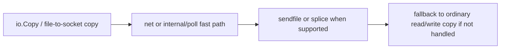

# Kernel I/O Paths: netpoll, epoll/kqueue, and Zero-Copy

The standard library makes socket I/O feel pleasantly blocking.

The kernel does not share that opinion.

This page is about the layer between those two realities: how Go maps socket operations onto kernel readiness APIs, where `pollDesc` lives, and when data movement falls onto `sendfile` or `splice` instead of user-space copies.

## Mental model


There is a second, separate path for bulk copy optimization:



## Readiness is not throughput

Kernel readiness APIs such as epoll and kqueue answer one question:

“Is this descriptor ready for an operation without blocking right now?”

They do not answer:

- how much application work will happen after readiness,
- how much user-space parsing you will do,
- how much TLS encryption or decompression still remains,
- how much disk or downstream latency sits behind the next step.

That distinction matters because teams often blame “the network” when the real cost is above readiness.

## The `pollDesc` boundary

Go's runtime and `internal/poll` work together around a poll descriptor object.

At a high level it stores:

- descriptor identity and lifecycle state,
- read and write waiter state,
- deadline association,
- wakeup coordination so stale descriptor reuse does not wake the wrong goroutine.

That is why the boundary between `net.Conn` and the runtime is more than a raw file descriptor number.

## Simplified internal sketch

```go
func readFromFD(fd *FD, p []byte) (int, error) {
	if err := fd.pd.prepareRead(fd.isFile); err != nil {
		return 0, err
	}
	for {
		n, err := syscallRead(fd.Sysfd, p)
		if err != wouldBlock {
			return n, err
		}
		if err := fd.pd.waitRead(fd.isFile); err != nil {
			return 0, err
		}
	}
}
```

This is not the literal source, but it captures the important shape:

- try the operation,
- if the descriptor would block, park on readiness,
- wake when the runtime poller says it is ready or a deadline expires.

## epoll and kqueue are implementation details, but useful ones

On Linux, the runtime integrates with epoll.

On BSD and macOS, it integrates with kqueue.

You do not need to memorize every flag, but you should know what the runtime is buying you:

- goroutines can block on socket readiness without pinning a thread forever,
- deadlines can wake a goroutine even if readiness never comes,
- scheduler runnable queues receive wakeups from I/O readiness.

That is the same story you saw in [Netpoller, Timers, and Syscalls](/fundamentals/netpoller-timers-syscalls), now viewed from the kernel boundary inward.

## Zero-copy is conditional, not magic

Modern Go can sometimes avoid extra user-space copies for bulk transfer.

The common names are:

- `sendfile`
- `splice` on Linux

But the important word is “sometimes.”

These fast paths depend on:

- source and destination descriptor types,
- platform support,
- file and socket state,
- whether the fast path reports itself as handled.

If the fast path cannot be used, the standard library falls back to ordinary buffered copies. That fallback is normal, not a bug.

## Runtime and stdlib source pointers

Read these files together:

- [`runtime/netpoll.go`](https://github.com/golang/go/blob/go1.26.0/src/runtime/netpoll.go)
- [`runtime/netpoll_epoll.go`](https://github.com/golang/go/blob/go1.26.0/src/runtime/netpoll_epoll.go)
- [`runtime/netpoll_kqueue.go`](https://github.com/golang/go/blob/go1.26.0/src/runtime/netpoll_kqueue.go)
- [`internal/poll/fd_poll_runtime.go`](https://github.com/golang/go/blob/go1.26.0/src/internal/poll/fd_poll_runtime.go)
- [`internal/poll/sendfile_unix.go`](https://github.com/golang/go/blob/go1.26.0/src/internal/poll/sendfile_unix.go)
- [`internal/poll/splice_linux.go`](https://github.com/golang/go/blob/go1.26.0/src/internal/poll/splice_linux.go)
- [`net/sendfile.go`](https://github.com/golang/go/blob/go1.26.0/src/net/sendfile.go)
- [`net/splice_linux.go`](https://github.com/golang/go/blob/go1.26.0/src/net/splice_linux.go)

Read them with these questions:

1. where does readiness waiting happen,
2. where do deadlines enter,
3. where is stale descriptor reuse defended against,
4. where do copy fast paths decide whether they can handle the transfer.

## What Go hides well

Go does a good job hiding:

- readiness registration,
- wakeup coordination,
- descriptor deadline integration,
- retry loops around “would block” behavior,
- some platform-specific fast copy choices.

That is why direct-style socket code feels usable.

## What Go cannot hide

Go cannot hide:

- DNS latency,
- TLS CPU cost,
- kernel accept backlog pressure,
- user-space parsing cost,
- downstream service slowness,
- cgo or arbitrary blocking syscalls,
- disk and filesystem behavior that does not fit the socket readiness model.

If one of those dominates latency, netpoll being correct does not save the service.

## Failure patterns

### Treating readiness as proof of high throughput

A ready socket can still feed slow application parsing, slow downstream fan-out, or expensive encryption.

### Assuming zero-copy always happens

`io.Copy` may hit `sendfile` or `splice`, but it may also fall back to ordinary reads and writes depending on descriptors and platform.

### Forgetting that deadlines wake the goroutine too

If you only model readiness events, timeout behavior feels mysterious. Deadlines are part of the same wakeup story.

### Blaming the scheduler for kernel or transport policy problems

Sometimes the process is fine and the issue is connection churn, handshake cost, or slow peer behavior.

## How to observe and debug it

- Use `go tool trace` to separate network waits from CPU and lock waits.
- Use `pprof` to see whether the time is actually in user-space processing after the socket is ready.
- Use OS socket tools such as `ss`, `lsof`, and packet captures when you need to confirm whether the kernel path or peer behavior is the bottleneck.
- Use transport-level metrics to distinguish connection churn from request load.

## Production consequence

The runtime makes kernel readiness usable. It does not erase kernel reality.

The best Go networking engineers know both where the runtime helps and where the kernel or peer still dominates behavior.

## Practical takeaway

Use this page as the bridge between Go's direct-style I/O API and the kernel-level mechanisms underneath it.

If you need the operational side next, continue with [Debugging Go Network Services in Production](/production/debugging-go-network-services).
