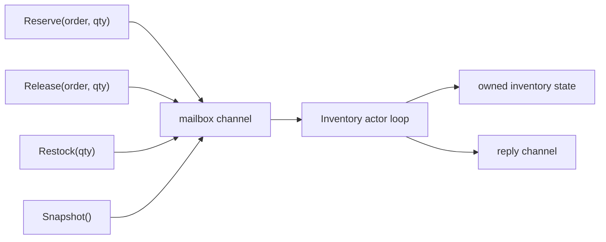

# 액터 패턴

Go는 액터 프레임워크를 기본 제공하지는 않지만, 고루틴과 채널만으로도 꽤 깔끔하게 액터 모델을 구현할 수 있습니다.

액터의 핵심은 단순합니다.

- 하나의 액터가 하나의 변경 가능한 상태를 소유하고,
- 다른 고루틴은 락 대신 메시지를 보내며,
- 액터는 메시지를 순차적으로 처리합니다.

## 언제 잘 맞는가

- 동시 호출이 많은 hot mutable state가 있고,
- 그 상태의 소유자를 분명히 하고 싶고,
- 단순 mutex 보호 필드보다 상태 전이 규칙이 richer하고,
- 공유 메모리 변경보다 command 메시지가 더 자연스러울 때

## 예제 시나리오

`examples/actor`는 플래시 세일 SKU에 대한 재고 예약 액터를 모델링합니다.

이런 문제는 oversell이 절대 허용되지 않고, 예약/해제/입고 같은 변경이 명령 형태로 직렬화되기 때문에 액터 패턴과 잘 맞습니다.



## 구현의 핵심

[`examples/actor/actor.go`](https://github.com/jaeyoung0509/golang-conccurency-patterns/blob/main/examples/actor/actor.go)의 공개 API는 이벤트 루프를 메서드 뒤에 숨깁니다.

```go
func (actor *InventoryActor) Reserve(ctx context.Context, orderID string, quantity int) (StockSnapshot, error) {
    return actor.request(ctx, reserveCommand{orderID: orderID, quantity: quantity})
}

func (actor *InventoryActor) loop(state *inventoryState) {
    for {
        select {
        case <-actor.stop:
            return
        case envelope := <-actor.commands:
            envelope.reply <- envelope.command.run(state)
        }
    }
}
```

## 단순화한 mailbox 스케치

```go
type envelope struct {
    cmd   Command
    reply chan Result
}

func loop(state *State, mailbox <-chan envelope) {
    for env := range mailbox {
        env.reply <- env.cmd.Apply(state)
    }
}
```

가장 작은 유효 actor 형태는 이것입니다. mailbox 하나, owner loop 하나, state machine 하나.

안전성은 한 가지 규칙에서 나옵니다. `inventoryState`를 실제로 변경하는 곳이 액터 루프 하나뿐이라는 점입니다.

즉,

- 외부 mutex 없이도 상태 일관성을 유지할 수 있고,
- 여러 호출자가 동시에 요청을 보내도 상태 변경 자체는 직렬화되며,
- "가용 재고 이상 예약 금지" 같은 비즈니스 규칙이 한 지점에 모입니다.

## 테스트가 증명하는 것

[`examples/actor/actor_test.go`](https://github.com/jaeyoung0509/golang-conccurency-patterns/blob/main/examples/actor/actor_test.go)는 다음을 검증합니다.

- 동시 예약이 들어와도 oversell이 발생하지 않는가
- release와 restock 이후 snapshot이 일관적인가
- 액터 종료 후 명령이 깔끔하게 실패하는가

## 액터 vs mutex

| 도구 | 더 적합한 경우 |
| --- | --- |
| Mutex | critical section이 짧고 로컬한 경우 |
| Actor | 상태 전이가 command 중심이고 소유권을 분명히 드러내야 하는 경우 |

뮤텍스는 메모리를 보호합니다. 액터는 프로토콜을 정의합니다.

상태 전이가 복잡하거나 audit, retry, multi-step transition이 붙기 시작하면 이 차이가 커집니다.

## 액터 vs 워커 풀

두 패턴은 해결하는 문제가 다릅니다.

- 워커 풀은 많은 독립 작업의 병렬 수를 제한하고,
- 액터는 하나의 상태 기계에 대한 변경을 직렬화합니다.

둘은 함께 쓸 수도 있습니다. 예를 들어 워커 풀이 여러 액터와 통신하거나, 한 액터가 배경 작업을 워커 풀로 넘길 수도 있습니다.

## 주의할 점

### 실패 패턴: 내부 상태를 바깥에 노출하기

```go
func (actor *InventoryActor) UnsafeState() *inventoryState {
    return actor.state // ownership boundary 붕괴
}
```

바깥 코드가 내부 포인터를 직접 만질 수 있으면 actor 보장은 거의 사라집니다.

### mailbox에도 역압력이 필요하다

호출자가 액터 처리 속도보다 빠르게 enqueue할 수 있으면 bounded mailbox, 거절 정책, 상위 레벨 throttling이 필요합니다.

### 하나의 액터가 병목이 될 수 있다

그건 종종 의도된 비용입니다. 다만 상태를 key별로 나눌 수 있다면 여러 액터로 partition하는 편이 낫습니다.

### supervision은 직접 설계해야 한다

Go는 Erlang OTP 같은 supervisor를 기본 제공하지 않습니다. 재시작 정책, mailbox 내구성, 수명 주기 관리가 모두 애플리케이션 책임입니다.

### reply channel의 수명도 설계해야 한다

caller가 요청을 포기할 수 있다면, reply path가 actor loop를 wedge시키지 않아야 합니다. 그래서 one-shot buffered reply channel이 shared response path보다 안전한 경우가 많습니다.

## 실전 요약

상태 소유권을 분명하게 드러내고, 중요한 불변식을 한 직렬화 지점에서 강제하고 싶다면 액터 패턴이 매우 좋습니다.

채널 중심 설계의 이론적 뿌리를 보려면 [CSP Theory in Go](/ko/advanced/csp-theory)를 이어서 보면 됩니다.
