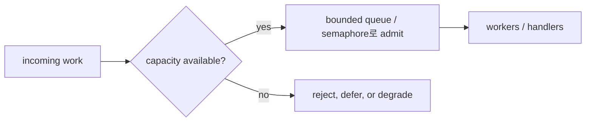

# 역압력과 로드 셰딩

많은 동시성 버그는 사실 overload 버그입니다.

작게 보면 코드는 맞아 보이는데, 지속적인 부하 아래에서는:

- goroutine이 너무 많이 쌓이고,
- queue가 무한히 커지고,
- latency가 터지고,
- 실패가 너무 늦게 발생합니다.

## 역압력과 로드 셰딩의 차이

둘은 관련 있지만 같지는 않습니다.

| 개념 | 의미 |
| --- | --- |
| Backpressure | consumer가 못 따라오면 producer를 늦추거나 admission을 막음 |
| Load shedding | 모두 처리하면 시스템이 망가질 때 일부 작업을 거절, 지연, degrade |

실전 시스템은 둘 다 필요한 경우가 많습니다.

## Go 개발자가 자주 하는 실수

가장 흔한 안티패턴은 "고루틴은 싸니까"라는 생각 위에 놓인 무한 queue입니다.

이 패턴은 보통:

- 들어오는 요청마다 더 많은 작업을 만들고,
- downstream latency가 올라가고,
- queue가 커지고,
- cancel은 늦게 도착하고,
- 결국 메모리와 tail latency가 진짜 장애가 됩니다.

## Go에서 쓸 수 있는 실용 도구

마법 같은 단일 primitive는 없습니다. 명확한 정책이 필요합니다.

자주 쓰는 building block은 다음과 같습니다.

- bounded buffered channel
- `select` + `default` 기반 try-send rejection
- finite queue를 가진 worker pool
- admission control용 semaphore
- request deadline과 context cancellation
- full failure 대신 degraded response

## 설계 전에 답해야 할 질문

1. 무엇을 bound할 것인가: goroutine 수, queue length, memory weight, downstream QPS?
2. capacity 소진 시 무엇을 할 것인가: block, timeout, reject, degrade?
3. queue에 들어간 뒤 cancellation은 어떻게 전파되는가?
4. limit 근처에서 시스템이 흔들리는지 어떤 metric으로 볼 것인가?

## 이 저장소 패턴과의 연결

- [워커 풀](/ko/patterns/worker-pool): active worker 수를 제한
- [가중 세마포어](/ko/advanced/weighted-semaphore): resource weight를 제한
- [구조화된 동시성](/ko/advanced/structured-concurrency): cancel된 작업이 계속 남지 않게 함
- [Singleflight](/ko/advanced/singleflight): 같은 key에 대한 중복 backend pressure를 줄임

## 실전 요약

admission control 없는 동시성 패턴은 반쪽짜리입니다.

시스템이 초기에 "no"를 말할 수 없으면, 더 늦고 더 비싼 방식으로 실패하게 되는 경우가 많습니다.
