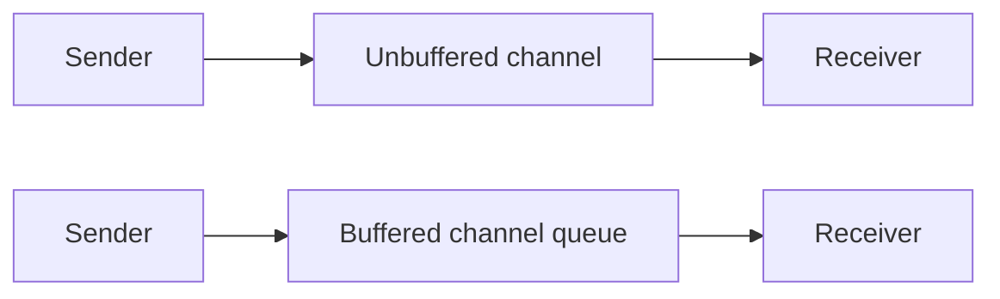

# Go에서의 CSP 이론

Go의 동시성 철학은 CSP, 즉 Communicating Sequential Processes의 영향을 강하게 받습니다.

핵심 아이디어는 Tony Hoare로 대표되는 이론에서 왔습니다. 서로 독립적으로 실행되는 프로세스가 공유 메모리를 자유롭게 건드리는 대신, 명시적인 채널을 통해 통신한다는 생각입니다.

## 유명한 문장과 실제 의미

Go는 다음 문장을 널리 퍼뜨렸습니다.

> Do not communicate by sharing memory; instead, share memory by communicating.

이 말이 Go에서 shared memory를 금지한다는 뜻은 아닙니다. 통신을 프로토콜의 중심에 두면 동기화 자체가 설계 안으로 들어오기 때문에 reasoning이 쉬워진다는 뜻에 가깝습니다.

## Go에서 보이는 CSP 핵심 요소

| CSP 개념 | Go 대응물 |
| --- | --- |
| 독립 프로세스 | Goroutine |
| 통신 채널 | `chan T` |
| 동기적 통신 | 언버퍼드 채널 send/receive |
| 여러 통신 중 선택 | `select` |
| 프로세스 조합 | 파이프라인, 워커 네트워크, 팬아웃/팬인 |

## Go는 순수 CSP는 아니다

Go는 CSP에서 영감을 받은 것이지, 그 안에 갇힌 언어는 아닙니다.

Go에는 다음도 있습니다.

- shared memory
- mutex
- atomic
- buffered channel
- 수학적 순수성보다 실용성을 택한 런타임 스케줄링

그래서 Go는 연구용 언어보다 실용 시스템 언어에 가깝게 느껴집니다.

## Rendezvous와 버퍼드 통신

CSP는 흔히 sender와 receiver가 같은 통신 이벤트에서 만나는 synchronous rendezvous로 설명됩니다.

Go에서는:

- 언버퍼드 채널이 여기에 가장 가깝고,
- 버퍼드 채널은 중간 큐를 넣어 이 제약을 완화하며,
- 둘 다 여전히 중요한 동기화 의미를 가집니다.

## 실전 패턴과의 연결

이 저장소 패턴도 CSP 관점으로 보면 더 명확해집니다.

- 워커 풀: 채널로 조정되는 고루틴 네트워크
- 파이프라인: 단계형 프로세스 조합
- 팬아웃 / 팬인: one-to-many, many-to-one 통신
- 컨텍스트 취소: 프로세스 경계를 가로지르는 제어 신호

## CSP vs 액터 모델

둘은 관련 있지만 중심축이 다릅니다.

| 모델 | 중심 관심사 |
| --- | --- |
| CSP | 동시 프로세스 간 통신 |
| 액터 | 상태 소유권과 메시지 기반 개체 |

Go 식으로 말하면:

- CSP 스타일은 채널과 프로세스 조합에서 출발하고,
- 액터 스타일은 상태 소유권과 mailbox에서 출발합니다.

어느 쪽이 항상 더 좋다는 것은 아닙니다. 무엇을 더 분명하게 드러내고 싶은지가 다를 뿐입니다.

## Go가 둘 다 표현할 수 있는 이유

고루틴과 채널이 충분히 유연하기 때문입니다.

- 데이터플로우형 통신 그래프
- mailbox 기반 상태 기계
- 구조화된 취소 패턴
- 필요할 때의 shared-memory fallback

모두 표현할 수 있습니다.

## 중요한 한 가지

CSP는 조합 방식을 설명해주지만, 다음 같은 실전 문제를 대신 해결해주지는 않습니다.

- 역압력
- 종료 처리
- 에러 전파
- 메모리 가시성
- 관측 가능성

실제 시스템이 깔끔할지 취약할지는 대부분 여기서 갈립니다.

## 실전 요약

CSP를 이해하면 Go의 채널 중심 관용구가 임의의 스타일이 아니라 일관된 설계 언어로 보이기 시작합니다.

그러면 파이프라인, 워커 풀, [액터 패턴](/ko/advanced/actor-pattern) 중 무엇을 쓸지 더 의식적으로 선택할 수 있습니다.

이걸 Rust의 future/executor 스타일과 직접 비교하고 싶다면 [Go CSP vs Rust Tokio](/ko/extras/go-csp-vs-rust-tokio)로 이어서 읽어보세요.
