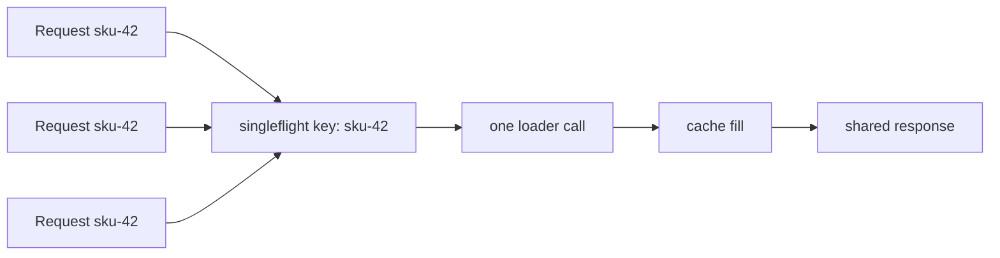

# Singleflight

Singleflight는 같은 키에 대한 중복 in-flight 작업을 억제합니다.

같은 missing value를 100개의 요청이 동시에 물어본다고 해서, DB나 API 호출도 100번 날릴 필요는 없습니다.

## 이것이 하는 일과 하지 않는 일

`golang.org/x/sync/singleflight`는:

- in-flight 작업의 중복 억제
- string key 기준 그룹화
- cache miss coalescing과 shared fetch에 유용

하지만 다음은 아닙니다.

- cache 자체
- rate limiter
- 영구 memoization 계층

## 예제 시나리오

`examples/singleflightcache`는 가격 조회 서비스를 모델링합니다.

- 먼저 local cache 확인
- miss면 singleflight로 같은 SKU의 동시 요청을 하나로 합침
- 성공 시 cache 채움

## 왜 `DoChan`이 실무에서 더 나을 때가 있는가

예제는 plain `Do` 대신 `DoChan`을 사용합니다. 그래야 follower request가 기다리는 동안 자신의 context가 취소되면 독립적으로 빠져나올 수 있습니다.

즉,

- shared work 자체는 leader가 결정하고,
- follower는 기다리기만 하되,
- waiting policy는 자기 timeout에 맞출 수 있습니다.

## 테스트가 증명하는 것

테스트는 다음을 검증합니다.

- 같은 키의 동시 cache miss가 loader 1회만 발생시키는가
- follower는 timeout 나도 leader는 계속 완료할 수 있는가
- 실패한 load를 성공처럼 cache하지 않는가

## 중요한 트레이드오프: 어떤 context가 load를 주도하는가

singleflight는 여러 caller의 context를 자동으로 "완벽하게 합친" shared context를 만들어주지 않습니다.

정책을 직접 정해야 합니다.

대표적으로:

- leader context가 load를 주도
- 서비스 전용 detached context가 load를 주도
- follower는 기다리기만 멈추고 shared work는 계속 진행

어떤 선택이 맞는지는 시스템마다 다르지만, 중요한 건 명시적으로 정하는 것입니다.

## 흔한 실수

### singleflight가 cache를 대체한다고 착각하기

아닙니다. singleflight는 진행 중인 중복 작업만 줄입니다. 호출이 끝나면 결과를 따로 저장하지 않는 이상 다음 요청은 다시 backend를 칩니다.

### key cardinality를 무시하기

모든 요청이 사실상 서로 다른 key를 쓰면 singleflight는 거의 이득이 없습니다.

### stampede 일부만 해결하고 overload는 그대로 두기

singleflight는 같은 key에 대한 herd를 줄여줍니다. 서로 다른 수많은 key에 대한 폭주까지 막아주진 않습니다.

## 실전 요약

Singleflight는 Go에서 request coalescing을 가장 깔끔하게 표현하는 도구 중 하나입니다.

cache miss 주변이나 공통 메타데이터 fetch처럼 같은 비싼 조회가 동시에 자주 발생하는 곳에 특히 잘 맞습니다.
