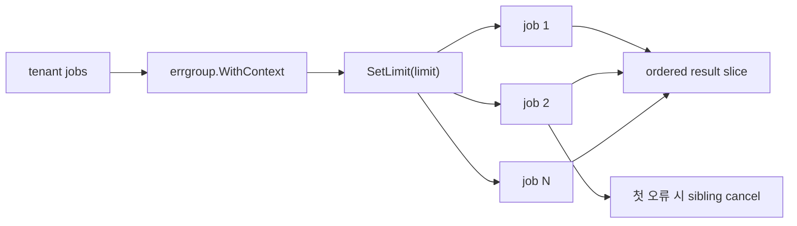

# 구조화된 동시성

구조화된 동시성의 핵심은 자식 goroutine이 명확한 부모 작업에 속해야 하고, 실수로 그 수명 바깥으로 흘러나가면 안 된다는 점입니다.

Go에서 이를 가장 실용적으로 표현하는 도구는 `golang.org/x/sync/errgroup`입니다.

:::tip 빠른 요약
이 패턴의 핵심은 parallelism보다 lifetime discipline입니다. 함께 성공하고, 함께 실패하고, 함께 취소돼야 하는 작업은 하나의 구조화된 subtree로 표현하는 편이 맞습니다.
:::

## 왜 중요한가

구조가 없으면 goroutine은 시작하기는 쉽지만 잊어버리기도 쉽습니다.

그 결과:

- 요청 취소 뒤에도 남는 작업,
- CPU를 계속 태우는 partial failure,
- 임시방편식 error aggregation,
- reasoning이 어려운 lifecycle

이 생깁니다.

## `errgroup` 모델

`errgroup`은 세 가지를 한 번에 묶어줍니다.

- 여러 goroutine 시작
- `WithContext` 사용 시 첫 오류에서 sibling cancel
- `Wait` 한 번으로 전체 종료 대기

최근 버전은 `SetLimit`도 지원해서, 유한한 task set에 대한 구조화된 동시성을 실무적으로 쓰기 좋습니다.

## 단순화한 구현 스케치

```go
group, ctx := errgroup.WithContext(parent)
group.SetLimit(limit)

for _, tenant := range tenants {
    tenant := tenant
    group.Go(func() error {
        return backfillTenant(ctx, tenant)
    })
}

if err := group.Wait(); err != nil {
    return err
}
```

핵심 형태는 이것입니다. 하나의 parent context, 하나의 bounded task set, 하나의 wait point.

## 예제 시나리오

`examples/errgroupbatch`는 tenant backfill batch를 실행합니다.

- tenant job은 서로 독립적이고,
- 하나 실패하면 전체를 중단해야 하며,
- 동시 실행 수는 제한돼야 합니다.



## 왜 worker pool 대신 이것을 쓰는가

worker pool은 channel 기반의 reusable dispatch 구조가 필요할 때 좋습니다.

구조화된 동시성은 다음일 때 더 좋습니다.

- 작업 집합이 이미 메모리에 정해져 있고,
- lifetime을 부모 작업에 강하게 묶고 싶고,
- manual queue plumbing 없이 cancel/wait semantics를 표현하고 싶을 때

## 예제가 증명하는 것

테스트는 다음을 검증합니다.

- 결과 순서가 deterministic한가
- 동시 실행 수 제한을 지키는가
- 하나의 job 실패가 sibling cancel로 이어지는가

## 중요한 디테일

### `SetLimit`은 queue abstraction이 아니다

`SetLimit`은 active goroutine 수가 limit 아래로 내려갈 때까지 추가 `Go` 호출을 block합니다.
즉, 별도 jobs channel과 worker fleet을 만든 것과는 다릅니다.

### limit는 실행 중에 바꾸면 안 된다

패키지 소스도 이 점을 명시합니다. limit는 group construction의 일부로 봐야지, live knob로 취급하면 안 됩니다.

### loop variable capture는 여전히 중요하다

`errgroup`을 쓴다고 해서 Go의 기본 closure 함정이 사라지지는 않습니다. goroutine을 띄우기 전에 loop variable rebinding이 필요합니다.

## 흔한 실패 패턴

### structured lifetime과 unstructured lifetime을 섞는 경우

```go
group.Go(func() error {
    return runPrimary(ctx)
})

go fireAndForgetAudit(ctx) // group 바깥
```

이제 cancellation은 실제 workflow의 일부에만 적용됩니다. 그러면 이 패턴의 핵심 장점이 사라집니다.

### loop variable rebinding을 빼먹는 경우

```go
for _, tenant := range tenants {
    group.Go(func() error {
        return backfillTenant(ctx, tenant) // tenant rebinding이 없으면 위험
    })
}
```

`errgroup`은 lifetime control을 좋게 해주지만, Go의 closure rule까지 없애주지는 않습니다.

## 실전 요약

구조화된 동시성은 새로운 스케줄러가 아니라, goroutine lifetime을 다루는 설계 규율입니다.

동시 작업 서브트리가 함께 성공하거나 함께 실패해야 한다면 `errgroup`이 가장 명확한 표현인 경우가 많습니다.
