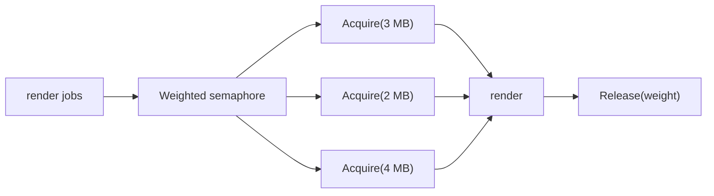

# 가중 세마포어

어떤 워크로드는 "몇 개의 goroutine이 돌고 있나"보다 "얼마나 큰 자원을 동시에 먹고 있나"가 더 중요합니다.

이럴 때 가중 세마포어가 유용합니다.

## 왜 plain worker pool로는 부족한가

worker pool은 모든 job의 비용이 대략 비슷하다고 가정하기 쉽습니다.

하지만 현실은 종종 다릅니다.

- 어떤 render는 50MB, 어떤 render는 500MB를 쓰고,
- 어떤 작업은 파일 1개, 어떤 작업은 20개를 열고,
- 어떤 작업은 API 1번, 어떤 작업은 내부 fan-out으로 여러 번 호출합니다.

이 경우에는 worker count보다 resource weight를 제한해야 합니다.

## 예제 시나리오

`examples/weightedsemaphore`는 각 job이 필요한 메모리 예산을 MB 단위로 요청하는 render 작업을 모델링합니다.

이 예제는:

- `errgroup.WithContext`로 structured cancellation을 하고,
- `x/sync/semaphore`로 weighted admission control을 합니다.

## 테스트가 증명하는 것

테스트는 다음을 검증합니다.

- 동시 in-flight weight 총합이 capacity를 넘지 않는가
- 하나의 render 실패가 sibling render를 취소시키는가
- 절대 처리 불가능한 oversized job을 초기에 거부하는가

## 소스 레벨에서 중요한 디테일

`x/sync/semaphore` 구현은 waiter queue를 유지하고, 큰 요청 앞에서 작은 요청이 계속 새치기해서 큰 요청이 굶주리는 상황을 피하려고 설계돼 있습니다.

즉,

- 큰 요청 starvation은 줄어들고,
- 대신 capacity 일부가 잠깐 놀 수는 있습니다.

실무에서는 보통 이 tradeoff가 맞습니다.

## 언제 잘 맞는가

다음일 때 가중 세마포어가 특히 좋습니다.

- job 비용 편차가 크고,
- 주요 병목이 CPU thread count가 아니라 메모리나 quota이며,
- admission control 계층을 작고 명시적으로 두고 싶을 때

## 흔한 실수

### 불가능한 요청을 검증하지 않기

시스템 전체 capacity보다 큰 요청은 영원히 만족될 수 없습니다. 초기에 실패시켜야 합니다.

### semaphore를 workflow 전체로 착각하기

semaphore는 "이 작업을 지금 시작해도 되는가"를 말해줍니다. error aggregation이나 cancel policy까지 대신해주지는 않습니다.

## 실전 요약

worker count는 거친 제한이고, weighted semaphore는 실제 병목을 더 정확히 표현합니다.

메모리 집약적이거나 quota 집약적인 Go 서비스에서는 특히 가치가 큰 고급 패턴입니다.
