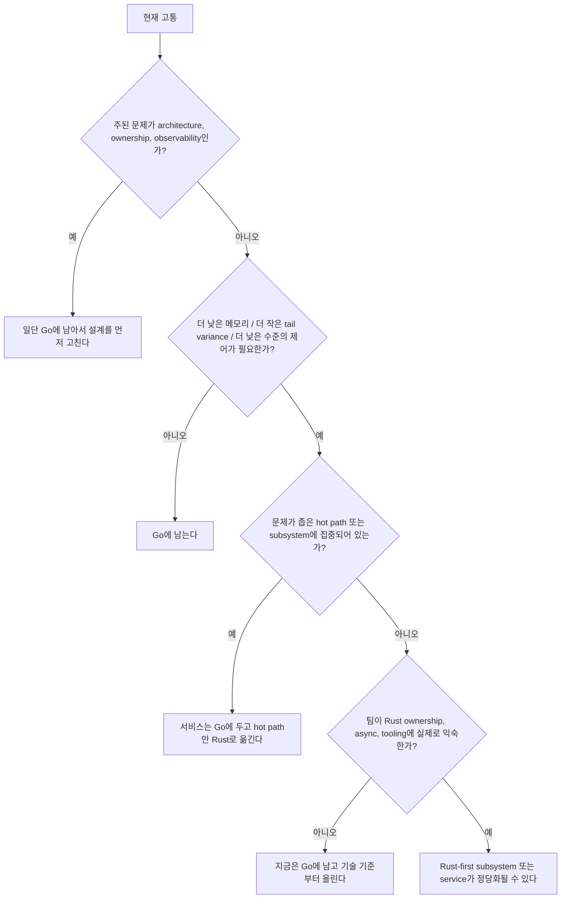

# Go vs Rust 결정 가이드

이 문서는 누가 더 낫다고 선언하려는 문서가 아닙니다.

왜냐하면 팀이 보통 잘못된 질문부터 하기 때문입니다.

- 나쁜 질문: “Rust가 Go보다 낫나?”
- 좋은 질문: “내가 푸는 문제가 정확히 무엇이고, 각 언어가 어디서 비용을 정당화하는가?”

:::tip Quick takeaway
기본값은 Go로 두는 편이 맞습니다. 서비스 orchestration, API, control plane, 내부 도구, 대부분의 네트워크 서비스에서는 특히 그렇습니다. Rust는 더 낮은 메모리 풋프린트, 더 타이트한 tail-latency variance, 더 강한 compile-time ownership 보장, 더 낮은 수준의 제어가 실제로 필요할 때 좁은 서브시스템에 투입하는 편이 맞습니다.
:::

## 결정 트리

## 기본 입장

증명이 나오기 전까지는 Go를 기본값으로 유지하는 편이 맞습니다.

이건 보수적 태도가 아니라 비용 계산입니다.

Go는 다음에 유리한 기본 스택을 줍니다.

- direct-style concurrent service code
- 간단한 배포와 cross-compilation
- runtime-integrated goroutine과 netpoll
- 빠른 팀 온보딩
- 단순한 운영 모델

Rust는 다른 거래를 제시합니다.

- 더 강한 compile-time ownership 보장
- allocation과 layout에 대한 더 낮은 수준의 제어
- GC-driven latency trade 없음
- 일부 systems/data-plane workload에 더 잘 맞음

## 기본값으로 Go에 남는 경우

대개 Go가 더 잘 맞는 경우는 다음입니다.

- HTTP / gRPC API
- control plane
- Kubernetes operator와 platform service
- queue consumer와 background worker
- 내부 도구와 CLI
- raw compute보다 I/O와 coordination이 더 중요한 서비스

시스템의 대부분이 network wait, business rule, orchestration, integration work로 채워져 있다면 총 엔지니어링 생산성 면에서 Go가 유리한 경우가 많습니다.

## Rust로 서브시스템을 옮길 만한 경우

Rust가 비용을 정당화하기 시작하는 순간은 대체로 이럴 때입니다.

- connection당 또는 object당 memory footprint가 실제로 중요할 때
- GC 관련 tail variance가 제품을 실질적으로 해칠 때
- hot path에서 zero-copy나 매우 세밀한 buffer control이 필요할 때
- parser, proxy, codec, storage engine, execution engine처럼 data-plane 성격이 강할 때
- Go 코드 리뷰만으로는 안정적으로 강제하기 어려운 ownership/aliasing 제약이 있을 때
- C, C++, kernel, embedded constraint와 매우 타이트하게 맞물리는 라이브러리/컴포넌트를 만들 때

중요한 점은, 이 판단이 회사 전체 언어 선택이 아니라 특정 서브시스템 판단인 경우가 많다는 것입니다.

## 사실은 이유가 아닌 것들

다음 이유만으로 Rust로 옮기면 안 됩니다.

- 소셜 미디어에서 Rust가 더 빠르다고 들었기 때문
- Go 서비스 p99가 나쁜데 queueing이나 backpressure를 먼저 안 고쳤기 때문
- memory가 높은데 profile이 보여주는 낭비를 아직 제거하지 않았기 때문
- goroutine leak이 shutdown ownership 문제인데 언어 탓으로 돌리기 때문
- deadline, pooling, retry가 현재 무질서한데 언어를 바꾸면 해결될 거라고 생각하기 때문
- 팀에 Rust 빌드/디버깅/프로파일링/운영 경험이 없기 때문

이건 종종 언어 한계가 아니라 architecture와 discipline 문제입니다.

## 비교 mental model

| 축 | Go의 장점 | Rust의 장점 |
| --- | --- | --- |
| 팀 생산성 | 서비스 코드를 단순하게 쓰기 좋고 온보딩이 빠름 | 팀이 익숙해진 뒤에는 더 많은 invariant를 컴파일 타임에 강제 |
| 동시성 ergonomics | goroutine, channel, netpoll, direct style | ownership과 async boundary가 더 명시적 |
| latency profile | 대부분의 서비스에 충분히 좋고, GC trade가 있음 | GC variance가 허용되지 않을 때 더 유리 |
| memory control | 많은 백엔드에서 충분함 | layout, borrowing, allocation 제어가 더 강함 |
| systems integration | 배포와 static binary가 단순함 | low-level library, kernel, parser, FFI-heavy workload에 더 잘 맞음 |
| 운영 비용 | 일반적인 서비스 작업에서 대체로 낮음 | 좁은 고성능 컴포넌트에서는 비용을 상쇄할 수 있음 |

## 공식 모델이 강조하는 것

Rust 공식 책은 “fearless concurrency”를, 잘못된 concurrent code를 더 이른 시점에 컴파일 에러로 드러내는 방향으로 설명합니다. Tokio runtime 문서는 I/O driver, scheduler, timer를 가진 runtime과 fairness 가정이 task가 runtime thread를 계속 붙잡지 않는다는 전제 위에 있음을 설명합니다.

Go 공식 가이드는 direct concurrency composition과 “sharing memory by communicating” 같은 CSP 계열 사고를 강조합니다. 그래서 memory layout trick보다 communication structure가 더 중요한 서비스 코드에서는 Go가 특히 매력적입니다.

## 유즈케이스 매트릭스

### Go에 남는 편이 좋은 경우

- API gateway와 internal API
- control plane과 operator
- job worker와 pipeline service
- 대부분의 microservice
- feature velocity와 operability를 더 중시하는 팀

### Rust를 서브시스템에 도입할 만한 경우

- protocol parser와 codec
- high-throughput proxy
- storage / indexing engine
- memory-sensitive agent
- embedded / edge component
- allocation shape가 비용을 지배하는 hot loop

### Rust를 더 넓게 검토할 만한 경우

- 제품 자체가 data-plane 또는 systems product일 때
- 팀이 이미 Rust와 async에 익숙할 때
- debugging, CI, packaging, incident tooling이 준비돼 있을 때
- 기대 이득이 이론이 아니라 측정으로 확인됐을 때

## Split architecture가 종종 최선이다

많은 팀은 서비스 경계에서 “Go냐 Rust냐”를 묻기보다 이렇게 물어야 합니다.

- control plane은 Go에 둘 수 있는가
- hot parser / engine / proxy / native module만 Rust로 옮길 수 있는가
- 그 경계가 여전히 observable하고 운영하기 지루할 만큼 단순한가

이렇게 하면:

- coordination이 많은 곳은 Go,
- tight control이 필요한 곳은 Rust

로 나눌 수 있습니다.

## 마이그레이션 체크리스트

Rust로 옮기기 전에 최소한 이것들은 확인해야 합니다.

1. 병목이 측정으로 확인됐다.
2. 명백한 Go-side fix를 해도 병목이 남아 있다.
3. 대상 범위가 좁고 명시적이다.
4. 팀이 Rust를 빌드, 프로파일링, 테스트, 디버깅, 운영할 수 있다.
5. runtime model과 shutdown model을 튜토리얼 복붙이 아니라 실제로 이해하고 있다.
6. Go와 Rust 사이 인터페이스가 원래 문제보다 더 복잡하지 않다.

## 이 사이트의 다른 문서와 연결

- runtime model 비교는 [Go CSP vs Rust Tokio](/ko/extras/go-csp-vs-rust-tokio)를 읽습니다.
- Go를 탓하기 전에 [Go 런타임과 스케줄러](/ko/fundamentals/go-runtime-scheduler), [가비지 컬렉터와 Green Tea GC](/ko/fundamentals/garbage-collector)를 읽습니다.
- 언어가 아니라 설계가 병목일 수 있으므로 [역압력과 로드 셰딩](/ko/advanced/backpressure-load-shedding), [대규모 Go 시스템](/ko/production/large-scale-go-systems)도 같이 봅니다.

## 공식 자료

- [Rust Book의 Fearless Concurrency](https://doc.rust-lang.org/book/ch16-00-concurrency.html)
- [Tokio spawning tutorial](https://tokio.rs/tokio/tutorial/spawning)
- [Tokio runtime docs](https://docs.rs/tokio/latest/tokio/runtime/)
- [Effective Go: concurrency](https://go.dev/doc/effective_go#concurrency)
- [Go concurrency patterns: pipelines](https://go.dev/blog/pipelines)

## Practical takeaway

Rust는 Go의 상위호환 상태 업그레이드가 아닙니다.

비용 구조가 다른 도구입니다.

서비스 orchestration의 기본값은 Go로 두고, 측정된 제약이 Go보다 더 타이트한 제어를 요구할 때만 좁은 서브시스템을 Rust로 옮기는 편이 가장 현실적입니다.
