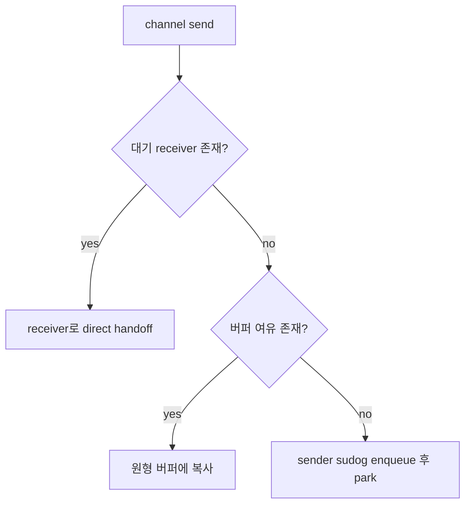
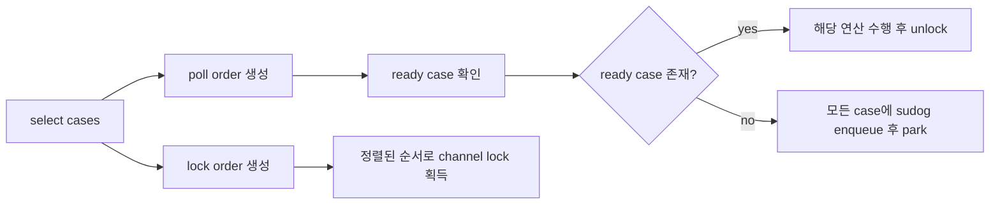

# 채널 내부 동작

채널은 표면적으로는 단순하지만, 런타임 내부에서는 꽤 정교한 구조 위에서 동작합니다.

이 문서는 `chan T` 사용법이 아니라, 채널 기반 코드가 왜 그런 성질을 갖는지 설명하는 문서입니다.

:::tip 빠른 요약
채널은 단순 queue가 아닙니다. synchronization, queueing, parking, wakeup, lifecycle signaling이 함께 들어 있는 추상화입니다. 대부분의 채널 버그는 문법보다 프로토콜이 약해서 생깁니다.
:::

:::info 버전 기준
이 문서는 Go 1.26의 `runtime/chan.go`, `runtime/select.go`를 기준으로 정리했습니다.
:::

## 핵심 런타임 객체: `hchan`

런타임에서 채널은 `hchan` 구조체로 표현됩니다.

중요한 필드는 다음과 같습니다.

| 필드 | 역할 |
| --- | --- |
| `qcount` | 현재 버퍼에 들어 있는 원소 수 |
| `dataqsiz` | 원형 버퍼 크기 |
| `buf` | 버퍼 저장 영역 포인터 |
| `sendx` / `recvx` | 원형 버퍼 인덱스 |
| `recvq` / `sendq` | 대기 중인 receiver / sender 큐 |
| `closed` | 되돌릴 수 없는 closed 상태 플래그 |
| `lock` | 채널 상태를 보호하는 내부 mutex |

중요한 포인트는 이것입니다. 채널은 "완전히 lock-free 마법"이 아닙니다. 빠른 경로에서는 lock을 피하려고 하지만, 전체 프로토콜은 매우 엄격하게 보호됩니다.

## 단순화한 런타임 스케치

다음 스케치는 실제 런타임보다 훨씬 작지만, 구조는 정확합니다.

```go
type hchan struct {
	qcount   uint
	dataqsiz uint
	buf      unsafe.Pointer
	sendx    uint
	recvx    uint
	recvq    waitq
	sendq    waitq
	closed   uint32
	lock     mutex
}

func chansend(c *hchan, value *T) {
	lock(&c.lock)
	switch {
	case recvqHasWaiter(c):
		directHandoff(c, value)
	case c.qcount < c.dataqsiz:
		bufferedEnqueue(c, value)
	default:
		enqueueSenderAndPark(c, value)
	}
	unlock(&c.lock)
}
```

이 스케치를 따라갈 수 있으면 실제 `runtime/chan.go`도 훨씬 읽기 쉬워집니다.

## Send의 세 가지 핵심 경로

`c <- v`를 실행하면 런타임은 대략 다음 순서로 처리합니다.

1. 이미 기다리는 receiver가 있는가
2. 버퍼에 자리가 있는가
3. 둘 다 아니면 sender를 block해야 하는가



### Direct handoff

이미 receiver가 기다리고 있으면 버퍼를 거치지 않고 receiver의 목적지로 직접 값을 전달할 수 있습니다.

언버퍼드 채널에서는 이 rendezvous 성질이 특히 중요합니다.

### Buffered enqueue

버퍼에 자리가 있으면 런타임은 `buf[sendx]`에 값을 복사하고, 원형 인덱스를 증가시키고, `qcount`를 늘립니다.

### Blocking path

채널이 가득 차 있고 blocking send라면, 고루틴은 `sudog`라는 대기 레코드로 표현되어 wait queue에 연결되고 park됩니다.

나중에 다른 고루틴이 matching operation을 수행하면 이 goroutine이 다시 ready 상태가 됩니다.

## Receive는 대칭적이지만 완전히 같지는 않다

Receive도 여러 경우를 가집니다.

1. 버퍼에 데이터가 이미 있다
2. 대기 sender가 있다
3. 채널이 닫혔고 비어 있다
4. 아니면 block한다

버퍼가 가득 찬 상태에서 sender가 기다리는 경우, receive는 head에서 값을 꺼내고 sender의 값을 tail에 넣는 작업을 같은 lock 구간에서 처리할 수 있습니다.

이 디테일이 고 contention에서도 buffered channel semantics를 일관되게 유지하게 해줍니다.

## `sudog`는 block된 goroutine의 런타임 기록이다

고루틴이 채널에서 block될 때 런타임은 단순히 "잠든다" 수준으로 처리하지 않습니다.

`sudog`에는 대략 다음이 연결됩니다.

- goroutine 자체
- 채널
- handoff에 쓰일 element pointer
- `select`에서 왔는지 같은 메타데이터

그래서 채널 internals는 stack safety와 parking logic과 강하게 묶여 있습니다.

## 언버퍼드 채널은 다른 고루틴의 스택에 직접 복사할 수 있다

`runtime/chan.go`에서 가장 흥미로운 구현 포인트 중 하나는, 언버퍼드 send/receive가 한 running goroutine에서 다른 goroutine의 stack slot로 직접 데이터를 복사할 수 있다는 점입니다.

런타임은 이를 위해 direct-send / direct-receive 경로와 barrier 처리를 따로 둡니다. GC 가정이 깨지지 않게 하기 위해서입니다.

즉, 채널 구현은 "값 하나 큐에 넣기"보다 훨씬 복잡합니다.

## Close는 broadcast성 lifecycle 이벤트다

채널 close는 단순히 Boolean 하나 바꾸는 작업이 아닙니다.

`closechan`은 channel lock 아래에서 다음을 수행합니다.

1. 채널을 closed 상태로 표시
2. 기다리는 receiver 해제
3. 기다리는 sender 해제
4. lock 해제
5. 영향을 받은 goroutine들을 ready 상태로 전환

이 순서가 중요한 이유:

- closed-and-empty channel의 receiver는 zero value와 `ok=false`를 받게 되고,
- block된 sender는 깨어나서 `send on closed channel` panic을 일으키며,
- goroutine ready는 lock을 내려놓은 뒤에 해야 deadlock 위험이 줄어듭니다.

## 왜 close는 한쪽만 책임져야 하는가

이 내부 동작이 사용자 레벨 규칙을 설명해 줍니다.

- 보통 sender 쪽 소유자가 close를 책임져야 하고,
- receiver가 close하는 구조는 거의 항상 smell이며,
- close 후보가 여러 개라면 별도 동기화 없이는 위험합니다.

런타임은 여러분의 lifecycle contract를 대신 추론해주지 않습니다.

## `select`는 내부에서 어떻게 동작하는가

`select`도 내부적으로 꽤 정교합니다.

`runtime/select.go`는 대략 다음을 합니다.

1. case poll order를 랜덤화
2. channel address 기준 lock order 정렬
3. ready case가 없으면 모든 관련 wait queue에 자신을 등록하고 park

각 단계의 이유는 다음과 같습니다.

- randomized polling은 deterministic bias를 줄이고,
- sorted lock order는 여러 channel lock이 얽힐 때 deadlock을 피하며,
- multi-queue parking은 하나의 wakeup이 승자가 되고 나머지 case를 cleanup하게 합니다.



## 런타임 소스 읽기 순서

1. [runtime/chan.go](https://github.com/golang/go/blob/go1.26.0/src/runtime/chan.go)
2. [runtime/select.go](https://github.com/golang/go/blob/go1.26.0/src/runtime/select.go)
3. [Go Memory Model](https://go.dev/ref/mem)

`hchan`, `waitq`, `sudog`, `closechan`, `selectgo` 같은 이름은 한 번 익혀 두면 계속 도움이 됩니다.

## Buffered channel이 잘하는 것과 못하는 것

Buffered channel은 다음에 매우 좋습니다.

- producer/consumer의 짧은 속도 차를 흡수
- stage 간 latency를 조금 decouple
- bounded mailbox나 token pool 표현

하지만 다음을 대체하진 못합니다.

- 진짜 backpressure 정책
- queue monitoring
- admission control
- 명확한 shutdown protocol

버퍼를 키우는 것은 과부하를 잠깐 숨길 수는 있어도 제거하진 못합니다.

## 애플리케이션 코드에 주는 의미

이 내부 구조를 이해하면 다음 best practice가 왜 중요한지 납득됩니다.

- channel ownership을 명확히 둘 것
- close 책임을 명시적으로 둘 것
- `select` fairness를 완전한 보장으로 착각하지 말 것
- blocked goroutine이 탈출할 수 있도록 context cancellation을 둘 것
- overload가 중요하면 bounded queue를 사용할 것

## 실패 패턴

공유 output channel을 여러 producer가 쓰는데, 그중 한 producer가 `close`까지 자기 책임이라고 생각하면 프로토콜이 바로 깨지기 시작합니다.

```go
func producer(out chan<- Job, jobs []Job, wg *sync.WaitGroup) {
	defer wg.Done()
	for _, job := range jobs {
		out <- job
	}
	close(out) // bad: 여러 producer 중 하나가 shared channel을 닫음
}
```

다른 producer가 나중에 send하거나 또 `close`하려는 순간 panic이 납니다. 겉으로는 runtime panic이지만, 본질은 lifecycle ownership을 명확히 정하지 않은 설계입니다.

## 실전 요약

채널은 효율적이지만 단순한 추상화는 아닙니다. queueing, synchronization, parking, wakeup, lifecycle signaling을 한 추상화 안에 같이 담고 있습니다.

그 힘이 채널 기반 설계를 매우 우아하게도, 매우 위험하게도 만들 수 있습니다. 차이는 프로토콜이 명확한가에 달려 있습니다.

다음으로 [Mutex와 런타임 세마포어 내부](/ko/fundamentals/mutex-semaphore-internals)를 보면 Go의 communication-first 스타일과 shared-memory blocking primitive를 비교해 볼 수 있습니다.
