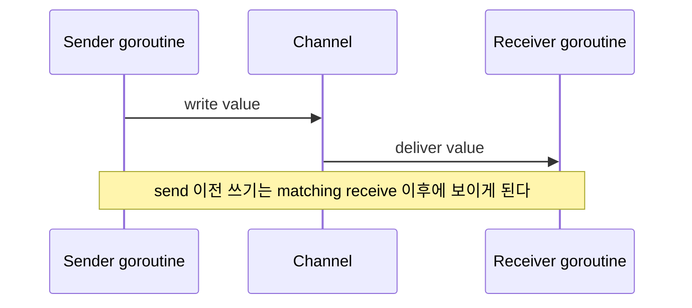

# Channels, Select, 그리고 Memory Model

동시성은 단순히 "동시에 실행된다"가 아닙니다. 동시에 실행될 때도 결과가 올바른가가 핵심입니다.

:::tip 빠른 요약
핵심 질문은 "이 goroutine들이 concurrent한가?"가 아니라 "어떤 이벤트가 한 goroutine의 write를 다른 goroutine에게 보이게 만드는가?"입니다.
:::

Go의 memory model은 한 고루틴의 쓰기가 다른 고루틴에 언제 보장되게 보이는지를 설명합니다. 언어는 그 보장을 만드는 동기화 지점을 제공합니다.

## 가장 중요한 규칙

두 고루틴이 같은 메모리에 동시에 접근하고, 그중 하나 이상이 쓰기라면 동기화가 필요합니다.

Go에서 대표적인 동기화 경계는 다음과 같습니다.

- 채널 send/receive
- 채널 close 관측
- mutex unlock/lock
- `sync.Once`
- atomic 연산
- 고루틴 생성 이후의 명시적 동기화

## 채널은 조정과 동기화를 함께 한다

언버퍼드 채널 send는 두 가지를 동시에 합니다.

- 값을 전달하고,
- sender와 receiver를 동기화합니다.

버퍼드 채널도 동기화는 하지만, 즉시 rendezvous 대신 버퍼 슬롯을 사이에 둡니다.



## 단순화한 happens-before 스케치

작은 예제를 머릿속에 두면 좋습니다.

```go
var cfg Config
ready := make(chan struct{})

go func() {
	cfg.Timeout = 2 * time.Second
	cfg.MaxBatch = 32
	close(ready)
}()

<-ready
use(cfg)
```

중요한 것은 `close` 문법이 아니라, receiver가 channel close를 관측했다는 사실이 synchronization edge를 만든다는 점입니다. 이 edge가 없으면 `use(cfg)`는 writer와 race할 수 있습니다.

## `select`가 실제로 주는 것

`select`는 여러 통신 가능성 중 준비된 것을 기다리는 Go의 기본 도구입니다.

주로 다음에 유용합니다.

- `ctx.Done()` 기반 취소
- timeout
- 여러 입력의 다중화
- `default`를 통한 non-blocking send/receive 시도

하지만 다음을 자동 보장하지는 않습니다.

- 엄격한 fairness
- 결정적 case 순서
- 그 자체로 올바른 프로토콜

즉, `select`는 준비된 case를 고를 뿐이고, 프로토콜의 타당성은 여전히 설계해야 합니다.

## 채널 close는 신호다

채널 close는 receiver 입장에서 broadcast성 이벤트입니다.

- 이후 receive는 종료를 감지할 수 있고,
- 보통 데이터 값보다 lifecycle 신호로 쓰이며,
- 채널 수명 주기를 소유한 sender 측만 닫는 것이 안전합니다.

이 저장소 예제들이 채널 생성과 close를 producer 또는 coordinator 근처에 두는 이유가 여기에 있습니다.

## Mutex와 채널은 대체 관계가 아니다

Go는 CSP 영향을 받았지만 "채널만 써라"는 언어는 아닙니다.

뮤텍스가 더 명확한 경우:

- 짧은 critical section 보호
- 작은 in-memory cache 보호
- 별도 통신 프로토콜 없이 상태만 잠깐 보호할 때

채널이 더 명확한 경우:

- 작업 분배
- 단계별 스트리밍
- 액터 mailbox
- 취소와 종료 신호 전달

## 내부 구현 관점

이 보장은 낙관론이 아니라 런타임 메커니즘과 언어 스펙에서 나옵니다.

크게 보면:

- channel operation은 `runtime/chan.go`,
- `select`는 `runtime/select.go`,
- mutex는 lock state와 runtime semaphore wakeup,
- memory model은 어떤 이벤트가 happens-before를 만드는지

를 정의합니다.

그래서 "goroutine을 썼다"는 사실 자체는 별 의미가 없습니다. edge가 중요합니다.

## 스펙 / 소스 포인터

- [Go Memory Model](https://go.dev/ref/mem)
- [runtime/chan.go](https://github.com/golang/go/blob/go1.26.0/src/runtime/chan.go)
- [runtime/select.go](https://github.com/golang/go/blob/go1.26.0/src/runtime/select.go)
- [internal/sync/mutex.go](https://github.com/golang/go/blob/go1.26.0/src/internal/sync/mutex.go)

## 액터 패턴도 이것에 의존한다

액터가 안전한 이유는 신비로운 철학 때문이 아닙니다.

- 하나의 고루틴이 상태를 직렬로 소유하고,
- 다른 고루틴은 mailbox 채널로만 접근하고,
- 채널 연산이 동기화 경계를 제공하기 때문입니다.

## 실전 체크리스트

동시성 코드를 읽을 때 다음을 물어보면 좋습니다.

1. happens-before 경계는 어디인가?
2. 공유 상태 가시성은 무엇이 동기화하는가?
3. 채널 close는 누가 소유하는가?
4. collector가 먼저 끝나면 다른 고루틴이 영원히 막히지는 않는가?

## 흔한 오해

### "채널을 썼으니 race는 없다"

아닙니다.

동일한 상태를 채널 프로토콜 바깥에서도 읽거나 쓴다면 여전히 data race가 생길 수 있습니다. 채널은 상태 전이를 실제로 그 프로토콜 안에 넣었을 때만 도움이 됩니다.

## 실전 요약

정확한 Go 동시성은 고루틴 개수보다 명시적 동기화에 달려 있습니다.

런타임 레벨 메커니즘을 더 보려면 [채널 내부 동작](/ko/fundamentals/channel-internals)과 [Mutex와 런타임 세마포어 내부](/ko/fundamentals/mutex-semaphore-internals)를 이어서 보면 됩니다.

다음 단계로 [CSP Theory in Go](/ko/advanced/csp-theory)에서 이론적 뿌리를 보고, [Actor Pattern](/ko/advanced/actor-pattern)에서 상태 소유형 모델을 비교해 볼 수 있습니다.
