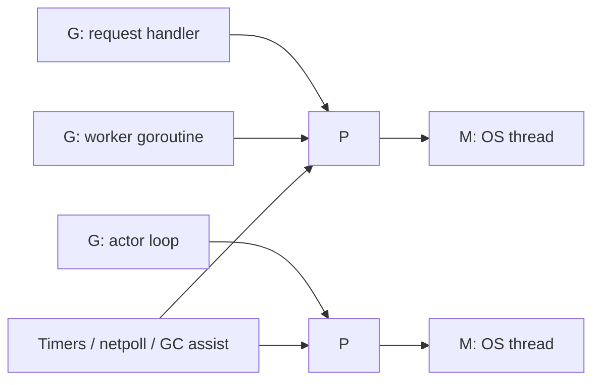

# Go 런타임과 스케줄러

Go 동시성 패턴이 왜 실용적인지 이해하려면 런타임부터 봐야 합니다.

:::tip 빠른 요약
이 페이지에서 하나만 기억한다면 이것입니다. 런타임은 goroutine을 싸게 만들고 잘 스케줄링해주지만, 서비스 한도, queue 정책, 실패 의미까지 대신 정해주지는 않습니다. 그 부분은 여전히 애플리케이션 설계 책임입니다.
:::

Go가 워커 풀, 파이프라인, 액터, 요청 단위 fan-out을 현실적으로 사용할 수 있는 이유는 다음과 같습니다.

- 고루틴이 OS 스레드보다 훨씬 가볍고,
- 스케줄러가 이를 여러 실행 자원에 효율적으로 다중화하며,
- 런타임이 타이머, 네트워크 I/O, GC, 스택 성장과 함께 동작하기 때문입니다.

:::info 버전 기준
이 문서는 Go 1.26 런타임 소스, 특히 `runtime/proc.go` 기준으로 정리했습니다.
:::

## 실제 기본 모델: G, M, P

Go 스케줄러는 보통 `G-M-P`로 설명합니다.

- `G`: goroutine, 논리적 동시 작업 단위
- `M`: machine, OS 스레드
- `P`: processor, Go 코드를 실행할 권한을 가진 런타임 토큰

핵심은 `M`이 `P`를 가지고 있어야 일반 Go 코드를 실행할 수 있다는 점입니다.
반대로 `M`은 syscall 같은 이유로 `P` 없이 존재할 수도 있습니다.

## Run queue와 locality

Go는 runnable 고루틴을 하나의 거대한 전역 큐에만 넣지 않습니다.

대신 주로 다음을 사용합니다.

- `P`별 local run queue
- overflow와 균형 조정을 위한 global run queue
- timer, netpoll, GC 같은 추가 작업 소스

이 구조의 의미는 분명합니다.

- local queue는 캐시 locality를 살리고,
- 대부분의 스케줄링 판단을 싸게 유지하고,
- 전역 조정은 꼭 필요할 때만 하게 만듭니다.

## Work stealing과 spinning thread

어떤 `P`가 local work를 다 쓰면 런타임은 바로 포기하지 않습니다.

보통 다음을 시도합니다.

1. global run queue 확인
2. timer 또는 netpoll work 확인
3. 다른 `P`의 runnable goroutine steal

그래서 burst성 부하에서도 비교적 자연스럽게 균형을 맞출 수 있습니다.

또 `runtime/proc.go`의 주석은 "spinning worker thread" 관리가 왜 필요한지도 자세히 설명합니다. 요지는 새 일을 받을 때마다 무조건 OS 스레드를 깨우면 park/unpark thrashing이 심해지기 때문에, 충분한 반응성을 유지하면서도 과도한 스레드 churn을 줄이려는 것입니다.

## 블로킹 I/O가 전체를 망치지 않는 이유

모든 블로킹 고루틴이 스레드를 영원히 붙잡고 있다면 Go 서버는 네트워크 대기에서 쉽게 무너졌을 겁니다.

런타임은 이를 피하려고 다음을 통합합니다.

- 파일 디스크립터 readiness를 보는 netpoller
- deadline과 sleep를 다루는 timer
- syscall에 들어간 스레드와 스케줄러 사이의 handoff

그래서 I/O 대기 중인 고루틴이 실행 슬롯을 계속 점유하지 않아도 됩니다.

## Syscall, cgo, 그리고 processor 회수

실무에서 중요한 미묘한 포인트가 하나 더 있습니다.

- 고루틴이 블로킹 syscall에 들어가면 그 `M`은 Go 코드를 못 돌릴 수 있고,
- 런타임은 `P`를 떼어 다른 `M`에 붙여 실행을 계속할 수 있으며,
- cgo 호출은 pure Go 블로킹보다 런타임 제어권이 약해서 스케줄링 관점에서 더 복잡해집니다.

그래서 "이건 그냥 I/O 바운드예요"라는 말만으로는 충분한 성능 설명이 되지 않습니다.

## Sysmon, 선점, fairness

Go 런타임에는 보통 `sysmon`이라고 부르는 background monitor thread가 있습니다.

이 스레드는 다음 같은 역할을 돕습니다.

- 선점
- timer wakeup
- 긴 syscall에서 processor 회수
- 런타임 housekeeping

현대 Go는 비동기 선점도 지원합니다. 즉, CPU를 오래 잡는 고루틴이 채널이나 mutex 블로킹 지점을 빨리 만나지 않더라도, 예전보다 훨씬 덜 전체를 굶기게 됩니다.

그래도 이게 모든 설계 문제를 해결하진 않습니다.

- CPU 집약 작업은 여전히 명시적 bound가 필요하고,
- fairness는 좋지만 완벽하지 않으며,
- 선점이 있다고 해서 무한 goroutine 생성이나 나쁜 backpressure가 괜찮아지지는 않습니다.

## 고루틴 스택과 작은 시작 비용

고루틴은 작은 스택으로 시작하고 필요할 때 커집니다.

이게 Go가 대량의 고루틴을 실용적으로 다룰 수 있는 가장 큰 이유 중 하나입니다.

동시에 tradeoff도 있습니다.

- 스택은 grow/shrink될 수 있고,
- 스택 복사는 런타임 협조를 요구하며,
- 채널과 select 내부는 blocked goroutine의 stack pointer 안전성을 매우 조심스럽게 다룹니다.

즉, 채널 런타임 코드가 parking과 lock 순서를 유난히 엄격하게 다루는 데는 이유가 있습니다.

## `GOMAXPROCS`는 동시성 제한이 아니다

`GOMAXPROCS`는 동시에 Go 코드를 실행할 수 있는 `P` 수를 정합니다.

즉,

- CPU 병렬성에는 영향을 주지만,
- 고루틴 수를 제한하지 않고,
- 애플리케이션 레벨 admission control을 대체하지 않으며,
- 외부 의존성 saturation을 해결해주지도 않습니다.

외부 API에 동시 호출 8개만 허용해야 한다면 `GOMAXPROCS`가 아니라 worker pool, semaphore, structured concurrency limit을 써야 합니다.

## 이 저장소 패턴과의 연결

| 패턴 | 의존하는 런타임 속성 |
| --- | --- |
| 워커 풀 | 가벼운 고루틴 + 명시적 병렬 수 제한 |
| 파이프라인 | 단계 간 blocking과 rescheduling |
| 팬아웃 / 팬인 | 많은 독립 작업을 빠르게 시작 가능 |
| 구조화된 동시성 | 공유 cancel과 제한된 goroutine lifetime |
| 액터 패턴 | 한 고루틴이 상태 기계를 분명하게 소유 가능 |

## 흔한 오해

### "고루틴은 거의 공짜다"

많이 써도 될 만큼 싸지만, 공짜는 아닙니다.

각 고루틴은 여전히:

- 스택 메모리,
- 스케줄링 오버헤드,
- 힙 객체 생존 시간 연장 가능성,
- 불명확한 종료 경계가 만든 운영 복잡도

를 가집니다.

### "스케줄러가 알아서 최적 병렬성을 맞춰준다"

스케줄러는 runnable goroutine을 언제 실행할지 정할 뿐입니다.
외부 API 한도, 메모리 예산, latency SLO, backpressure 정책은 모릅니다.

## 실전 요약

런타임은 Go 동시성 패턴을 가능하게 해주지만, 소유권 모델과 실패 정책은 대신 정해주지 않습니다.

그건 여전히 애플리케이션 설계의 책임입니다.

다음으로 [Channels, `select`, 그리고 Memory Model](/ko/fundamentals/channels-memory-model)을 보고, 이어서 [채널 내부 동작](/ko/fundamentals/channel-internals)으로 들어가면 표면 API와 런타임 구현이 연결됩니다.
