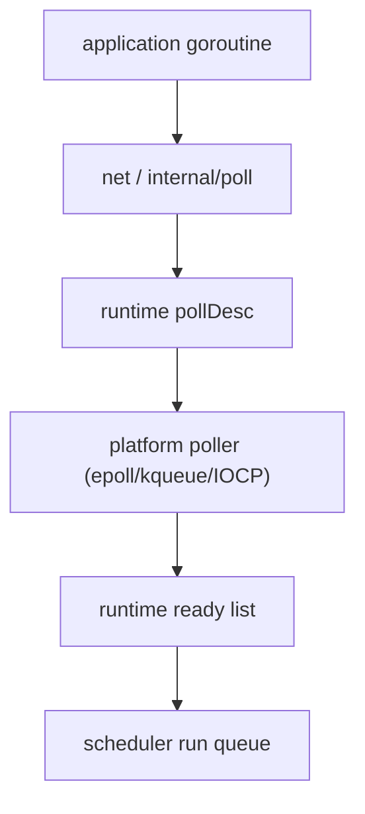

# Netpoller, 타이머, 그리고 Syscall

Go에서 `goroutine-per-connection`이 실용적인 가장 깊은 이유 중 하나는, 네트워크 I/O가 "socket 하나 막히면 OS thread 하나가 영원히 묶인다"는 모델이 아니기 때문입니다.

런타임 안에는 통합된 network poller가 있습니다.

:::tip Quick takeaway
Netpoller는 OS 수준의 readiness 이벤트를 runnable goroutine으로 바꾸는 다리입니다. Go 코드가 blocking처럼 보여도 프로세스 전체는 계속 굴러가게 만드는 핵심 메커니즘입니다.
:::

## 머릿속 모델



애플리케이션은 `Read`, `Write`, `Accept`를 직접 호출하는 것처럼 보이지만, 아래에서는 readiness notification과 goroutine park/wakeup이 연결됩니다.

## 핵심 런타임 객체: `pollDesc`

`runtime/netpoll.go`의 `pollDesc`는 다음을 같이 관리합니다.

- read waiter,
- write waiter,
- deadline timer,
- descriptor state,
- stale fd reuse 방지용 sequence.

즉, 단순히 "readable 여부"만 기록하는 구조가 아닙니다.

## 단순화한 내부 스케치

```go
func runtimePollWait(pd *pollDesc, mode int) error {
	for {
		if ready(mode, pd) {
			return nil
		}
		if deadlineExpired(pd, mode) {
			return ErrTimeout
		}
		parkCurrentGOn(pd, mode)
	}
}

func netpollLoop() {
	readyList := platformNetpoll()
	for g := range readyList {
		injectIntoRunQueue(g)
	}
}
```

실제 구현은 lost wakeup, timeout race, stale fd event, 플랫폼 차이를 모두 처리해야 하므로 훨씬 복잡합니다.

## 왜 timer도 여기와 붙어 있나

goroutine이 read readiness를 기다리며 block 되어 있을 때, 그 goroutine을 깨울 수 있는 것은 두 종류뿐입니다.

- OS readiness event
- deadline 만료

그래서 runtime 입장에서는 netpoll과 timer가 따로 노는 기능이 아니라, 같은 "wake up source" 체계 안에 있습니다.

## 진짜 blocking syscall은 어떻게 되나

모든 block이 netpoller를 타는 것은 아닙니다.

어떤 goroutine이 진짜 blocking syscall에 들어가면:

- 현재 `M`은 Go 코드를 실행하지 못할 수 있고,
- runtime은 `P`를 떼어내 다른 `M`에 붙일 수 있으며,
- 다른 goroutine들은 그 `P`를 통해 계속 진행할 수 있습니다.

이 차이는 중요합니다.

- 네트워크 I/O는 poller와 잘 통합되고,
- 임의 syscall이나 cgo는 런타임이 덜 우아하게 다룰 수 있습니다.

## 왜 goroutine-per-connection이 가능한가

이 설계 덕분에 Go는 강한 착시를 제공합니다.

- 애플리케이션 코드는 direct style로 쓰고,
- I/O 대기 중인 goroutine은 park되며,
- readiness event가 오면 다시 runnable 상태로 돌아옵니다.

물론 이것이 자동 확장을 뜻하지는 않습니다. 여전히 필요합니다.

- backpressure,
- connection limit,
- bounded fan-out,
- timeout,
- cancellation discipline.

## 운영에서 체감되는 결과

### deadline은 장식이 아니다

deadline이 없으면 goroutine은 I/O에서 영원히 park될 수 있습니다.

규모가 커지면 이는 곧:

- goroutine 수 증가,
- 메모리 retention,
- shutdown 복잡도 증가

로 이어집니다.

### cgo는 다른 세계다

런타임은 Go가 직접 관리하는 pollable fd처럼 cgo block을 우아하게 다루지 못합니다.

### trace로 보면 훨씬 선명하다

`go tool trace`를 보면 goroutine이 netpoll에 막힌 것인지, syscall에 막힌 것인지, scheduler에서 밀리고 있는지 구분할 수 있습니다.

## 런타임 소스 포인터

- [runtime/netpoll.go](https://github.com/golang/go/blob/go1.26.0/src/runtime/netpoll.go)
- [runtime/netpoll_epoll.go](https://github.com/golang/go/blob/go1.26.0/src/runtime/netpoll_epoll.go)
- [runtime/netpoll_kqueue.go](https://github.com/golang/go/blob/go1.26.0/src/runtime/netpoll_kqueue.go)
- [runtime/time.go](https://github.com/golang/go/blob/go1.26.0/src/runtime/time.go)
- [internal/poll/fd_unix.go](https://github.com/golang/go/blob/go1.26.0/src/internal/poll/fd_unix.go)

## 어떻게 관측할까

- `go test -trace=trace.out ./...`
- `go tool trace trace.out`
- `GODEBUG=schedtrace=1000,scheddetail=1`
- connection / timeout 관련 서비스 메트릭

## Practical takeaway

Netpoller는 Go I/O 구현의 부가 기능이 아니라 동시성 모델의 핵심입니다.

OS readiness를 goroutine scheduling으로 연결해 주기 때문에, direct-style 코드와 scalable I/O가 동시에 가능합니다.
