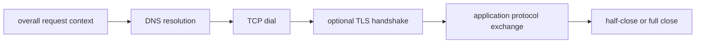
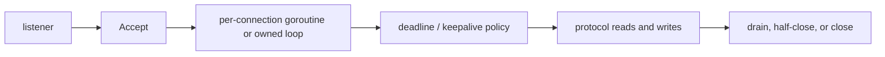

# Go에서의 TCP, DNS, 그리고 Connection Lifecycle

프로덕션 네트워크 버그의 상당수는 문법을 몰라서 생기지 않습니다.

대신 lifecycle 모델이 틀려서 생깁니다.

- DNS가 언제 일어나는지 모름
- `DialContext`가 이후 `Read`/`Write`까지 보호한다고 생각
- `net.Conn`을 byte stream이 아니라 message API처럼 사용
- listener, deadline, shutdown의 owner를 구분하지 않음

:::tip Quick takeaway
하나의 큰 네트워크 호출로 보지 말고, resolve -> dial -> handshake -> exchange -> half-close 또는 full close 라는 단계로 보십시오. 각 단계마다 timeout, owner, failure mode가 다릅니다.
:::

## Mental model



인바운드 트래픽은 listener에서 시작한다는 점만 다릅니다.



이 단계들이 중요한 이유는 레이어가 다르기 때문입니다.

- DNS는 `net.Resolver`
- socket establish는 `net.Dialer`
- connection I/O는 `net.Conn`
- deadline은 `SetDeadline`
- scheduler wakeup은 netpoll
- teardown은 close 혹은 커널 상태 전이

가 담당합니다.

## 실전 코드 스케치

```go
func exchange(ctx context.Context, endpoint string, request []byte) ([]byte, error) {
	dialer := net.Dialer{
		Timeout:   150 * time.Millisecond,
		KeepAlive: 30 * time.Second,
	}

	conn, err := dialer.DialContext(ctx, "tcp", endpoint)
	if err != nil {
		return nil, err
	}
	defer conn.Close()

	if err := conn.SetDeadline(time.Now().Add(200 * time.Millisecond)); err != nil {
		return nil, err
	}

	if _, err := conn.Write(request); err != nil {
		return nil, err
	}

	reply := make([]byte, 4096)
	n, err := conn.Read(reply)
	if err != nil {
		return nil, err
	}
	return reply[:n], nil
}
```

중요한 건 구분입니다.

- `DialContext`는 resolution + connect budget
- `KeepAlive`는 TCP idle peer 감지 정책
- `SetDeadline`은 이미 열린 socket의 이후 I/O budget

입니다.

## Listener ownership이 첫 번째 경계다

`Accept` loop는 너무 쉽게 쓰이고, 그래서 아주 오래 남습니다.

진짜 중요한 건 `Accept` 자체가 아니라 다음입니다.

- 누가 loop를 멈추는가
- 누가 listener를 닫는가
- 누가 per-connection goroutine을 소유하는가
- 누가 socket deadline을 넣는가
- 누가 partial client를 drain하거나 버리는가

단순화하면 이런 모양입니다.

```go
for {
	conn, err := ln.Accept()
	if err != nil {
		if shuttingDown(err) {
			return nil
		}
		continue
	}

	go func(c net.Conn) {
		defer c.Close()
		_ = c.SetDeadline(time.Now().Add(30 * time.Second))
		handleConn(c)
	}(conn)
}
```

이 코드는 주변 시스템이 shutdown, admission, deadline 정책까지 같이 정의할 때만 안전합니다.

## `net.Conn`은 message queue가 아니라 byte stream이다

이 부분이 가장 흔한 오해입니다.

`Read`, `Write`는 부분 완료가 가능합니다.

- 한 번의 `Read`가 logical frame 절반만 줄 수 있고
- 한 번의 `Write`가 버퍼 일부만 받아들일 수 있으며
- 반대편은 write 방향만 닫을 수 있고
- EOF는 application-level “done” 메시지와 다릅니다

message semantics가 필요하면 framing을 직접 정의해야 합니다. 이 트랙에서 추가한 [`examples/tcpprotocol`](https://github.com/jaeyoung0509/golang-handbook/tree/develop/examples/tcpprotocol) 예제가 바로 그 패턴입니다.

## Half-close는 실제로 유용하다

TCP에서는 `*net.TCPConn`에 다음 메서드가 있습니다.

- `CloseRead`
- `CloseWrite`

이건 “request body는 다 보냈지만 response는 계속 받아야 하는” 프로토콜에서 중요합니다. full `Close`만 쓰면 이런 phase를 표현하기 어렵습니다.

## DNS도 request latency 일부다

아직도 많은 팀이 resolution을 눈에 안 보이는 준비 단계처럼 다룹니다.

하지만 Go에서는 dial 과정에 명시적으로 포함됩니다.

- `DialContext`는 hostname resolution 후 connect를 시도할 수 있고
- `Resolver`는 환경에 따라 pure Go resolver 혹은 cgo/native resolution을 사용하며
- cgo resolution이 막히면 OS thread를 소비할 수 있습니다

실무 규칙은 간단합니다.

- DNS 시간을 request budget 일부로 본다
- connect timeout을 “DNS 이후 네트워크만”으로 생각하지 않는다
- resolver 선택이 의심스러우면 `GODEBUG=netdns=go+2`를 쓴다
- resolution이 끝난 뒤 주소 표현은 `netip.AddrPort` 같은 value type으로 다룬다

## Dial budget은 I/O budget이 아니다

이 구분은 몇 번을 강조해도 지나치지 않습니다.

`DialContext`는 connection이 열리거나 실패하면 끝납니다. 이후의 `Read`, `Write`를 자동으로 제어하지 않습니다.

그래서 기존 [`examples/dialbudget`](https://github.com/jaeyoung0509/golang-handbook/tree/develop/examples/dialbudget) 예제도 다음 둘을 분리합니다.

1. per-attempt connect budget
2. post-connect exchange deadline

이 둘을 하나의 큰 timeout으로 뭉개면 trace도 흐려지고 failure handling도 나빠집니다.

## Keepalive는 generic health policy가 아니다

`net.Dialer.KeepAlive`는 TCP keepalive 설정이지 다음을 대체하지 않습니다.

- protocol heartbeat
- request timeout
- application-level liveness check
- 상위 transport의 idle connection eviction policy

kernel keepalive는 죽은 peer를 언젠가 발견하게 해줄 뿐, SLA 관점의 건강함을 보장하지 않습니다.

## 런타임/표준 라이브러리 소스 포인터

- [`net/dial.go` `DialContext`](https://github.com/golang/go/blob/go1.26.0/src/net/dial.go#L526)
- [`net/lookup.go` `Resolver`](https://github.com/golang/go/blob/go1.26.0/src/net/lookup.go#L134)
- [`net/tcpsock.go` `TCPConn`](https://github.com/golang/go/blob/go1.26.0/src/net/tcpsock.go#L112)
- [`net/tcpsock.go` `CloseRead`](https://github.com/golang/go/blob/go1.26.0/src/net/tcpsock.go#L186)
- [`net/tcpsock.go` `CloseWrite`](https://github.com/golang/go/blob/go1.26.0/src/net/tcpsock.go#L198)
- [`internal/poll/fd_poll_runtime.go`](https://github.com/golang/go/blob/go1.26.0/src/internal/poll/fd_poll_runtime.go)

표준 라이브러리는 이미 경계를 분리해두고 있습니다.

- resolution
- dialing
- socket operation
- deadline과 netpoll의 통합

애플리케이션 코드는 이 경계를 흐리지 않는 쪽으로 써야 합니다.

## 실패 패턴

### `DialContext`가 이후 `Read`/`Write`까지 지켜준다고 생각

```go
conn, _ := dialer.DialContext(ctx, "tcp", addr)
_, _ = conn.Read(buf) // bad: read deadline이 없으면 무제한
```

### `Read` 한 번을 메시지 한 개라고 생각

```go
n, _ := conn.Read(buf)
handleMessage(buf[:n]) // bad: frame 일부일 수 있음
```

### shutdown 중에도 listener가 계속 Accept

```go
for {
	conn, _ := ln.Accept()
	go handle(conn)
}
```

stop contract가 전혀 드러나지 않습니다.

### half-close가 필요한 프로토콜에서 full close만 사용

request 종료와 response 대기를 분리해야 하는 프로토콜이라면 full `Close`만으로는 표현이 거칠어집니다.

## 어떻게 관측하고 디버깅할까

- blocked socket의 런타임 측면은 [Netpoller, 타이머, 그리고 Syscall](/ko/fundamentals/netpoller-timers-syscalls)에서 이어집니다.
- resolver 선택과 lookup 동작은 `GODEBUG=netdns=go+2`로 확인합니다.
- DNS, connect, TLS, application exchange를 각각 다른 span 혹은 metric으로 봅니다.
- 테스트에서는 `net.Pipe`로 framing과 deadline을 결정적으로 검증합니다.
- 운영에서는 socket metric, timeout count, connection churn을 따로 봅니다.

## 프로덕션에서의 의미

resolution, connect, handshake, application I/O, teardown 경계를 이름 붙여 말할 수 없다면 결국 잘못된 단계를 디버깅하게 됩니다.

## Practical takeaway

lifecycle을 먼저 배우고 그 위에 protocol을 올리십시오.

다음으로는 [net.Conn과 bufio로 프로토콜 설계하기](/ko/stdlib/protocol-design-net-conn-bufio)에서 byte stream 위에 안전한 프로토콜을 얹는 법을 보고, 운영 쪽은 [프로덕션에서 Go 네트워크 서비스 디버깅하기](/ko/production/debugging-go-network-services)로 이어가면 됩니다.
