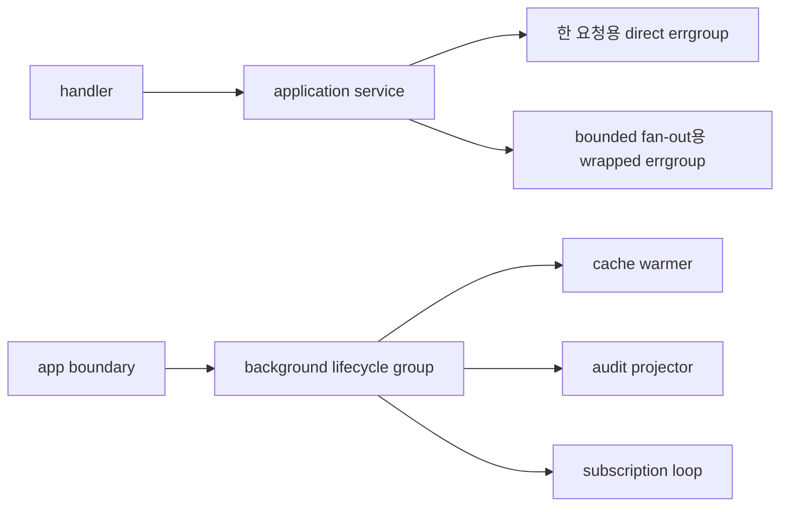

# 애플리케이션 레이어 병렬 호출

실제 Go 서비스의 application 또는 use-case 레이어는 여러 다운스트림을 병렬로 호출해야 하는 경우가 많습니다.

- partner config,
- risk rule,
- balance,
- inventory,
- pricing,
- entitlement 또는 policy check.

문제는 goroutine을 써도 되느냐가 아닙니다.

진짜 문제는 그 병렬 작업에 어떤 lifetime contract를 줄 것인가입니다.

:::tip Quick takeaway
작고 유한한 sibling task를 가진 단일 요청에는 직접 `errgroup`를 쓰는 것이 기본값입니다. 팀이 `Go(ctx)` 형태, 공통 limit 정책, tracing, helper 메서드를 원하면 얇은 `errgroup` 래퍼를 둡니다. 오래 사는 background loop에는 `WaitGroup` 자체보다 lifecycle wrapper를 두는 편이 맞습니다.
:::

구체적인 코드는 [`examples/appparallel`](https://github.com/jaeyoung0509/golang-handbook/tree/develop/examples/appparallel)에서 볼 수 있습니다.

## 머릿속 모델



애플리케이션 레이어는 다음을 결정하는 곳입니다.

- 어떤 호출들이 함께 성공하거나 실패해야 하는지,
- 첫 오류가 sibling을 취소해야 하는지,
- 어떤 goroutine이 request-scoped인지,
- 어떤 goroutine이 프로세스 자체에 속하는지.

그래서 concurrency policy는 임의의 helper 안에 숨기기보다 application layer에 드러나는 편이 맞습니다.

## 왜 큰 코드베이스는 `errgroup`과 `WaitGroup`을 래핑할까

큰 Go 코드베이스가 이 프리미티브를 래핑하는 이유는 원본이 나빠서가 아닙니다.

원본 프리미티브가 의도적으로 작고, 로컬 서비스 정책을 담고 있지 않기 때문입니다.

raw `errgroup`가 주는 것:

- child goroutine 시작,
- parent-derived cancellation,
- 하나의 `Wait`,
- `SetLimit`을 통한 bounded parallelism.

raw `sync.WaitGroup`가 주는 것:

- 카운터,
- 사실상 그뿐입니다.

raw 프리미티브가 직접 표현하지 않는 것:

- 명시적인 context ownership,
- shutdown 시작 후 새 작업 거부,
- 표준 logging/tracing hook,
- panic policy,
- spawn-and-wait helper 형태,
- stop-signal convention,
- request lifetime과 service lifetime의 구분.

그래서 실제 시스템에서는 래퍼가 등장합니다.

## 오픈소스 source pointer

좋은 예시는 세 가지입니다.

- [CockroachDB `ctxgroup`](https://github.com/cockroachdb/cockroach/blob/master/pkg/util/ctxgroup/ctxgroup.go): `errgroup` 위에 얇게 올린 래퍼로, `GoCtx(func(ctx context.Context) error)`처럼 context 전달을 명시적으로 만들고 `GoAndWait` 같은 helper를 제공합니다.
- [CockroachDB `stop.Stopper`](https://github.com/cockroachdb/cockroach/blob/master/pkg/util/stop/stopper.go): quiescing 중 새 작업을 거부하고, task를 기다리고, goroutine 관리를 서비스 shutdown 계약의 일부로 취급하는 더 무거운 lifecycle wrapper입니다.
- [Kubernetes `wait.Group`](https://github.com/kubernetes/apimachinery/blob/master/pkg/util/wait/wait.go): `sync.WaitGroup` 위에 `Start`, `StartWithContext`, `StartWithChannel`을 추가해서 goroutine 시작 규약을 통일한 얇은 래퍼입니다.

중요한 것은 정확히 같은 API를 복제하는 일이 아닙니다.

중요한 것은 프로젝트별 invariant를 한 번만 정의하고, 모든 호출 지점이 매번 기억에 의존하지 않게 만드는 것입니다.

## 시나리오 1: 한 요청에는 직접 `errgroup`

이것이 request-scoped fan-out의 기본값입니다.

다음 조건이면 잘 맞습니다.

- task 집합이 유한하고,
- 하나의 요청 또는 하나의 use case에 속하고,
- 하나의 실패가 sibling 취소로 이어져야 하고,
- handler가 반환되기 전에 child work가 모두 끝나야 할 때.

예제 패키지의 `LoadCheckoutSnapshot`은 partner config, risk, balance를 직접 `errgroup`로 fan-out합니다.

```go
func LoadCheckoutSnapshot(ctx context.Context, req CheckoutRequest, deps Dependencies) (CheckoutSnapshot, error) {
	group, groupCtx := errgroup.WithContext(ctx)

	var partner PartnerConfig
	var risk RiskDecision
	var balance BalanceSnapshot

	group.Go(func() error {
		result, err := deps.PartnerConfigs.LoadPartnerConfig(groupCtx, req.PartnerID)
		if err != nil {
			return fmt.Errorf("load partner config: %w", err)
		}
		partner = result
		return nil
	})

	group.Go(func() error {
		result, err := deps.Risk.EvaluateRisk(groupCtx, req)
		if err != nil {
			return fmt.Errorf("evaluate risk: %w", err)
		}
		risk = result
		return nil
	})

	group.Go(func() error {
		result, err := deps.Balances.LoadBalance(groupCtx, req.UserID)
		if err != nil {
			return fmt.Errorf("load balance: %w", err)
		}
		balance = result
		return nil
	})

	if err := group.Wait(); err != nil {
		return CheckoutSnapshot{}, err
	}

	return CheckoutSnapshot{
		UserID:    req.UserID,
		PartnerID: req.PartnerID,
		Partner:   partner,
		Risk:      risk,
		Balance:   balance,
	}, nil
}
```

이게 좋은 기본값인 이유:

- lifetime이 명확하고,
- cancellation이 자동으로 전파되고,
- handler가 작업이 끝나기 전에 먼저 반환될 수 없습니다.

즉, use case가 “세 개의 다운스트림을 병렬 호출해서 결과를 합친다” 정도라면 먼저 framework를 만들 필요가 없습니다.

## 시나리오 2: 팀 공통 request fan-out 형태가 필요하면 `errgroup`을 래핑

이 시점부터 큰 서비스들이 `errgroup`을 래핑하기 시작합니다.

대표적인 이유:

- `group, ctx := errgroup.WithContext(ctx)`에서 생기는 shadowing 실수를 줄이고 싶다.
- `SetLimit` 정책을 표준화하고 싶다.
- 파생된 context를 모든 task에 명시적으로 넘기고 싶다.
- tracing, metrics, logging, panic normalization을 한곳에 넣고 싶다.
- `RunAll`, `GoCtx`, `GoAndWait` 같은 helper 형태를 만들고 싶다.

예제 패키지에는 `TaskGroup`이라는 얇은 래퍼가 있습니다.

```go
type TaskGroup struct {
	ctx   context.Context
	group *errgroup.Group
}

func NewTaskGroup(ctx context.Context, limit int) (*TaskGroup, error) {
	group, childCtx := errgroup.WithContext(ctx)
	group.SetLimit(limit)

	return &TaskGroup{
		ctx:   childCtx,
		group: group,
	}, nil
}

func (g *TaskGroup) Go(fn func(context.Context) error) {
	g.group.Go(func() error {
		return fn(g.ctx)
	})
}
```

이 래퍼는 근본 모델을 바꾸지 않습니다.

대신 호출 지점의 discipline을 바꿉니다.

배치 예제는 이를 이용해 partner fan-out에 bounded parallelism을 겁니다.

```go
group, err := NewTaskGroup(ctx, limit)
if err != nil {
	return nil, err
}

for index, partnerID := range partnerIDs {
	index := index
	partnerID := partnerID

	group.Go(func(ctx context.Context) error {
		summary, err := fetch.FetchPartnerSummary(ctx, partnerID)
		if err != nil {
			return fmt.Errorf("fetch partner %s: %w", partnerID, err)
		}
		results[index] = summary
		return nil
	})
}

if err := group.Wait(); err != nil {
	return nil, err
}
```

잘 맞는 경우:

- request-scoped batch read,
- 많은 ID를 대상으로 한 bounded fan-out,
- use case마다 같은 동시성 형태를 반복하는 팀,
- 공통 instrumentation과 limit 정책이 필요한 경우.

CockroachDB `ctxgroup`도 같은 압력에서 나옵니다. `errgroup` 의미는 유지하되, context와 helper 계약을 더 명시적으로 만드는 것입니다.

## 시나리오 3: 오래 사는 background task에는 `WaitGroup`이 아니라 lifecycle wrapper

`sync.WaitGroup`은 request fan-out 프리미티브가 아닙니다.

다음이 없습니다.

- error propagation,
- derived context,
- shutdown contract,
- admission control,
- cancellation semantics.

그래서 raw `WaitGroup`은 request-scoped application code 안에서 대개 맞지 않습니다.

반대로 프로세스에 속한 오래 사는 background 작업에는 맞는 자리가 있습니다.

- cache warmer,
- audit projector,
- subscription loop,
- periodic refresher,
- controller 또는 watcher loop.

이 경우 진짜 필요한 것은 fail-fast error aggregation이 아니라 lifecycle management입니다.

예제 패키지는 `WaitGroup`과 owned cancellation을 합친 `BackgroundGroup`을 사용합니다.

```go
type BackgroundGroup struct {
	ctx    context.Context
	cancel context.CancelFunc

	mu     sync.Mutex
	closed bool
	wg     sync.WaitGroup
}

func (g *BackgroundGroup) Go(fn func(context.Context)) error {
	g.mu.Lock()
	if g.closed {
		g.mu.Unlock()
		return ErrClosed
	}
	g.wg.Add(1)
	g.mu.Unlock()

	go func() {
		defer g.wg.Done()
		fn(g.ctx)
	}()

	return nil
}

func (g *BackgroundGroup) Shutdown(ctx context.Context) error {
	g.mu.Lock()
	if !g.closed {
		g.closed = true
		g.cancel()
	}
	g.mu.Unlock()

	done := make(chan struct{})
	go func() {
		defer close(done)
		g.wg.Wait()
	}()

	select {
	case <-done:
		return nil
	case <-ctx.Done():
		return ctx.Err()
	}
}
```

Kubernetes가 `WaitGroup` 위에 `StartWithContext`를 얹는 이유도, CockroachDB가 훨씬 더 무거운 `Stopper`를 두는 이유도 결국 이 lifecycle pressure 때문입니다.

## 시나리오별 선택표

| 시나리오 | 기본 추천 | 이유 |
| --- | --- | --- |
| 하나의 요청 안에서 세 개에서 여섯 개 정도의 sibling downstream 호출 | 직접 `errgroup.WithContext` | fail-fast cancellation과 단일 wait point가 정확히 필요한 계약이기 때문입니다. |
| 하나의 요청이지만 많은 ID를 bounded batch로 fan-out | `SetLimit`이 들어간 얇은 `errgroup` 래퍼 | 같은 fail-fast 모델을 유지하면서 context, limit, instrumentation을 통일할 수 있습니다. |
| 프로세스가 소유한 background worker | `WaitGroup` 기반 lifecycle wrapper | 중요한 것은 start, stop, reject-new-work, wait-for-exit 계약입니다. |
| 서비스 startup component가 clean quiescing을 해야 할 때 | lifecycle wrapper 또는 stopper 스타일 abstraction | 단순 카운트보다 shutdown policy와 admission control이 더 중요합니다. |
| 하나의 실패가 나도 나머지를 끝까지 모아야 하는 partial-success fan-out | result collector 또는 worker-pool 스타일 orchestration | fail-fast `errgroup`의 의미론이 맞지 않습니다. |
| 요청에서 파생된 best-effort side effect | durable queue, outbox, 또는 owned background subsystem | detached request goroutine은 leak과 shutdown bug를 만들기 쉽습니다. |

## 피해야 할 실패 패턴

### 1. request fan-out에 raw `WaitGroup`

```go
var wg sync.WaitGroup
var risk RiskDecision
var balance BalanceSnapshot

wg.Add(2)
go func() {
	defer wg.Done()
	risk, _ = riskClient.EvaluateRisk(ctx, req)
}()
go func() {
	defer wg.Done()
	balance, _ = balanceClient.LoadBalance(ctx, req.UserID)
}()
wg.Wait()
```

컴파일은 되지만, 이제 first-error policy도 없고 sibling cancellation도 없고 실패를 어떻게 반환할지도 불명확합니다.

### 2. application layer 안에서 fire-and-forget

```go
go auditSink.Write(context.Background(), event)
```

이제 이 작업은 request-scoped도 아니고, 그렇다고 process-scoped ownership이 명확한 것도 아닙니다.

이런 코드가 결국 leak과 정체 모를 shutdown 버그를 만듭니다.

### 3. request lifetime과 process lifetime을 같은 추상화에 섞기

같은 helper 타입을 다음 둘에 같이 쓰지 않는 편이 좋습니다.

- handler가 반환되기 전에 반드시 끝나야 하는 request fan-out,
- 어떤 단일 요청보다 오래 사는 background loop.

둘은 다른 lifetime contract입니다.

## 인터뷰에서 이렇게 말하면 좋다

강한 답변은 보통 이 정도입니다.

1. “한 요청에서 유한한 sibling call을 병렬화할 때는 `errgroup.WithContext`를 직접 씁니다.”
2. “팀이 같은 bounded fan-out 형태를 반복하면 `errgroup`을 래핑해서 context 전달, limit, instrumentation을 표준화합니다.”
3. “서비스가 소유한 오래 사는 goroutine에는 `WaitGroup`을 request primitive처럼 쓰지 않고, shutdown ownership과 새 작업 거부가 들어간 lifecycle wrapper를 둡니다.”

여러 패키지 이름을 나열하는 것보다, lifetime semantics를 설명하는 편이 훨씬 낫습니다.

## 같이 읽으면 좋은 페이지

- [깔끔한 Go 서비스 기본기](/ko/guide/clean-go-service-basics)
- [구조화된 동시성](/ko/advanced/structured-concurrency)
- [Graceful Shutdown](/ko/patterns/graceful-shutdown)
- [Leak, Shutdown, Timeout 테스트](/ko/testing/leaks-and-shutdowns)
