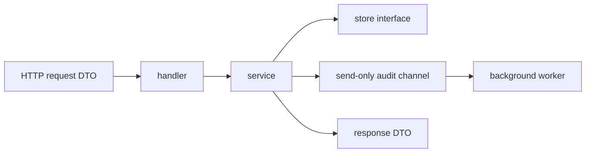

# 깔끔한 Go 서비스 기본기

FastAPI, Spring, NestJS 쪽에 익숙하다면 Go에서도 가장 깔끔한 스타일은 “비슷한 큰 프레임워크를 찾아서 마법처럼 쓰는 것”이라고 생각하기 쉽습니다.

하지만 보통 Go에서 더 깔끔한 스타일은 다음입니다.

- explicit wiring
- consumer 가까이에 둔 작은 interface
- transport edge에만 있는 DTO
- plain Go type 중심의 service
- 메인 프로그램에 포함된 graceful shutdown

:::tip Quick takeaway
인터뷰 답변용으로는 `handler -> service -> store`, edge DTO, 전체 call chain의 `context.Context`, channel direction으로 드러나는 ownership, `http.Server.Shutdown` 기반 graceful exit를 기본 답으로 가져가면 좋습니다.
:::

## Mental model



이 구조의 구체적인 예시는 [`examples/cleanservice`](https://github.com/jaeyoung0509/golang-handbook/tree/develop/examples/cleanservice)에서 볼 수 있습니다.

## 1. DTO는 transport edge에 둔다

가장 흔한 설계 실수 중 하나는 HTTP/JSON 모양의 struct를 애플리케이션 전체로 끌고 다니는 것입니다.

더 깔끔한 경계는 이렇습니다.

- handler에 request DTO
- service 내부에는 domain 혹은 service input
- 응답 직전에 response DTO

```go
type CreatePaymentRequest struct {
	PartnerID string `json:"partner_id"`
	Amount    int    `json:"amount"`
	Currency  string `json:"currency"`
}

type Payment struct {
	ID        string
	PartnerID string
	Amount    int
	Currency  string
	CreatedAt time.Time
}
```

이 방식이 더 나은 이유:

- transport concern이 edge에만 남고
- service code가 JSON tag에 의존하지 않으며
- 테스트가 plain type 중심으로 단순해집니다

## 2. interface는 consumer 가까이에 둔다

Go에서는 보통 interface를 구현체 쪽이 아니라 소비하는 쪽에 둡니다.

```go
type PaymentStore interface {
	Save(context.Context, Payment) error
}

type Service struct {
	store PaymentStore
}
```

미리 큰 `repository` 패키지를 만들어 speculative interface를 쌓는 것보다 이 편이 더 Go답습니다.

인터뷰에서 기억할 답:

“Go에서는 작은 interface를 보통 consumer package에 둡니다. dependency shape를 실제로 소유하는 쪽이 consumer이기 때문입니다.”

## 3. `context.Context`는 call chain 전체에 흘린다

기본 규칙은 이렇습니다.

- handler는 `r.Context()`를 받고
- service는 첫 번째 인자로 `ctx`를 받으며
- store와 outbound call도 같은 context를 받습니다

```go
func (s Service) CreatePayment(ctx context.Context, req CreatePaymentRequest) (PaymentResponse, error) {
	// validation
	// store.Save(ctx, ...)
	// outbound calls with ctx
}
```

request-scoped code에서 `context.Background()`나 global lifetime을 몰래 쓰지 않는 것이 기본입니다.

## 4. channel direction으로 ownership을 드러낸다

작은 문법이지만 API를 훨씬 읽기 좋게 만듭니다.

```go
type Service struct {
	audit chan<- AuditEvent
}

func drainAudit(events <-chan AuditEvent, sink AuditSink) {
	for event := range events {
		_ = sink.Write(context.Background(), event)
	}
}
```

이렇게 쓰면 의도가 바로 드러납니다.

- service는 send만 할 수 있고
- worker는 receive만 할 수 있습니다

`chan AuditEvent`를 여기저기 넘기며 ownership을 추측하게 만드는 것보다 훨씬 낫습니다.

## 5. handler는 얇게 유지한다

HTTP handler는 보통 네 가지만 하면 됩니다.

1. request DTO decode/validate
2. service 호출
3. service error를 HTTP status로 매핑
4. response DTO encode

그 정도면 충분합니다.

handler가 business branching, persistence logic, retry, background coordination까지 다 해버리면 경계가 이미 너무 넓어진 것입니다.

## 6. graceful shutdown은 app boundary 책임이다

graceful shutdown은 대개 service layer 책임이 아니라 application 책임입니다.

깔끔한 형태는 대략 이렇습니다.

```go
ctx, stop := signal.NotifyContext(context.Background(), os.Interrupt, syscall.SIGTERM)
defer stop()

go func() {
	<-ctx.Done()

	shutdownCtx, cancel := context.WithTimeout(context.Background(), 10*time.Second)
	defer cancel()

	_ = server.Shutdown(shutdownCtx)
}()
```

[`examples/cleanservice`](https://github.com/jaeyoung0509/golang-handbook/tree/develop/examples/cleanservice) 예제는 여기서 한 단계 더 가서, HTTP 서버가 새 요청을 멈춘 뒤 audit worker까지 drain합니다.

동시성 패턴 관점에서 더 깊게 보려면 [Graceful Shutdown](/ko/patterns/graceful-shutdown) 문서를 같이 읽으면 됩니다.

## 7. validation은 일찍, error mapping은 edge에서

좋은 Go 서비스 코드는 보통 boundary 가까이에서 validation을 하고, 위로는 ordinary error를 반환합니다.

```go
var ErrPartnerIDRequired = errors.New("partner_id is required")

switch {
case errors.Is(err, ErrPartnerIDRequired):
	writeJSON(w, http.StatusBadRequest, map[string]string{"error": err.Error()})
default:
	writeJSON(w, http.StatusInternalServerError, map[string]string{"error": "internal server error"})
}
```

이 패턴의 장점은:

- service 안에서는 business error가 읽기 쉽고
- handler에서는 protocol mapping이 명확하며
- 프레임워크성 hidden behavior가 줄어든다는 점입니다

## 8. framework magic보다 explicit construction

Go 서비스는 dependency가 눈에 보일수록 깔끔해집니다.

```go
app := NewApp(":8080", Dependencies{
	Store:     store,
	IDs:       ids,
	AuditSink: auditSink,
	Now:       time.Now,
})
```

이게 Go 서비스가 프레임워크 중심 시스템보다 “가볍게” 느껴지는 이유 중 하나입니다. construction이 지루할 만큼 명시적이라는 건 보통 장점입니다.

## 추천 패키지 구조

적당한 크기의 API 서비스라면 이 정도면 충분합니다.

```text
internal/
  payments/
    service.go
    handler.go
    dto.go
    store.go
cmd/api/
  main.go
```

처음부터 거대한 hexagonal folder tree가 필요한 건 아닙니다.

정말 필요한 것은:

- 분명한 edge
- 분명한 service boundary
- explicit dependency wiring
- 중요한 동작을 증명하는 테스트

입니다.

## 인터뷰 체크리스트

“Go 백엔드 서비스를 어떻게 구조화하나요?”라는 질문에는 이렇게 답하면 강합니다.

- DTO는 HTTP 혹은 message boundary에 둡니다.
- 비즈니스 로직은 plain Go type 중심의 service layer에 둡니다.
- interface는 작게 만들고 consumer 가까이에 둡니다.
- `context.Context`는 request-scoped dependency 전체로 전달합니다.
- ownership이 중요하면 channel direction을 사용합니다.
- graceful shutdown은 deadline을 둔 `http.Server.Shutdown`으로 처리합니다.
- error는 service에서 wrap하고, protocol status 매핑은 edge에서 합니다.

## Practical takeaway

FastAPI 같은 마법이 없어도 Go 서비스는 충분히 깔끔해질 수 있습니다.

필요한 것은 더 날카로운 경계, 더 작은 interface, 더 명시적인 lifecycle ownership입니다.
