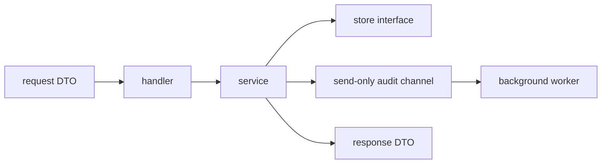

# 깔끔한 Go 서비스 기본기

FastAPI, Spring, NestJS 쪽에 익숙하다면 Go에서도 “큰 프레임워크를 붙이면 깔끔해질 것”이라고 생각하기 쉽습니다.

하지만 보통 Go에서 더 깔끔한 기본값은 다음입니다.

- explicit wiring
- edge에만 있는 DTO
- 얇은 handler
- plain service
- consumer 가까이에 둔 작은 interface
- app boundary에 둔 graceful shutdown
- ownership이 드러나는 channel

:::tip Quick takeaway
인터뷰 답변용 기본 구조는 `handler -> service -> store`, edge DTO, call chain 전체에 흐르는 `context.Context`, ownership이 보이는 channel, `http.Server.Shutdown` 기반 graceful exit입니다.
:::

이 구조의 실제 예시는 [`examples/cleanservice`](https://github.com/jaeyoung0509/golang-handbook/tree/develop/examples/cleanservice)에서 볼 수 있습니다.

## 먼저 외울 기본 구조



면접에서 “Go API를 어떻게 구조화하나요?”라는 질문을 받으면, 이 그림만 제대로 설명해도 이미 좋은 출발입니다.

## 1. DTO는 transport edge에 둔다

좋지 않은 기본값:

```go
type Payment struct {
	PartnerID string `json:"partner_id"`
	Amount    int    `json:"amount"`
	Currency  string `json:"currency"`
}

func (s Service) CreatePayment(ctx context.Context, payment Payment) error {
	// JSON concern이 service 안까지 들어옴
	return nil
}
```

더 나은 구조:

```go
type CreatePaymentRequest struct {
	PartnerID string `json:"partner_id"`
	Amount    int    `json:"amount"`
	Currency  string `json:"currency"`
}

type Payment struct {
	ID        string
	PartnerID string
	Amount    int
	Currency  string
	CreatedAt time.Time
}

type PaymentResponse struct {
	ID        string `json:"id"`
	PartnerID string `json:"partner_id"`
	Amount    int    `json:"amount"`
	Currency  string `json:"currency"`
	CreatedAt string `json:"created_at"`
}
```

핵심은 이겁니다.

- handler가 request/response DTO를 소유하고
- service는 plain type을 소유합니다

이렇게 해야 transport concern이 애플리케이션 전체로 번지지 않습니다.

## 2. DTO mapping은 작아도 명시적으로 둔다

작은 mapping 함수는 부끄러운 코드가 아니라, 오히려 Go 서비스 코드에서 가장 깔끔한 부분 중 하나입니다.

```go
func toPaymentResponse(payment Payment) PaymentResponse {
	return PaymentResponse{
		ID:        payment.ID,
		PartnerID: payment.PartnerID,
		Amount:    payment.Amount,
		Currency:  payment.Currency,
		CreatedAt: payment.CreatedAt.Format(time.RFC3339),
	}
}
```

이게 다음보다 낫습니다.

- DB model을 그대로 JSON으로 내보내기
- persistence field를 response에 그대로 노출하기
- reflection magic에 숨기기

## 3. interface는 consumer 가까이에 둔다

Go에서는 interface를 보통 구현체 쪽이 아니라 소비하는 쪽에 둡니다.

```go
type PaymentStore interface {
	Save(context.Context, Payment) error
}

type Service struct {
	store PaymentStore
}
```

큰 `repository` 패키지를 만들고 speculative interface를 쌓는 것보다 이 편이 더 Go답습니다.

인터뷰용 한 문장:

“Go에서는 dependency contract를 실제로 소비하는 쪽이 shape를 결정하므로, 작은 interface를 consumer package 가까이에 둡니다.”

## 4. `context.Context`는 request path 전체에 흘린다

기본 규칙은 이렇습니다.

- handler는 `r.Context()`를 쓰고
- service는 첫 번째 인자로 `ctx`를 받고
- store와 outbound call도 같은 context를 받습니다

```go
func (h Handler) createPayment(w http.ResponseWriter, r *http.Request) {
	resp, err := h.service.CreatePayment(r.Context(), req)
	_ = resp
	_ = err
}

func (s Service) CreatePayment(ctx context.Context, req CreatePaymentRequest) (PaymentResponse, error) {
	if err := s.store.Save(ctx, payment); err != nil {
		return PaymentResponse{}, err
	}
	return toPaymentResponse(payment), nil
}
```

request-scoped code에서 이런 식은 피합니다.

```go
func (s Service) CreatePayment(_ context.Context, req CreatePaymentRequest) error {
	return s.store.Save(context.Background(), payment) // bad
}
```

이렇게 하면 caller의 timeout과 cancellation을 잃습니다.

## 5. Channel direction 치트시트

여기서 많이 헷갈리는 게 정상입니다. 짧게 외우면 됩니다.

### 세 가지 형태

| 타입 | 의미 | 이 쪽에서 할 수 있는 일 |
| --- | --- | --- |
| `chan T` | bidirectional | send, receive 둘 다 |
| `chan<- T` | send-only | send만 |
| `<-chan T` | receive-only | receive만 |

### 가장 쉬운 기억법

- `chan<- T`: 내가 `T`를 집어넣는다
- `<-chan T`: 내가 `T`를 꺼내온다

### 최소 예제

```go
func producer(out chan<- int) {
	out <- 1
}

func consumer(in <-chan int) int {
	return <-in
}

func pipe() <-chan int {
	out := make(chan int, 1)
	out <- 42
	close(out)
	return out
}
```

### 왜 이게 유용한가

좋지 않은 예:

```go
func drainAudit(events chan AuditEvent) {
	for event := range events {
		_ = event
	}
}
```

이 함수가 send도 가능한지, receive만 하는지, close owner인지 읽는 사람이 알 수 없습니다.

더 나은 예:

```go
func drainAudit(events <-chan AuditEvent) {
	for event := range events {
		_ = event
	}
}
```

이제 API 자체가 말해줍니다.

- 이 함수는 read만 하고
- write하지 않으며
- sending side owner도 아니다

### 실전 규칙

channel direction은 다음에 특히 유용합니다.

- 함수 파라미터
- ownership을 드러내는 struct field
- producer 스타일의 return type

모든 local variable에 강제로 붙일 필요는 없습니다.

## 6. Handler는 얇게 유지한다

HTTP handler는 보통 네 가지만 하면 충분합니다.

1. request DTO decode/validate
2. service 호출
3. service error를 HTTP status로 매핑
4. response DTO encode

좋은 예:

```go
func (h Handler) createPayment(w http.ResponseWriter, r *http.Request) {
	defer r.Body.Close()

	var req CreatePaymentRequest
	decoder := json.NewDecoder(r.Body)
	decoder.DisallowUnknownFields()
	if err := decoder.Decode(&req); err != nil {
		writeJSON(w, http.StatusBadRequest, map[string]string{"error": "invalid request body"})
		return
	}

	resp, err := h.service.CreatePayment(r.Context(), req)
	if err != nil {
		writeServiceError(w, err)
		return
	}

	writeJSON(w, http.StatusCreated, resp)
}
```

좋지 않은 예:

```go
func createPayment(w http.ResponseWriter, r *http.Request) {
	// decode JSON
	// validate business rules
	// build SQL
	// call external API
	// enqueue audit event
	// map status codes
}
```

이건 경계가 너무 넓습니다.

## 7. Validation은 일찍, error mapping은 edge에서

service는 ordinary Go error를 반환하고,
handler는 그것을 protocol behavior로 바꾸는 식이 깔끔합니다.

```go
var ErrPartnerIDRequired = errors.New("partner_id is required")

func writeServiceError(w http.ResponseWriter, err error) {
	switch {
	case errors.Is(err, ErrPartnerIDRequired):
		writeJSON(w, http.StatusBadRequest, map[string]string{"error": err.Error()})
	default:
		writeJSON(w, http.StatusInternalServerError, map[string]string{"error": "internal server error"})
	}
}
```

이렇게 하면:

- service 안의 business error가 읽기 쉽고
- handler의 protocol mapping도 명확하며
- framework-style hidden behavior가 줄어듭니다

## 8. Framework magic보다 explicit construction

Go 서비스는 dependency가 보일수록 더 깔끔해집니다.

```go
app := NewApp(":8080", Dependencies{
	Store:     store,
	IDs:       ids,
	AuditSink: auditSink,
	Now:       time.Now,
})
```

이게 지루해 보여도 장점입니다.

읽는 사람은 바로 알 수 있습니다.

- 앱이 무엇에 의존하는지
- 무엇이 테스트 대체 가능인지
- wiring이 어디서 일어나는지

## 9. Graceful shutdown은 app boundary 책임이다

graceful shutdown은 보통 service layer가 아니라 application 책임입니다.

```go
ctx, stop := signal.NotifyContext(context.Background(), os.Interrupt, syscall.SIGTERM)
defer stop()

go func() {
	<-ctx.Done()

	shutdownCtx, cancel := context.WithTimeout(context.Background(), 10*time.Second)
	defer cancel()

	_ = server.Shutdown(shutdownCtx)
}()
```

background worker도 소유하고 있다면, 새 작업 수용을 멈춘 뒤 worker도 drain해야 합니다.

```go
func (a *App) Shutdown(ctx context.Context) error {
	if err := a.server.Shutdown(ctx); err != nil {
		return err
	}

	close(a.auditCh)
	a.auditWg.Wait()
	return nil
}
```

더 깊은 동시성 패턴은 [Graceful Shutdown](/ko/patterns/graceful-shutdown) 문서를 같이 보면 됩니다.

## 10. 추천 패키지 구조

적당한 크기의 API 서비스라면 이 정도면 충분합니다.

```text
internal/
  payments/
    dto.go
    handler.go
    service.go
    store.go
cmd/api/
  main.go
```

처음부터 거대한 folder taxonomy가 필요한 건 아닙니다.

정말 중요한 것은:

- 분명한 edge
- 분명한 service boundary
- explicit wiring
- 중요한 동작을 증명하는 테스트

입니다.

## 11. 자주 나오는 기본 실수

### 실수: request work에서 `context.Background()` 사용

```go
func (s Service) CreatePayment(ctx context.Context, req CreatePaymentRequest) error {
	return s.store.Save(context.Background(), payment) // bad
}
```

더 나은 예:

```go
func (s Service) CreatePayment(ctx context.Context, req CreatePaymentRequest) error {
	return s.store.Save(ctx, payment)
}
```

### 실수: 큰 bidirectional channel을 아무 데나 전달

```go
func startAudit(ch chan AuditEvent) { ... } // ownership이 모호함
```

더 나은 예:

```go
func startAudit(in <-chan AuditEvent) { ... }
func emitAudit(out chan<- AuditEvent, event AuditEvent) { out <- event }
```

### 실수: DTO가 비즈니스 코드까지 침투

```go
func (s Service) CreatePayment(ctx context.Context, req http.Request) error { ... }
```

더 나은 예:

```go
func (s Service) CreatePayment(ctx context.Context, req CreatePaymentRequest) (PaymentResponse, error) { ... }
```

### 실수: 시간과 ID를 global로 숨김

```go
func CreatePayment(...) Payment {
	return Payment{ID: uuid.NewString(), CreatedAt: time.Now()}
}
```

더 나은 예:

```go
type IDGenerator interface {
	Next() string
}

type Service struct {
	ids IDGenerator
	now func() time.Time
}
```

이렇게 해야 테스트가 쉬워집니다.

## 12. 인터뷰 체크리스트

“Go 백엔드 서비스를 어떻게 구조화하나요?”라는 질문에는 이렇게 답하면 강합니다.

- DTO는 HTTP 혹은 message boundary에 둡니다.
- 비즈니스 로직은 plain Go type 중심의 service layer에 둡니다.
- interface는 작게 만들고 consumer 가까이에 둡니다.
- `context.Context`는 request-scoped dependency 전체로 전달합니다.
- ownership이 중요하면 channel direction을 사용합니다.
- graceful shutdown은 deadline을 둔 `http.Server.Shutdown`으로 처리합니다.
- error는 service에서 반환하고, protocol status 매핑은 edge에서 합니다.
- constructor에서 dependency를 명시적으로 wiring하고 global state는 줄입니다.

## Practical takeaway

FastAPI 같은 마법이 없어도 Go 서비스는 충분히 깔끔해질 수 있습니다.

필요한 것은 더 날카로운 경계, 더 작은 interface, 더 명시적인 lifecycle ownership, 그리고 압박 상황에서도 바로 떠올릴 수 있을 만큼 짧고 많은 코드 스니펫입니다.
