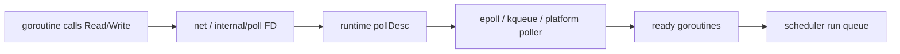
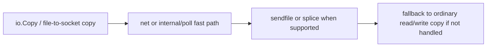

# Kernel I/O Paths: netpoll, epoll/kqueue, 그리고 Zero-Copy

표준 라이브러리는 socket I/O를 꽤 편안한 blocking API처럼 보이게 만듭니다.

커널은 그렇지 않습니다.

이 페이지는 그 사이 레이어를 다룹니다. 즉 socket operation이 kernel readiness API 위에서 어떻게 움직이는지, `pollDesc`가 어떤 경계인지, 그리고 대용량 copy가 언제 `sendfile`이나 `splice` fast path를 탈 수 있는지를 봅니다.

## Mental model



bulk copy 쪽에는 별도 fast path가 있습니다.



## Readiness는 throughput 증명이 아니다

epoll, kqueue 같은 readiness API는 한 가지 질문에 답합니다.

“지금 이 descriptor에 이 작업을 걸면 block 없이 진행 가능한가?”

하지만 다음 질문에는 답하지 않습니다.

- readiness 뒤에 application work가 얼마나 남았는가
- user-space parsing 비용이 얼마나 되는가
- TLS encryption, decompression이 얼마나 남았는가
- 디스크나 downstream latency가 그 뒤에 얼마나 있는가

그래서 readiness와 end-to-end throughput을 혼동하면 병목을 잘못 짚게 됩니다.

## `pollDesc` 경계

Go 런타임과 `internal/poll`은 poll descriptor를 중심으로 협력합니다.

고수준에서 보면 여기에 들어 있는 것은:

- descriptor identity와 lifecycle state
- read/write waiter state
- deadline association
- stale descriptor reuse가 잘못된 goroutine을 깨우지 않게 하는 coordination

입니다.

즉 `net.Conn`과 런타임 사이 경계는 단순한 fd 숫자 이상입니다.

## 단순화한 내부 코드 예시

```go
func readFromFD(fd *FD, p []byte) (int, error) {
	if err := fd.pd.prepareRead(fd.isFile); err != nil {
		return 0, err
	}
	for {
		n, err := syscallRead(fd.Sysfd, p)
		if err != wouldBlock {
			return n, err
		}
		if err := fd.pd.waitRead(fd.isFile); err != nil {
			return 0, err
		}
	}
}
```

리터럴 소스는 아니지만 중요한 구조는 드러납니다.

- 일단 시도하고
- would block면 readiness를 기다리고
- runtime poller 혹은 deadline이 goroutine을 깨웁니다

## epoll, kqueue는 구현 디테일이지만 중요한 디테일이다

Linux에서는 epoll,
BSD/macOS에서는 kqueue가 주된 readiness 기반입니다.

모든 flag를 외울 필요는 없지만, 런타임이 무엇을 사주는지는 알아야 합니다.

- goroutine은 socket readiness를 기다리며 무한히 thread를 붙잡지 않을 수 있고
- deadline도 goroutine을 깨울 수 있으며
- readiness wakeup은 scheduler run queue로 이어집니다

이게 바로 [Netpoller, 타이머, 그리고 Syscall](/ko/fundamentals/netpoller-timers-syscalls)에서 봤던 이야기의 OS-facing 버전입니다.

## Zero-copy는 조건부 최적화다

현대 Go는 때로 user-space copy를 줄일 수 있습니다.

대표 이름은:

- `sendfile`
- Linux의 `splice`

입니다.

하지만 중요한 단어는 “때로”입니다.

fast path 성립 여부는 다음에 달려 있습니다.

- source/destination descriptor 타입
- 플랫폼 지원
- file/socket state
- fast path가 handled를 반환하는지 여부

성립하지 않으면 ordinary buffered copy로 fallback합니다. 그건 정상 동작입니다.

## 런타임/표준 라이브러리 소스 포인터

- [`runtime/netpoll.go`](https://github.com/golang/go/blob/go1.26.0/src/runtime/netpoll.go)
- [`runtime/netpoll_epoll.go`](https://github.com/golang/go/blob/go1.26.0/src/runtime/netpoll_epoll.go)
- [`runtime/netpoll_kqueue.go`](https://github.com/golang/go/blob/go1.26.0/src/runtime/netpoll_kqueue.go)
- [`internal/poll/fd_poll_runtime.go`](https://github.com/golang/go/blob/go1.26.0/src/internal/poll/fd_poll_runtime.go)
- [`internal/poll/sendfile_unix.go`](https://github.com/golang/go/blob/go1.26.0/src/internal/poll/sendfile_unix.go)
- [`internal/poll/splice_linux.go`](https://github.com/golang/go/blob/go1.26.0/src/internal/poll/splice_linux.go)
- [`net/sendfile.go`](https://github.com/golang/go/blob/go1.26.0/src/net/sendfile.go)
- [`net/splice_linux.go`](https://github.com/golang/go/blob/go1.26.0/src/net/splice_linux.go)

이 파일들을 읽을 때는 다음 질문을 잡고 가면 됩니다.

1. readiness wait는 어디서 일어나는가
2. deadline은 어디서 들어오는가
3. stale fd reuse는 어디서 막는가
4. fast copy path는 어디서 handled 여부를 결정하는가

## Go가 잘 숨겨주는 것

Go는 다음을 잘 숨깁니다.

- readiness registration
- wakeup coordination
- descriptor deadline integration
- would-block retry loop
- 일부 플랫폼별 fast copy 선택

그래서 direct-style socket code가 실용적입니다.

## Go가 숨겨주지 못하는 것

Go는 다음을 숨겨주지 못합니다.

- DNS latency
- TLS CPU cost
- kernel accept backlog pressure
- user-space parsing cost
- downstream service slowness
- cgo 혹은 arbitrary blocking syscall
- socket readiness 모델과 잘 맞지 않는 disk/filesystem behavior

이 중 하나가 지배적이면 netpoll이 올바르게 동작해도 서비스는 느릴 수 있습니다.

## 실패 패턴

### readiness를 high throughput 증거로 착각

ready socket 뒤에서 application parsing, downstream fan-out, encryption cost가 병목일 수 있습니다.

### zero-copy가 항상 일어난다고 생각

`io.Copy`가 `sendfile`이나 `splice`를 탈 수도 있지만, descriptor나 플랫폼 조건에 따라 ordinary read/write로 자연스럽게 fallback할 수도 있습니다.

### deadline도 goroutine wakeup 경로라는 점을 잊음

readiness만 mental model에 넣으면 timeout 동작이 계속 미스터리하게 느껴집니다.

### scheduler 탓을 너무 빨리 함

문제가 connection churn, handshake cost, slow peer behavior일 수도 있습니다.

## 어떻게 관측하고 디버깅할까

- `go tool trace`로 network wait와 CPU/lock wait를 분리합니다.
- `pprof`로 ready socket 이후 user-space processing이 실제 병목인지 확인합니다.
- kernel path나 peer behavior가 의심되면 `ss`, `lsof`, packet capture 같은 OS 도구도 같이 봅니다.
- transport metric으로 connection churn과 request load를 구분합니다.

## 프로덕션에서의 의미

런타임은 kernel readiness를 usable하게 만들 뿐, kernel reality를 지우지 않습니다.

좋은 Go 네트워킹 엔지니어는 런타임이 도와주는 곳과, 여전히 커널이나 peer가 지배하는 곳을 같이 봅니다.

## Practical takeaway

이 페이지는 Go의 direct-style I/O API와 그 아래 kernel 메커니즘 사이를 연결하는 다리입니다.

운영 관점으로 바로 이어가려면 [프로덕션에서 Go 네트워크 서비스 디버깅하기](/ko/production/debugging-go-network-services)로 가면 됩니다.
