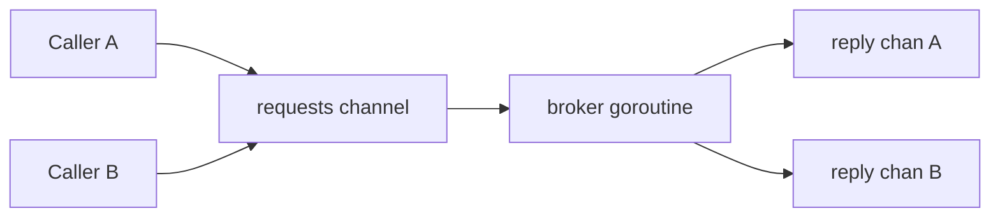

# Channel of Channels

`channel of channels` 패턴은 한 goroutine이 다른 goroutine에게 "전용 통신 경로" 자체를 넘길 때 나타납니다.

실전에서 가장 자주 쓰이는 형태는 request/reply입니다.

- caller가 private response channel을 만들고,
- 요청 안에 그 채널을 넣어 보내며,
- broker나 worker가 그 채널로 응답합니다.

## 언제 잘 맞나

- 많은 caller가 하나의 coordinator나 broker를 공유하고,
- 각 caller가 자기 응답 경로를 따로 가져야 하며,
- 전역 results channel 하나로는 correlation logic이 복잡해지고,
- 여전히 channel-first protocol을 유지하고 싶을 때.

## 예제 시나리오

`examples/requestreply`는 fraud-scoring broker를 모델링합니다.

모든 요청은 하나의 requests channel로 들어오지만, 각 요청은 자기만의 reply channel을 함께 들고 갑니다.



## 핵심 구조

```go
type request struct {
    payload Check
    reply   chan result
}

func (b *Broker) Check(ctx context.Context, check Check) (Decision, error) {
    reply := make(chan result, 1)

    select {
    case b.requests <- request{payload: check, reply: reply}:
    case <-ctx.Done():
        return Decision{}, ctx.Err()
    }

    select {
    case res := <-reply:
        return res.decision, res.err
    case <-ctx.Done():
        return Decision{}, ctx.Err()
    }
}
```

여기서 중요한 디테일은 `buffered reply channel`입니다.

caller가 요청을 보낸 뒤 timeout으로 떠나버려도, broker는 reply send에서 영원히 막히지 않아야 합니다.

## 왜 global results channel보다 나은가

전역 `results` channel 하나만 두면 모든 응답에 correlation metadata와 demultiplexer가 필요합니다.

반면 per-request reply channel은:

- correlation이 프로토콜 안에 녹아 있고,
- ownership이 요청 단위로 분리되며,
- broker 로직이 단순해집니다.

## 테스트가 증명해야 하는 것

`examples/requestreply/requestreply_test.go`는 다음을 검증합니다.

- concurrent caller가 각자 자기 응답을 정확히 받는지,
- caller가 timeout된 뒤에도 broker가 reply send에서 멈추지 않는지,
- parent context 종료 시 broker가 멈출 수 있는지.

## 흔한 실수

### cancellation이 있는 상황에서 unbuffered reply channel 사용

caller가 먼저 떠나면 broker가 쉽게 막힙니다.

### close ownership을 흐리게 만드는 것

one-shot reply라면 굳이 channel을 닫을 필요가 없는 경우가 많습니다. 누가 close하는지 애매해지는 순간 프로토콜이 흐려집니다.

### 그냥 함수 호출이면 되는 문제에 과한 프로토콜을 쓰는 것

broker boundary가 없고 concurrency boundary도 없다면 channel protocol은 과할 수 있습니다.

## Use this pattern when

per-call ownership이 분명한 brokered request/reply가 필요할 때 쓰면 좋습니다.

bulk parallel work를 처리하려면 [워커 풀](/ko/patterns/worker-pool), mutable state ownership이 핵심이면 [액터 패턴](/ko/advanced/actor-pattern)과 비교해 보세요.
