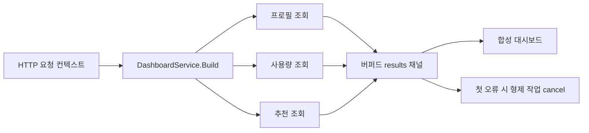

# 컨텍스트 취소

실전 동시성 버그의 상당수는 병렬 처리 자체보다 종료 처리에서 발생합니다.

`examples/contexttimeout` 예제는 하나의 요청 컨텍스트 아래에서 프로필, 사용량, 추천 데이터를 동시에 읽어 대시보드를 조합합니다.

규칙은 단순합니다.

- 하나의 의존성이 실패하면 형제 작업도 멈춰야 하고,
- 호출자 데드라인이 끝나면 모든 고루틴이 함께 멈춰야 합니다.

## 예제 시나리오



## 구현의 핵심

모든 로더가 하나의 파생 컨텍스트를 공유하도록 만드는 것이 핵심입니다.

```go
func (service DashboardService) Build(ctx context.Context, userID string) (Dashboard, error) {
    ctx, cancel := context.WithCancel(ctx)
    defer cancel()

    results := make(chan result, 3)

    go loadProfile(ctx, userID, results)
    go loadUsage(ctx, userID, results)
    go loadRecommendations(ctx, userID, results)

    for range 3 {
        select {
        case <-ctx.Done():
            return Dashboard{}, ctx.Err()
        case result := <-results:
            if result.err != nil {
                cancel()
                return Dashboard{}, result.err
            }
            applyResult(&dashboard, result)
        }
    }

    return dashboard, nil
}
```

여기서 중요한 디테일은 두 가지입니다.

1. 결과 채널이 버퍼드라서 collector가 먼저 종료되어도 로더가 send에서 영원히 막히지 않습니다.
2. 취소 결정은 collector가 가져가야 합니다. 비즈니스 계약을 가장 잘 아는 위치이기 때문입니다.

## 단순화한 cancellation 스케치

```go
ctx, cancel := context.WithCancel(parent)
defer cancel()

go func() { results <- loadA(ctx) }()
go func() { results <- loadB(ctx) }()
go func() { results <- loadC(ctx) }()
```

작은 형태지만 핵심은 다 들어 있습니다. 하나의 parent lifetime, 여러 child, 하나의 shared stop signal.

## 테스트가 증명하는 것

테스트는 다음을 검증합니다.

- 정상 상황에서 완전한 대시보드가 조합되는가
- 하나의 의존성 실패가 다른 호출을 취소시키는가
- 호출자 데드라인이 `context.DeadlineExceeded`로 제대로 드러나는가

## 흔한 실수

### 실패 패턴: 분리된 child goroutine

```go
go loadProfile(context.Background(), userID, results) // request lifetime과 분리됨
```

이렇게 되면 caller는 떠났는데 child work는 계속 살아남습니다.

### 파생 컨텍스트를 실제 하위 호출에 넘기지 않기

`context.WithCancel`을 만들어도 자식 호출이 원래 컨텍스트나 `Background`를 쓰면 취소는 전파되지 않습니다.

### 조기 반환 흐름에서 언버퍼드 결과 채널 사용하기

첫 오류에서 collector가 빠져나갈 수 있는 구조라면 언버퍼드 채널은 고루틴 누수를 만들기 쉽습니다.

### 취소 정책을 헬퍼 함수 안으로 숨기기

무엇이 전체 실패인지 결정하는 로직은 집계 지점 가까이에 있어야 유지보수가 쉽습니다.

### collector가 먼저 끝나도 sender가 탈출하지 못하는 구조

child goroutine에 buffered send 경로도 없고 `ctx.Done()` 경로도 없고 외부 shutdown 경로도 없으면, 조기 반환은 곧 leak가 됩니다.

## 이 패턴을 쓸 때

여러 고루틴이 하나의 요청, 잡, CLI 실행 수명 주기에 묶여 있다면 이 패턴은 거의 필수입니다.

다른 동시성 패턴을 안전하게 운영하기 위한 기본 안전장치라고 보면 됩니다.

## 전체 실행 예제

아래 블록은 `examples/contexttimeout`의 실제 파일을 그대로 렌더링합니다.

::: code-group
<<< ../../../examples/contexttimeout/contexttimeout.go [contexttimeout.go]
<<< ../../../examples/contexttimeout/contexttimeout_test.go [contexttimeout_test.go]
:::
