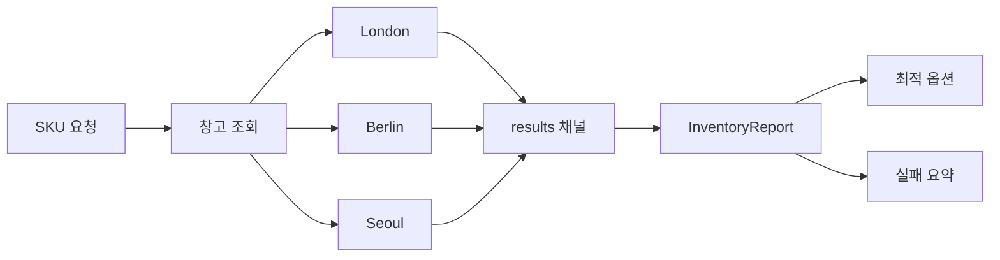

# 팬아웃 / 팬인

팬아웃/팬인은 같은 질문을 여러 독립적인 소스에 동시에 던진 뒤, 그 응답을 하나로 합칠 때 적합한 패턴입니다.

`examples/fanoutfanin` 예제는 여러 물류 창고에 동시에 재고를 조회합니다.

워커 풀과 다른 점은, 여기서는 하나의 실패가 전체 실패를 의미하지 않는다는 것입니다.
부분 결과만으로도 충분히 가치가 있습니다.

## 예제 시나리오

- fan out: 창고별 조회를 동시에 시작
- fan in: 모든 응답을 하나의 채널로 수집
- aggregate: 사용 가능한 옵션은 정렬하고, 실패는 따로 보존



## 구현의 핵심

좋은 데이터와 실패 정보를 분리해서 보존하는 것이 핵심입니다.

```go
func CollectInventory(ctx context.Context, sku string, lookups map[string]WarehouseLookup) (InventoryReport, error) {
    results := make(chan result, len(lookups))

    for name, lookup := range lookups {
        go func(name string, lookup WarehouseLookup) {
            stock, err := lookup(ctx, sku)
            results <- result{name: name, stock: stock, err: err}
        }(name, lookup)
    }

    for item := range results {
        if item.err != nil {
            report.Failures[item.name] = item.err.Error()
            continue
        }

        report.Options = append(report.Options, item.stock)
    }

    sortOptions(report.Options)
    return report, nil
}
```

## 단순화한 집계 스케치

```go
results := make(chan result, len(backends))

for _, backend := range backends {
    go func(backend Backend) {
        value, err := backend.Lookup(ctx, key)
        results <- result{value: value, err: err}
    }(backend)
}

for range backends {
    merge(<-results)
}
```

핵심 질문은 "fan-out이 일어났는가?"가 아니라 "일부 branch가 실패했을 때 어떤 aggregate가 허용 가능한가?"입니다.

창고 한 곳이 장애라고 해서 전체 가용성 정보를 버리는 것은 실무적으로 과한 경우가 많습니다.
이 예제는 그 점을 반영합니다.

## 테스트가 증명하는 것

테스트는 다음을 검증합니다.

- 한 창고가 실패해도 성공한 조회 결과는 유지되는가
- 최적 옵션 선택 기준이 항상 결정적이고 안정적인가
- 호출자 컨텍스트 취소가 전체 조회에 전파되는가

## 중요한 설계 선택

이 예제는 **첫 창고 실패에서 즉시 취소하지 않습니다.**

그 이유는 부분 재고 정보만으로도 주문 결정이나 운영 판단에 충분히 도움이 되기 때문입니다.

## 흔한 실수

### 실패 패턴: 무의식적인 all-or-nothing 정책

```go
if item.err != nil {
    return InventoryReport{}, item.err // 유용한 partial success까지 버림
}
```

그 정책이 맞을 수도 있지만, 기본 반사 동작이면 안 됩니다. 계약으로 정해야 합니다.

### 모든 오류를 같은 방식으로 취급하기

어떤 시스템은 "전부 성공해야 한다"가 맞고, 어떤 시스템은 "최대한 많이 가져오자"가 맞습니다. 먼저 계약을 정해야 합니다.

### 병합 결과를 정렬하지 않고 반환하기

동시 실행 완료 순서는 비즈니스 우선순위와 거의 일치하지 않습니다. 팬인 후 정렬이 필요합니다.

### 팬아웃 대상을 무제한으로 늘리기

이 예제는 창고 수가 작고 고정적이라는 전제입니다. 대상 수가 커질 수 있다면 워커 풀이나 세마포어와 결합해야 합니다.

### worker가 shared results 채널을 닫아버리는 경우

shared channel의 close 조건은 보통 aggregator가 소유해야 합니다. 여러 worker가 같은 채널을 닫을 수 있는 구조면 이미 위험합니다.
