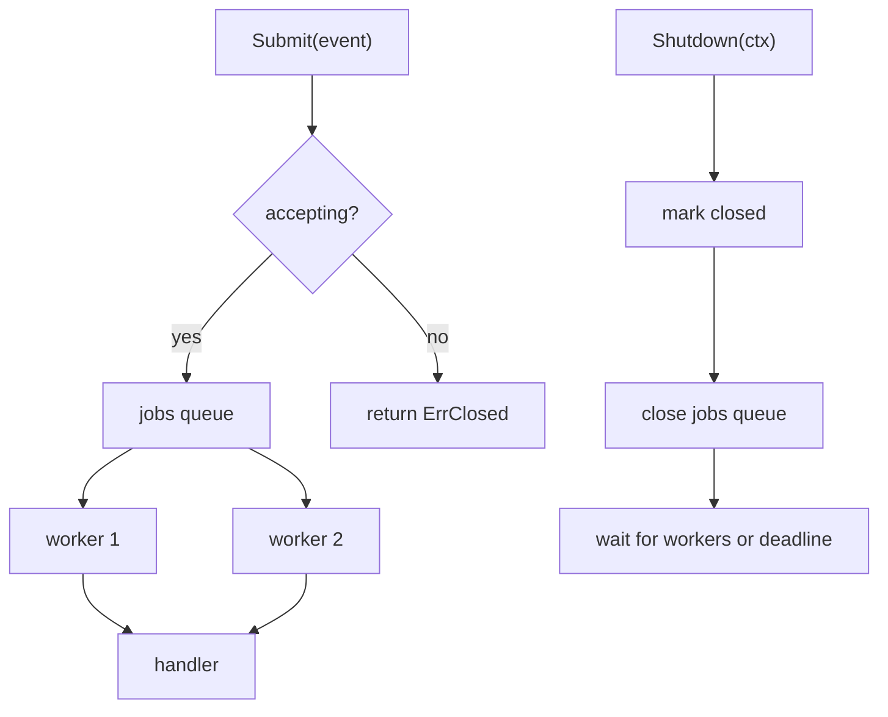

# Graceful Shutdown

Graceful shutdown은 운영 환경에서 가장 중요한 동시성 패턴 중 하나입니다.

목표는 단순히 "멈춘다"가 아닙니다.

1. 새 작업 수락을 멈추고,
2. 이미 수락한 작업은 가능하면 끝내고,
3. shutdown 자체가 영원히 걸리지 않도록 마지막 deadline을 둡니다.

## 언제 잘 맞나

- background worker가 큐를 소비하고,
- 프로세스가 signal이나 배포 종료를 처리하며,
- 이미 받은 일은 가능하면 완료해야 하고,
- shutdown 시작 후에는 caller가 명확한 실패를 받아야 할 때.

## 예제 시나리오

`examples/gracefulshutdown`은 bounded queue와 worker set을 가진 order-event processor를 모델링합니다.



## 핵심 구현 아이디어

중요한 순서는 이렇습니다.

1. 닫힌 상태로 표시,
2. 이후 submit 거부,
3. jobs queue close,
4. worker drain 대기,
5. shutdown context 만료 시 포기.

이 순서가 중요한 이유는, "그냥 전부 cancel"보다 운영 계약을 더 잘 반영하기 때문입니다.

## 단순화한 구현 스케치

```go
func (p *Processor) Shutdown(ctx context.Context) error {
    p.mu.Lock()
    p.closed = true
    close(p.jobs)
    p.mu.Unlock()

    done := make(chan struct{})
    go func() {
        defer close(done)
        p.wg.Wait()
    }()

    select {
    case <-done:
        return nil
    case <-ctx.Done():
        return ctx.Err()
    }
}
```

핵심 계약은 단순합니다. admission 중단, queue close, worker drain 대기, deadline 강제.

## 예제가 증명하는 것

`examples/gracefulshutdown/gracefulshutdown_test.go`는 다음을 검증합니다.

- 이미 수락된 작업은 shutdown 전에 처리되는지,
- shutdown 시작 후 submit은 명확한 에러를 반환하는지,
- handler가 멈추면 shutdown도 deadline에 맞춰 실패하는지.

## 설계에서 반드시 정해야 할 질문

Graceful shutdown은 결국 정책 문제이기도 합니다.

- 이미 받은 작업을 끝낼 것인가,
- 바로 취소할 것인가,
- 짧고 idempotent한 작업만 끝낼 것인가.

패턴은 비슷하지만 정책은 서비스마다 다릅니다.

## 흔한 실수

### close ownership이 불명확한 것

작업 수락을 관리하는 coordinator가 queue closing도 소유하는 편이 보통 안전합니다.

### submit race를 테스트하지 않는 것

"submit은 queue가 열려 있다고 보고, 그 사이 shutdown이 close해서 panic"은 아주 흔한 버그입니다.

### outer shutdown deadline이 없는 것

deadline 없는 graceful shutdown은 결국 graceful hang이 될 수 있습니다.

### 실패 패턴: closed 상태만 보고 send를 따로 하는 경우

```go
if !p.closed {
    p.jobs <- event // 이 사이 다른 goroutine이 jobs를 닫을 수 있음
}
```

이게 "테스트에서는 되던데?"가 production에서 `send on closed channel`로 바뀌는 전형적인 방식입니다.

## Use this pattern when

프로세스 수명과 작업 수명이 교차하는 모든 곳에서 필요합니다.

이 패턴이 없으면 흔히 생기는 문제는 정해져 있습니다.

- goroutine leak,
- in-flight work drop,
- hanging deploy,
- 모호한 실패 상태.
