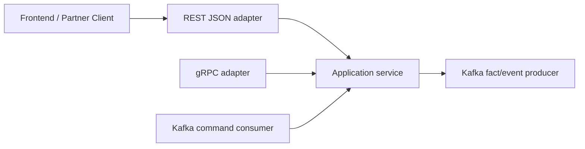

# API 경계에서의 Optional 값 패턴

Go에서 pointer 자체가 나쁜 건 아닙니다.

문제는 `*int`, `*string`, `*time.Time` 같은 형태가 자주 여러 의미를 한꺼번에 뭉개 버린다는 점입니다.

- 필드가 아예 없음
- 필드가 명시적으로 null임
- 나중에 lazy load됨
- 어떤 transport에서는 optional이지만 domain에서는 required임
- generated transport type이 애플리케이션 안쪽까지 새어 들어옴

이 패턴은 그 의미를 하나의 pointer에 몰아넣지 않고 분리합니다.

## 언제 잘 맞나

- 응답 DTO에서 필드는 항상 존재해야 하지만 `null`도 의미가 있고,
- PATCH류 입력에서 omitted, explicit null, concrete value를 구분해야 하며,
- 같은 비즈니스 개념이 REST, gRPC, 메시지 경계를 모두 지나가고,
- 프론트엔드가 `string | null`, `number | null` 같은 계약을 명확히 원할 때.

## 핵심 결정표

| 상황 | 권장 형태 | 이유 |
| --- | --- | --- |
| `next_cursor`, `total_count` 같은 응답 메타데이터 | `Optional[T]` | value 또는 explicit null이라는 2-state 출력 계약에 맞음 |
| PATCH/update/filter 요청 필드 | `Field[T]` 같은 tri-state 타입 | absent, null, concrete value가 서로 다른 의미를 가져야 함 |
| 내부 domain에서 항상 필요한 값 | plain `T` | transport 의미를 core business logic에 끌고 들어오지 않기 위해 |
| gRPC scalar presence | proto `optional`, `oneof`, wrapper/message presence | wire presence는 protobuf가 표현하고 Go adapter에서 내부 타입으로 매핑 |
| Kafka 등 메시지 스키마 | 명시적인 schema semantics, 보통은 정규화된 fact | replay와 consumer 해석이 쉬워짐 |

## 먼저 바로잡고 갈 점

이 패턴을 설명할 때 과장되기 쉬운 말이 두 가지 있습니다.

- pointer를 `nil`과 비교하는 것 자체는 panic이 아닙니다.
- `Optional[T]`가 곧바로 zero-allocation을 보장하는 것도 아닙니다. 값이 어디에 놓일지는 여전히 escape analysis가 결정합니다.

진짜 이점은 런타임 마법이 아니라 API 경계에서 의미를 더 선명하게 만드는 데 있습니다.

## 예제 시나리오

`examples/optionalvalues`는 실제 백엔드에서 자주 만나는 두 가지 상황을 모델링합니다.

1. keyset pagination 메타데이터가 붙은 트랜잭션 목록 응답
2. omitted, clear, set이 모두 구분돼야 하는 파트너 수정 요청



핵심 규칙은 단순합니다.

- 나갈 때는 `Optional[T]`
- 들어올 때는 tri-state field
- 가능한 빨리 plain domain field로 정규화

## 핵심 타입

```go
type Optional[T any] struct {
    Value T
    Valid bool
}

func Opt[T any](v T) Optional[T] {
    return Optional[T]{Value: v, Valid: true}
}

func (o Optional[T]) MarshalJSON() ([]byte, error) {
    if !o.Valid {
        return []byte("null"), nil
    }
    return json.Marshal(o.Value)
}

type Field[T any] struct {
    Value T
    Set   bool
    Valid bool
}
```

`Optional[T]`는 응답 타입입니다.

`Field[T]`는 입력 타입입니다. 의미는 다음과 같습니다.

- 필드 자체가 없음: `Set=false`
- 필드가 왔지만 null임: `Set=true`, `Valid=false`
- 필드가 왔고 값도 있음: `Set=true`, `Valid=true`

## REST와 JSON

### 응답 DTO: keyset pagination

결제/파트너 API에서 keyset pagination 메타데이터는 `Optional[T]`와 아주 잘 맞습니다.

```go
type Transaction struct {
    ID     string `json:"id"`
    Amount int    `json:"amount"`
}

type TransactionPage struct {
    Data       []Transaction    `json:"data"`
    HasMore    bool             `json:"has_more"`
    NextCursor Optional[string] `json:"next_cursor"`
    TotalCount Optional[int]    `json:"total_count"`
}
```

마지막 페이지라면 `next_cursor`는 JSON에 키가 그대로 존재한 채 `null`이 됩니다.

이건 `omitempty`보다 계약이 더 명확한 경우가 많습니다.

### 요청 DTO: tri-state patch semantics

이제 파트너 수정 요청을 보겠습니다.

```go
type UpdatePartnerRequest struct {
    DisplayName         Field[string] `json:"display_name"`
    SettlementDelayDays Field[int]    `json:"settlement_delay_days"`
    ExternalRef         Field[string] `json:"external_ref"`
}
```

이제 의미가 분명해집니다.

- `display_name` omitted: 그대로 둠
- `display_name: null`: 잘못된 요청
- `display_name: "Acme Europe"`: 값 교체
- `external_ref: null`: optional field clear
- `external_ref` omitted: 변경하지 않음

여기서 `Optional[T]` 하나로 처리하면 omitted와 explicit null을 구분하지 못합니다.

## 예제 테스트가 증명하는 것

`examples/optionalvalues/optionalvalues_test.go`는 다음을 검증합니다.

- pagination 응답이 비어 있는 메타데이터를 explicit `null`로 내리는지
- optional metadata가 있으면 실제 JSON 값으로 내려가는지
- tri-state 요청 decode가 omitted/null/value를 정확히 구분하는지
- patch apply에서 required field의 null은 거절하고 optional field는 clear할 수 있는지

## gRPC 가이드

gRPC 경계에서는 wire presence를 protobuf에 맡기는 편이 맞습니다.

응답 스칼라 presence는 proto `optional`이 기본적으로 가장 깔끔합니다.

```proto
message ListTransactionsResponse {
  repeated Transaction data = 1;
  bool has_more = 2;
  optional string next_cursor = 3;
  optional int64 total_count = 4;
}
```

하지만 update류 API는 scalar presence만으로 부족한 경우가 많습니다. "clear to null"과 "leave untouched"가 다른 연산이어야 하기 때문입니다.

이 경우 `oneof`, wrapper/message presence, 혹은 더 명시적인 patch schema가 필요합니다.

핵심 경계 규칙은 이겁니다.

- wire presence는 protobuf가 표현하고
- Go adapter에서 그 의미를 `Optional[T]`나 `Field[T]`로 옮기고
- protobuf wrapper 타입을 서비스 내부까지 끌고 들어오지 않습니다.

## Kafka와 기타 메시지

메시지는 HTTP 요청보다 더 엄격해야 합니다.

command 성격의 메시지라면 update 적용 전까지 tri-state 입력이 합리적일 수 있습니다.

```json
{
  "partner_id": "partner-77",
  "changes": {
    "display_name": { "set": true, "value": "Acme Europe" },
    "external_ref": { "set": true, "value": null }
  }
}
```

하지만 event 성격의 메시지는 command 의도를 들고 다니기보다, 적용이 끝난 뒤의 정규화된 fact를 내보내는 편이 훨씬 낫습니다.

```json
{
  "event_type": "partner.updated",
  "partner_id": "partner-77",
  "display_name": "Acme Europe",
  "external_ref": null
}
```

이렇게 해야 replay와 downstream consumer 해석이 단순해집니다.

## 실패 패턴

가장 흔한 실수는 3-state 입력 문제를 2-state optional 하나로 덮는 것입니다.

```go
type UpdatePartnerRequest struct {
    ExternalRef Optional[string] `json:"external_ref"` // bad for PATCH
}
```

이제 다음 두 경우가 같은 Go 값으로 뭉개집니다.

- 필드가 아예 오지 않음
- 필드가 왔지만 `null`임

PATCH endpoint는 바로 그 차이를 보존해야 하는 경우가 많습니다.

## Use this pattern when

출력 계약에서 "이 키는 항상 있고, 오늘 값은 null일 수 있다"를 표현해야 하면 `Optional[T]`를 쓰십시오.

쓰기 요청에서 다음 셋을 구분해야 하면 tri-state field를 쓰십시오.

- 변경하지 않음
- 지움
- 새 값으로 설정

plain required value로 충분하면 그냥 `T`를 유지하고 transport noise를 들여오지 않는 편이 낫습니다.

## 전체 실행 예제

아래 블록은 `examples/optionalvalues`의 실제 파일을 그대로 렌더링합니다.

::: code-group
```go [optionalvalues.go]
<<< ../../../examples/optionalvalues/optionalvalues.go
```

```go [optionalvalues_test.go]
<<< ../../../examples/optionalvalues/optionalvalues_test.go
```
:::
