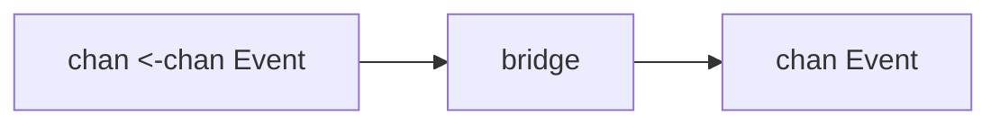

# Or-Done, Tee, Bridge

이 패턴들은 처음 배우는 패턴은 아니지만, channel composition이 깊어질수록 아주 유용해집니다.

## 왜 묶어서 보나

셋 다 "plumbing problem"을 해결합니다.

- `or-done`: cancellation이 오면 안전하게 읽기를 중단
- `tee`: 하나의 입력 스트림을 두 갈래로 복제
- `bridge`: stream of streams를 하나의 출력으로 평탄화

아키텍처 전체를 바꾸는 패턴은 아니지만, leak 위험을 크게 줄여줍니다.

## `or-done`

receive loop가 cancellation 이후 영원히 block되지 않게 감싸는 패턴입니다.

```go
func orDone[T any](done <-chan struct{}, in <-chan T) <-chan T {
    out := make(chan T)
    go func() {
        defer close(out)
        for {
            select {
            case <-done:
                return
            case v, ok := <-in:
                if !ok {
                    return
                }
                select {
                case out <- v:
                case <-done:
                    return
                }
            }
        }
    }()
    return out
}
```

작지만 매우 자주 쓸 수 있는 패턴입니다.

## `tee`

`tee`는 하나의 입력을 두 개의 downstream consumer로 복제합니다.

좋은 예시는:

- business logic + audit logging,
- metrics + persistence,
- 한 입력 스트림에 대한 두 종류의 분석.

핵심은 cancellation과 느린 consumer 때문에 전체가 막히지 않도록 설계하는 것입니다.

## `bridge`

`bridge`는 channel이 channel을 흘려보내는 경우를 flatten합니다.

예:

- paginated fetch 결과,
- partitioned work source,
- tenant별 하위 stream,
- channel-of-channels dispatcher.



## 언제 써야 하나

문제의 본질이 "composition"일 때 좋습니다.

반대로 ownership이나 backpressure가 핵심인데 이것만 넣는다고 설계가 좋아지지는 않습니다.

## 실패 패턴

아주 작은 forwarding helper도 cancellation을 무시하면 leak factory가 됩니다.

```go
func forward(in <-chan Item, out chan<- Item) {
	for v := range in {
		out <- v // bad: downstream이 멈추면 여기서 영원히 block
	}
}
```

`or-done`이 필요한 이유는 실제 파이프라인이 항상 모든 stage를 끝까지 drain하지 않기 때문입니다.

## Practical takeaway

이건 "작지만 고급인 패턴"입니다. 전체 아키텍처를 지배하진 않지만, channel-heavy 코드의 가장 까다로운 모서리를 정리하는 데 자주 쓰입니다.

## 전체 실행 예제

아래 블록은 `examples/ordoneteebridge`의 실제 파일을 그대로 렌더링합니다.

::: code-group
<<< ../../../examples/ordoneteebridge/ordoneteebridge.go [ordoneteebridge.go]
<<< ../../../examples/ordoneteebridge/ordoneteebridge_test.go [ordoneteebridge_test.go]
:::
