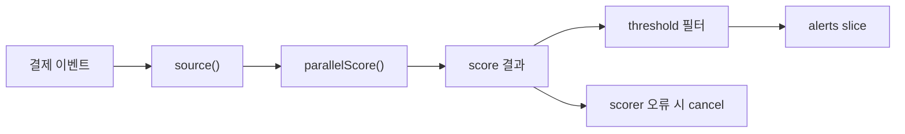

# 파이프라인

파이프라인은 단순히 "병렬 작업이 많다"가 아니라 "데이터가 순서 있는 여러 단계를 통과한다"는 문제에 적합합니다.

`examples/pipeline` 예제는 결제 이벤트를 부정거래 검토 알림으로 바꾸는 흐름을 보여줍니다.

1. source 단계가 결제 이벤트를 흘려보내고,
2. scoring 단계가 리스크를 병렬 계산하고,
3. sink 단계가 수동 검토가 필요한 알림만 골라냅니다.

## 왜 큰 함수 하나로 합치지 않는가

단계마다 실패 방식과 확장 방식이 다르기 때문입니다.

- ingestion은 입력 읽기를 책임지고,
- scoring은 비용이 큰 계산이나 외부 의존성을 책임지고,
- alert 단계는 무엇이 실제로 조치 가능한지를 책임집니다.



## 구현의 핵심

이 예제는 단계 경계를 분명하게 유지합니다.

```go
func RunAlertPipeline(ctx context.Context, events []CheckoutEvent, workers int, threshold int, scorer RiskScorer) ([]Alert, error) {
    ctx, cancel := context.WithCancel(ctx)
    defer cancel()

    in := source(ctx, events)
    out := parallelScore(ctx, workers, in, scorer)

    for result := range out {
        if result.err != nil && firstErr == nil {
            firstErr = fmt.Errorf("score checkout %s: %w", result.checkoutID, result.err)
            cancel()
            continue
        }

        if firstErr != nil || result.signal.Score < threshold {
            continue
        }

        alerts = append(alerts, buildAlert(result.signal))
    }

    return alerts, firstErr
}
```

이 구조의 장점은 책임이 섞이지 않는다는 데 있습니다.

- `source()`는 슬라이스를 스트림으로 바꾸는 책임만 갖고,
- `parallelScore()`는 제한된 병렬 점수 계산만 담당하고,
- collector는 실패 정책과 최종 출력 정리를 담당합니다.

## 테스트가 증명하는 것

테스트는 다음 계약을 검증합니다.

- 고위험 결제만 실제 알림으로 남는가
- 호출자가 보기에는 결과 순서가 안정적인가
- scorer 오류가 나면 다른 워커가 빠르게 취소되는가

## 설계 트레이드오프

### 단계 의미가 다를수록 강하다

이 점이 단순 워커 풀보다 큰 장점입니다. 단계별로 읽고 테스트하기 쉬워집니다.

### 중간 단계에서 순서가 섞일 수 있다

scoring이 병렬 실행되므로 완료 순서는 안정적이지 않습니다. 예제는 최종 알림을 checkout ID 기준으로 정렬해 API 출력을 안정화합니다.

### 에러 정책을 의식적으로 정해야 한다

모든 파이프라인이 첫 오류에서 중단할 필요는 없습니다. 이 예제는 점수 계산이 실패하면 전체 결과 신뢰도가 무너진다고 보고 즉시 취소합니다.

## 이 패턴을 쓸 때

단계별 책임이 분명하거나, 단계별 확장 방식이 다르거나, 스트리밍 모델로 생각하는 편이 자연스러울 때 파이프라인이 좋습니다.

같은 질문을 여러 백엔드에 동시에 던지고 합치는 문제라면 [팬아웃 / 팬인](/ko/patterns/fan-out-fan-in)이 더 잘 맞습니다.
