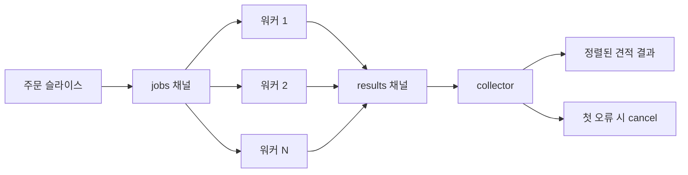

# 워커 풀

워커 풀은 "서로 독립적인 작업이 많지만 병렬 수는 제한해야 한다"는 상황의 기본 해답입니다.

이 저장소의 예제는 주문 묶음에 대한 배송 견적 생성입니다. 각 주문은 독립적으로 계산할 수 있지만, 운송사 API를 향해 고루틴을 무한히 늘리는 것은 운영상 위험합니다.

## 언제 잘 맞는가

- 독립적인 작업이 한 번에 많이 들어오고,
- 하위 시스템 처리량이 제한되어 있으며,
- 리소스 사용량을 예측 가능하게 유지하고 싶고,
- 보통 하나의 실패가 전체 배치를 멈춰야 할 때

## 예제 시나리오

`examples/workerpool`은 배치 배송 견적 생성을 모델링합니다.

- 입력: 주문 슬라이스
- 워커: 고정 개수의 운송사 견적 워커
- 출력: 원래 입력 순서대로 복원된 견적 결과



## 구현의 핵심

핵심은 단순히 "워커 N개를 띄운다"가 아닙니다.
핵심은 **collector가 실패 정책을 소유한다**는 점입니다.

```go
func GenerateQuotes(ctx context.Context, orders []Order, workers int, quoteFn QuoteFunc) ([]ShipmentQuote, error) {
    ctx, cancel := context.WithCancel(ctx)
    defer cancel()

    jobs := make(chan job)
    results := make(chan result, workers)

    for range workers {
        go worker()
    }

    go produceJobs()

    for item := range results {
        if item.err != nil && firstErr == nil {
            firstErr = fmt.Errorf("quote order %s: %w", orders[item.index].ID, item.err)
            cancel()
            continue
        }

        if firstErr == nil {
            quotes[item.index] = item.quote
        }
    }

    return quotes, firstErr
}
```

## 단순화한 구현 스케치

워커 풀의 가장 작은 유효 mental model은 이런 형태입니다.

```go
jobs := make(chan Job)
results := make(chan Result, workers)

for range workers {
    go func() {
        for job := range jobs {
            results <- process(job)
        }
    }()
}
```

실전 버전은 여기에 다음이 더해집니다.

- context cancellation,
- 입력 순서 복원을 위한 index,
- worker shutdown coordination,
- 명시적인 error policy.

여기서 중요한 선택은 세 가지입니다.

1. 결과에 원래 입력 인덱스를 실어 보내서 순서를 복원합니다.
2. 파생 컨텍스트를 만들어 첫 실패가 나타나면 나머지 워커를 즉시 취소합니다.
3. `results` 버퍼 크기를 워커 수로 맞춰 collector가 잠깐 늦어져도 워커가 불필요하게 막히지 않게 합니다.

## 테스트가 증명하는 것

`examples/workerpool/workerpool_test.go`는 단순 반환값이 아니라 다음 계약을 검증합니다.

- 작업 완료 순서가 섞여도 최종 출력 순서는 입력 순서를 유지하는가
- 실제 동시 실행 워커 수가 설정값을 넘지 않는가
- 한 작업이 실패하면 느린 작업이 취소를 관측하는가

## 흔한 실수

### 실패 패턴: collector가 먼저 끝나는데 unbuffered results 채널을 쓰는 경우

```go
results := make(chan result) // 조기 반환 흐름에서는 위험

if err != nil {
    return nil, err // worker가 send에서 영원히 막힐 수 있음
}
```

collector가 모든 worker send를 받기 전에 종료될 수 있다면, unbuffered results 채널은 goroutine leak를 만들기 가장 쉬운 구조 중 하나입니다.

### 완료 순서를 그대로 반환하기

호출자가 입력 순서를 기대한다면 쉽게 버그가 납니다. 이런 계약이 필요하면 인덱스를 붙여야 합니다.

### 취소를 너무 늦게 전파하기

공유 컨텍스트가 없으면 실패한 배치가 끝난 뒤에도 다른 워커가 계속 CPU와 네트워크를 사용합니다.

### 너무 작은 작업량에 과하게 적용하기

평균 요청 크기가 1~2개라면 워커 풀의 복잡도만 늘고 이득이 거의 없을 수 있습니다.

### worker가 배치 수명보다 오래 살아남게 두기

worker가 shared context나 shutdown signal을 보지 않으면, caller가 이미 결과를 포기한 뒤에도 downstream capacity를 계속 태울 수 있습니다.

## 이 패턴을 쓸 때

핵심 목표가 "병렬 수 제한"이라면 워커 풀이 맞습니다.

여러 단계가 서로 다른 책임을 가져야 한다면 [파이프라인](/ko/patterns/pipeline)으로 가는 편이 낫습니다.

## 전체 실행 예제

아래 블록은 `examples/workerpool`의 실제 파일을 그대로 렌더링합니다.

::: code-group
<<< ../../../examples/workerpool/workerpool.go [workerpool.go]
<<< ../../../examples/workerpool/workerpool_test.go [workerpool_test.go]
:::
