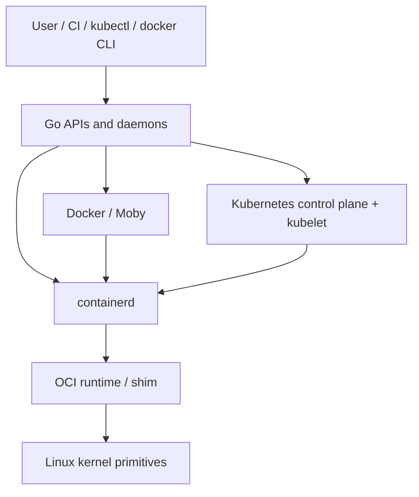
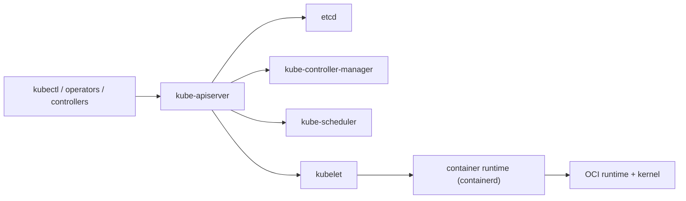

# Docker, containerd, 그리고 Kubernetes

Go가 왜 인프라에서 이렇게 강한 언어가 되었는지 이해하고 싶다면, 이 스택은 가장 좋은 답 중 하나입니다.

Docker, containerd, Kubernetes는 "밑바닥까지 전부 Go"인 시스템이 아닙니다.

이들은 다음 위에 올라간 Go-heavy 시스템입니다.

- Linux namespace와 cgroup
- overlay / snapshot filesystem
- OCI image / runtime contract
- network namespace, iptables, eBPF, storage driver

Go는 이 하위 primitive를 API, daemon, controller, reconciliation loop, 운영 가능한 시스템으로 바꾸는 계층입니다.

:::tip Quick takeaway
Docker는 user-facing engine/API 계층이고, containerd는 runtime core/lifecycle daemon이며, Kubernetes는 desired state를 향해 cluster를 계속 밀어가는 API-driven control plane입니다.
:::

## 첫 번째 머릿속 모델

이 스택은 이렇게 보면 가장 깔끔합니다.

- Docker/Moby는 컨테이너 workflow를 제품 형태로 묶은 daemon이고
- containerd는 image / snapshot / content / task lifecycle을 담당하는 runtime core이며
- Kubernetes는 container를 node-level execution target 중 하나로 다루는 더 큰 control system입니다



이 페이지는 이 중에서도 Go가 담당하는 부분, 즉 long-lived process, API boundary, control loop에 집중합니다.

## Docker는 제품 형태의 계층이다

공식 Docker Engine 문서는 Docker를 다음으로 이루어진 client-server application으로 설명합니다.

- server daemon
- REST API
- command-line client

Moby 프로젝트는 Docker가 만든 오픈소스 프로젝트로 소개됩니다.

여기서 중요한 점은:

Docker는 단순히 "컨테이너 하나 실행"이 아니라는 것입니다.

Docker는 다음을 묶은 product surface입니다.

- image build와 distribution
- API exposure
- networking
- volume
- lifecycle UX
- 하위 runtime stack과의 통합

### 소스 읽기 시작점

- [`cmd/dockerd/main.go`](https://github.com/moby/moby/blob/master/cmd/dockerd/main.go)
- [`daemon/`](https://github.com/moby/moby/tree/master/daemon)
- [`api/server/`](https://github.com/moby/moby/tree/master/api/server)
- [`daemon/cluster/`](https://github.com/moby/moby/tree/master/daemon/cluster)

### Docker가 실제로 소유하는 것

Docker daemon은 다음을 하는 Go server process입니다.

- API를 노출하고
- image와 config state를 해석하며
- network / volume 경계를 관리하고
- user request를 container lifecycle 작업으로 번역하고
- 더 낮은 runtime stack에 실행을 위임합니다

### 단순화한 mental model

```go
func RunContainer(req CreateRequest) error {
	image := imageStore.Resolve(req.ImageRef)
	rootfs := snapshotter.Prepare(image)
	spec := ociSpecBuilder.Build(req, rootfs)

	container := runtimeClient.NewContainer(spec)
	return container.Start()
}
```

이 코드는 일부러 압축했습니다. 핵심은 call graph가 아니라 boundary입니다.

- user intent를 해석하고
- OCI-ish execution state를 만들고
- runtime 작업을 아래 계층에 넘깁니다

### 중요한 교정 하나

Docker가 커널을 대체한 것이 아닙니다.

Docker는 kernel-backed container를 운영 가능한 제품으로 만든 것입니다.

이건 Go가 특히 잘하는 문제 형태입니다.

- API-heavy
- process-oriented
- long-lived
- operationally observable
- cross-platform packaging에 강한 구조

## containerd는 runtime core다

공식 containerd README는 containerd를 image transfer/storage, container execution/supervision, low-level storage/network attachment를 포함한 complete container lifecycle을 관리하는 industry-standard container runtime으로 설명합니다.

여기서 스택은 product layer에서 runtime core로 내려갑니다.

### 소스 읽기 시작점

- [`cmd/containerd/main.go`](https://github.com/containerd/containerd/blob/main/cmd/containerd/main.go)
- [`cmd/containerd/server/`](https://github.com/containerd/containerd/tree/main/cmd/containerd/server)
- [`core/content/`](https://github.com/containerd/containerd/tree/main/core/content)
- [`core/metadata/`](https://github.com/containerd/containerd/tree/main/core/metadata)
- [`core/snapshots/`](https://github.com/containerd/containerd/tree/main/core/snapshots)
- [`plugins/services/tasks/`](https://github.com/containerd/containerd/tree/main/plugins/services/tasks)

### 아키텍처 아이디어

containerd는 몇 가지 날카로운 책임을 가진 daemon + gRPC surface입니다.

- image/blob용 content store
- container/image/lease를 위한 metadata
- root filesystem view를 위한 snapshotter
- 실행 중인 container를 위한 task service
- 다른 storage/runtime backend를 위한 plugin boundary

containerd가 좋은 Go 사례인 이유도 여기 있습니다.

이건 단순한 `runc` wrapper가 아닙니다.
컨테이너 lifecycle을 안전하고, 관측 가능하고, 조합 가능하게 만드는 구조화된 daemon입니다.

### 단순화한 mental model

```go
func StartTask(req StartTaskRequest) error {
	container := metadataStore.LoadContainer(req.ContainerID)
	snapshot := snapshotter.Prepare(container.SnapshotKey)
	task := taskService.New(container, snapshot)
	return task.Start()
}
```

실제 구현은 더 복잡하지만, 유용한 boundary는 분명합니다.

- metadata와 content는 분리되고
- execution은 image storage와 같지 않으며
- plugin surface가 daemon을 확장 가능하게 만듭니다

### 왜 중요한가

사람들이 "Docker가 containerd를 쓴다"라고 할 때 중요한 건 브랜드 관계가 아닙니다.

중요한 건 아키텍처 분리입니다.

- user-facing product concern은 다른 속도로 진화할 수 있고
- runtime lifecycle은 더 집중된 core로 유지되며
- Kubernetes 같은 orchestrator는 더 안정적인 runtime core와 연결될 수 있습니다

## Kubernetes는 API-driven control plane이다

공식 Kubernetes components 문서는 control plane을 cluster에 대한 global decision을 내리고, cluster event를 감지하고 대응하는 컴포넌트로 설명합니다.

공식 controller 문서는 controller를 shared state를 watch하고 current state를 desired state 쪽으로 밀어가는 control loop로 설명합니다.

즉 Kubernetes의 핵심은 이것입니다.

Kubernetes는 API server 주변에 모인 거대한 Go control loop 집합입니다.

### 소스 읽기 시작점

- [`cmd/kube-apiserver/`](https://github.com/kubernetes/kubernetes/tree/master/cmd/kube-apiserver)
- [`pkg/controller/`](https://github.com/kubernetes/kubernetes/tree/master/pkg/controller)
- [`pkg/scheduler/`](https://github.com/kubernetes/kubernetes/tree/master/pkg/scheduler)
- [`cmd/kubelet/`](https://github.com/kubernetes/kubernetes/tree/master/cmd/kubelet)
- [`pkg/kubelet/`](https://github.com/kubernetes/kubernetes/tree/master/pkg/kubelet)

## 정말 중요한 component model



이 아키텍처는 "scheduler가 container를 실행한다"가 아닙니다.

정확히는:

- API server가 cluster intent를 저장하고
- controller가 상위 object를 reconcile하며
- scheduler가 아직 배치되지 않은 Pod를 node에 할당하고
- kubelet이 하나의 node에서 Pod state를 reconcile하며
- container runtime이 그 node에서 실제 container를 실행합니다

### 단순화한 reconciliation 스케치

```go
func ReconcileDeployment(key string) error {
	desired := apiServer.GetDeployment(key)
	current := replicaStore.ListPodsForDeployment(key)

	diff := desired.Replicas - len(current)
	switch {
	case diff > 0:
		return podControl.Create(diff)
	case diff < 0:
		return podControl.Delete(-diff)
	default:
		return nil
	}
}
```

일부러 generic하게 썼지만, Kubernetes controller logic의 모양은 잘 드러납니다.

- API에서 desired state를 읽고
- actual state를 관찰하고
- delta를 계산하고
- system을 다시 convergence 쪽으로 밀어줍니다

### kubelet이 좋은 Go 예시인 이유

kubelet은 단순히 "node에서 container 시작"이 아닙니다.

이건 다음을 소유하는 long-lived Go process입니다.

- Pod lifecycle reconciliation
- health checking
- status reporting
- node-local storage와 volume plumbing
- container runtime과의 상호작용
- node 단위 shutdown / restart resilience

즉 전형적인 Go daemon 구조입니다.

- 무한 루프
- 명시적인 state transition
- background worker
- 많은 I/O와 API edge
- 분명한 process ownership

## Go가 멈추는 지점

많은 사람이 놓치는 부분이 여기입니다.

이 스택에서 Go는 중요하지만, 전부는 아닙니다.

보통 경계는 이렇게 나뉩니다.

- Go daemon은 API, metadata, reconciliation, orchestration을 소유하고
- OCI runtime은 low-level process creation과 container spec execution을 소유하며
- Linux kernel은 namespace, cgroup, mount, networking, process isolation을 소유합니다

이 경계를 놓치면 시스템 전체를 잘못 이해하게 됩니다.

## 왜 Go가 이 생태계에 잘 맞는가

이 프로젝트들은 전형적인 Go형 문제입니다.

- long-lived daemon과 clear owner
- 많은 networking / API boundary
- controller loop와 watcher
- plugin과 extension surface
- tracing / profiling / metrics 같은 운영 도구
- practical한 바이너리 배포와 packaging

이건 대부분 SIMD나 수제 memory layout 문제가 아닙니다.

대부분은:

- coordination
- lifecycle ownership
- process supervision
- background work
- control-plane correctness

입니다.

Go는 역사적으로 이 영역에서 강했습니다.

## 이 시스템을 읽을 때 자주 하는 실수

### Docker와 containerd를 같은 것으로 보는 것

둘은 관련 있지만 abstraction layer가 다릅니다.

### Kubernetes가 container를 직접 실행한다고 생각하는 것

Kubernetes는 주로 API + reconciliation 시스템입니다. node execution은 아래 runtime 계층에 위임됩니다.

### 전부 Go magic이라고 생각하는 것

가장 어려운 경계는 종종 Linux와 OCI interface에 있습니다.

### goroutine 개수만 보고 배우는 것

배워야 할 건 "goroutine을 더 써라"가 아니라, API / loop / runtime handoff 사이 ownership boundary를 더 날카롭게 설계하라는 점입니다.

## 내 시스템에 가져갈 것

- user-facing API concern과 runtime-core concern을 분리하고
- 각 계층의 state ownership을 명확히 하며
- reconciliation을 1급 control loop로 취급하고
- ad hoc imperative script보다 API-driven convergence를 선호하고
- node-local execution과 cluster-global control을 분리하십시오

## Official reading

- [Docker Engine overview](https://docs.docker.com/engine/)
- [Moby README](https://github.com/moby/moby/blob/master/README.md)
- [containerd README](https://github.com/containerd/containerd/blob/main/README.md)
- [Kubernetes Components](https://kubernetes.io/docs/concepts/overview/components/)
- [Kubernetes Controllers](https://kubernetes.io/docs/concepts/architecture/controller/)

## Practical takeaway

Docker, containerd, Kubernetes는 같은 Go 강점을 서로 다른 계층에서 보여줍니다.

- product daemon
- runtime core
- distributed control plane

그래서 Go는 인프라에서 유독 끈적하게 살아남았습니다. 운영체제와 네트워크 primitive를 이해 가능하고 디버그 가능한 long-lived system으로 바꾸는 데 강하기 때문입니다.
