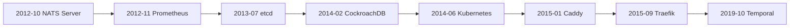

# Go 오픈소스 역사 읽기

지금의 Go 생태계만 보면, 중요한 인프라 프로젝트가 많이 Go로 만들어진 게 당연해 보일 수 있습니다.

하지만 그건 당연했던 일이 아니라 "시대와 문제 형태가 맞아떨어진 결과"였습니다.

Go는 정확히 많은 팀이 아래를 원하던 시점에 등장했습니다.

- 네트워크 기반 시스템
- 더 단순한 배포
- 적은 런타임 의존성
- callback-heavy 설계보다 읽기 쉬운 동시성
- 작은 인프라 팀도 감당 가능한 생산성

이 문서는 production 섹션의 곁다리이자, 재밌게 읽는 역사 파트입니다.
단순히 "어떻게 동작하는가"가 아니라 "왜 이 시기에 이런 프로젝트들이 Go로 공개되었는가"를 같이 봅니다.

## 날짜에 대한 한 가지 주의점

아래 날짜는 GitHub 공개 저장소 생성 시점을 기준으로 잡았습니다.

이건 공적인 출발 시점을 보기엔 유용하지만, 항상 전체 기원을 뜻하진 않습니다.
예를 들어 Temporal은 2019년 10월 16일 공개 저장소 기준으로 잡을 수 있지만, README는 Uber Cadence의 fork에서 시작했다고 분명히 말합니다.

## 타임라인

## 빠른 지도

| 공개 저장소 날짜 | 프로젝트 | 시스템 형태 | Go가 말해주는 것 |
| --- | --- | --- | --- |
| 2012-10-29 | NATS Server | 저지연 메시징 서버 | Go는 C++급 ceremony 없이도 진지한 네트워크 데몬을 만들 수 있었다 |
| 2012-11-24 | Prometheus | 모니터링 시스템 + TSDB | self-contained ops binary와 periodic worker loop에 Go가 강했다 |
| 2013-07-06 | etcd | 분산 coordination store | consensus-heavy control plane과 service API에 Go가 잘 맞았다 |
| 2014-02-06 | CockroachDB | 분산 SQL 데이터베이스 | Go는 CLI나 proxy만이 아니라 야심찬 distributed data system도 감당할 수 있었다 |
| 2014-06-06 | Kubernetes | 클러스터 control plane | Go는 controller, API, reconciliation loop의 언어가 되었다 |
| 2015-01-13 | Caddy | operator-first 웹 서버 | deployability와 표준 라이브러리 networking의 가치가 컸다 |
| 2015-09-13 | Traefik | 동적 edge proxy와 routing control plane | Go는 orchestrator 상태를 restart 없이 live routing으로 바꾸는 시스템과도 잘 맞았다 |
| 2019-10-16 | Temporal | durable execution 플랫폼 | Go는 persistence-backed state machine과 workflow orchestration까지 확장됐다 |

## 왜 이런 파동이 생겼나

이 프로젝트들은 서로 다르지만, 공통 형태가 있습니다.

- 장기 실행 서버 프로세스
- 많은 I/O
- background loop가 많음
- 운영 경계가 중요함
- build/test/release workflow가 단순해야 함
- 수동 메모리 최적화보다 팀 생산성이 더 중요함

이 지점에서 Go는 유난히 강했습니다.

## 1기: 운영이 쉬운 네트워크 소프트웨어

### NATS Server

공개 저장소 날짜: 2012년 10월 29일.

NATS는 Go가 단순 스크립팅 대체제가 아니었다는 걸 아주 일찍 보여준 사례입니다.

여기서 보이는 건:

- hot socket path
- 장기 실행 read/write loop
- 저지연 메시징 서버
- 운영하기 쉬운 compact binary

입니다.

읽을 곳:

- [NATS Server repository](https://github.com/nats-io/nats-server)
- [`server/client.go`의 read/write ownership](https://github.com/nats-io/nats-server/blob/main/server/client.go)

왜 중요했나:

Go가 네트워크 인프라의 "주변"이 아니라 "핵심"에 들어갈 수 있다는 신호였습니다.

### Prometheus

공개 저장소 날짜: 2012년 11월 24일.

Prometheus는 다른 강점을 보여줍니다.

- scrape loop
- storage ingestion
- service discovery
- HTTP API
- 운영자가 바로 실행할 수 있는 self-contained binary

읽을 곳:

- [Prometheus repository](https://github.com/prometheus/prometheus)
- [`scrape/scrape.go`](https://github.com/prometheus/prometheus/blob/main/scrape/scrape.go)

왜 중요했나:

"single-binary operational software"를 자연스럽게 만든 프로젝트였습니다.
이건 Go 문화 전체에 큰 영향을 줬습니다.

## 2기: control plane과 분산 coordination

### etcd

공개 저장소 날짜: 2013년 7월 6일.

etcd는 Go 이야기를 아주 인프라답게 만듭니다.

- distributed coordination store
- Raft
- API
- watch stream
- maximal feature complexity보다 operational safety 우선

읽을 곳:

- [etcd repository](https://github.com/etcd-io/etcd)
- [raft `node.go`](https://github.com/etcd-io/raft/blob/main/node.go)

왜 중요했나:

Go가 correctness와 networked coordination이 핵심인 control-plane 언어라는 인식을 굳히는 데 큰 역할을 했습니다.

### Kubernetes

공개 저장소 날짜: 2014년 6월 6일.

Kubernetes는 Go adoption wave를 생태계 수준으로 키운 프로젝트입니다.

그 핵심 모양은 사실 Go의 강점 선언문에 가깝습니다.

- API
- controller
- reconciliation loop
- work queue
- shared informer
- CLI + server tooling
- 대규모 contributor base

읽을 곳:

- [Kubernetes repository](https://github.com/kubernetes/kubernetes)
- [`client-go/util/workqueue`](https://github.com/kubernetes/client-go/tree/master/util/workqueue)

왜 중요했나:

cloud-native control plane이 Go 모양을 띠게 되면서, 주변 프로젝트들도 같은 방향으로 따라가기 쉬워졌습니다.

## 3기: 더 야심찬 데이터 시스템

### CockroachDB

공개 저장소 날짜: 2014년 2월 6일.

CockroachDB는 Go에 대한 너무 좁은 이야기를 깨는 프로젝트입니다.

Go는 단지:

- CLI
- proxy
- orchestration layer

만을 위한 언어가 아니라,

- consensus
- task lifetime
- admission control
- quiesce / shutdown contract
- 큰 내부 동시성 표면

을 가진 분산 SQL DB도 담을 수 있다는 걸 보여줍니다.

읽을 곳:

- [CockroachDB repository](https://github.com/cockroachdb/cockroach)
- [`pkg/util/stop/stopper.go`](https://github.com/cockroachdb/cockroach/blob/master/pkg/util/stop/stopper.go)

왜 중요했나:

Go를 "운영 툴 언어"에서 "진지한 distributed system 구현 언어"로 올려서 보게 만든 사례 중 하나입니다.

## 4기: operator-first 서버와 edge control plane

### Caddy

공개 저장소 날짜: 2015년 1월 13일.

Caddy는 Go의 성장이 클러스터와 consensus에만 있지 않았다는 걸 보여줍니다.
이건 제품 형태의 이야기이기도 했습니다.

Caddy는 웹 서버가 다음일 수 있음을 강하게 보여줬습니다.

- one binary
- 쉬운 설정
- 쉬운 확장
- default가 운영 친화적

읽을 곳:

- [Caddy repository](https://github.com/caddyserver/caddy)
- [`caddy.go`](https://github.com/caddyserver/caddy/blob/master/caddy.go)

왜 중요했나:

Go의 표준 라이브러리와 바이너리 모델은 운영자가 직접 배포해야 하는 인프라 소프트웨어와 궁합이 좋았습니다.

### Traefik

공개 저장소 날짜: 2015년 9월 13일.

Traefik은 같은 Go 역사에서 조금 다른 갈래를 보여줍니다.
이건 단순 웹 서버라기보다:

- orchestrator/provider 상태를 감시하고
- 여러 source의 설정을 merge하고
- live router를 rebuild하고
- 운영용 hook을 노출하고
- 여전히 practical한 인프라 소프트웨어로 배포되는

동적 reverse proxy / routing control plane입니다.

읽을 곳:

- [Traefik repository](https://github.com/traefik/traefik)
- [`pkg/provider/aggregator/aggregator.go`](https://github.com/traefik/traefik/blob/master/pkg/provider/aggregator/aggregator.go)
- [`pkg/server/configurationwatcher.go`](https://github.com/traefik/traefik/blob/master/pkg/server/configurationwatcher.go)
- [`pkg/server/routerfactory.go`](https://github.com/traefik/traefik/blob/master/pkg/server/routerfactory.go)

왜 중요했나:

Traefik은 Go가 단순한 edge server뿐 아니라, control-plane 상태를 지속적으로 ingest해서 live routing behavior로 바꾸는 동적 edge 시스템에도 잘 맞았다는 걸 보여줬습니다.

## 5기: durable orchestration과 workflow 엔진

### Temporal

공개 저장소 날짜: 2019년 10월 16일.

Temporal은 더 새롭고 더 흥미로운 파동입니다.

README는 이 프로젝트가 Uber Cadence의 fork에서 시작했다고 설명합니다.
이 시스템은 단순한 API 서버가 아니라:

- workflow history
- matching / task queue
- worker polling
- event sourcing
- deterministic replay

를 중심으로 돌아가는 durable execution 플랫폼입니다.

읽을 곳:

- [Temporal repository](https://github.com/temporalio/temporal)
- [Temporal architecture docs](https://github.com/temporalio/temporal/blob/main/docs/architecture/README.md)
- [Temporal과 Durable Execution](/ko/production/temporal-durable-execution)

왜 중요했나:

"Go 인프라" 이야기가 orchestration이나 monitoring에서 끝난 게 아니라 durable workflow control plane까지 확장됐음을 보여줍니다.

## 이 프로젝트들이 공통으로 보여주는 것

이 프로젝트들은 서로 다르지만 같은 engineering sweet spot에 모입니다.

- API와 네트워크 서비스
- background work loop
- 강한 운영 ergonomics
- explicit하게 유지해야 하는 concurrency
- 언어 묘기보다 읽기 쉬운 시스템을 원하는 팀

그래서 "Go가 인프라에서 인기 있다"는 말은 너무 넓습니다.
더 정확히 말하면:

Go는 coordination, lifecycle, throughput, operability가 핵심인 시스템에 유난히 잘 맞았습니다.

## 시스템 형태별 읽기 지도

| 이런 시스템이 궁금하면 | 여기부터 |
| --- | --- |
| control plane과 reconciler loop | Kubernetes, etcd |
| messaging과 hot socket ownership | NATS Server |
| periodic work와 scrape ownership | Prometheus |
| 대규모 task lifetime과 shutdown | CockroachDB |
| deployable operator-first edge/server software | Caddy |
| dynamic reverse proxy와 routing control plane | Traefik |
| durable workflow orchestration | Temporal |

## 다음으로 읽을 곳

- 실제 concurrency boundary를 더 깊게 보려면 [오픈소스 사례](/ko/production/open-source-case-studies)를 읽습니다.
- 현대 workflow engine 한 개를 깊게 보려면 [Temporal과 Durable Execution](/ko/production/temporal-durable-execution)을 읽습니다.
- 프로젝트 역사보다 운영 규칙이 궁금하면 [대규모 Go 시스템](/ko/production/large-scale-go-systems)을 읽습니다.

## 공식 프로젝트 소스

- [Temporal repository metadata](https://github.com/temporalio/temporal)
- [CockroachDB repository metadata](https://github.com/cockroachdb/cockroach)
- [Kubernetes repository metadata](https://github.com/kubernetes/kubernetes)
- [etcd repository metadata](https://github.com/etcd-io/etcd)
- [Prometheus repository metadata](https://github.com/prometheus/prometheus)
- [NATS Server repository metadata](https://github.com/nats-io/nats-server)
- [Caddy repository metadata](https://github.com/caddyserver/caddy)
- [Traefik repository metadata](https://github.com/traefik/traefik)

## Practical takeaway

이 역사는 "Go가 이겼다"가 아닙니다.

대신 2012년 이후 많은 오픈소스 팀이 아래 문제군에서 Go가 유난히 강하다고 느꼈다는 뜻입니다.

- distributed control plane
- operator-run binary
- network service
- manual memory control보다 coordination과 lifecycle이 더 어려운 concurrency-heavy system
