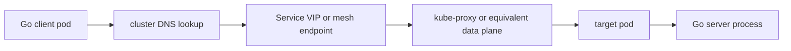
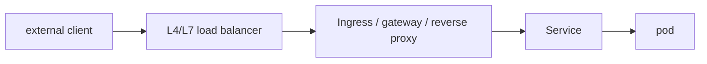

# Go 엔지니어를 위한 Kubernetes 서비스 네트워킹

많은 Go 서비스는 로컬에서는 잘 동작하다가 클러스터 안에서 갑자기 복잡해집니다.

그건 Kubernetes가 랜덤해서가 아닙니다.

이제 네트워크 경로, identity model, shutdown path가 달라졌기 때문입니다.

- DNS는 cluster DNS
- peer는 종종 Service abstraction 뒤에 있음
- packet path는 kube-proxy 혹은 다른 data plane을 지남
- readiness와 draining이 새 트래픽 유입을 좌우함
- reverse proxy나 mesh가 클라이언트와 서버 사이에 있을 수 있음

## Mental model

인그레스 경로에는 레이어가 더 늘어납니다.

hop이 늘어날수록 connection reuse, source identity, graceful shutdown의 의미도 달라집니다.

## Pod와 Service DNS는 런타임 환경 일부다

Kubernetes 안에서 hostname resolution은 보통:

- cluster DNS를 통한 pod-to-Service lookup
- namespace 기준 short name resolution
- TCP connect 이전 dial target 결정

을 의미합니다.

Go 엔지니어 관점에서 실무 규칙은 간단합니다.

- resolution도 request latency 일부다
- cluster DNS failure는 곧 application latency다
- dial에서 난 `context deadline exceeded`가 사실은 DNS 문제일 수 있다

## Service abstraction은 connection ownership을 바꾼다

Go client는 흔히 하나의 authority에 연결한다고 생각합니다.

하지만 Kubernetes에서는 그 logical authority 뒤에 실제로 다음이 있을 수 있습니다.

- 여러 pod
- 계속 바뀌는 endpoint set
- rolling deploy churn
- termination 중 connection draining
- sidecar나 proxy 레이어

따라서 transport policy가 더 중요해집니다.

- body ownership과 reuse
- retry policy
- per-request deadline
- connection pool size
- readiness-aware backoff

## Readiness는 process liveness와 다르다

Readiness는 “새 트래픽을 받아도 되는가”를 제어합니다.

하지만 다음과는 다릅니다.

- process가 살아 있는가
- 기존 connection이 drain되는가
- in-flight request가 끝날 수 있는가
- upstream client가 이미 pooled connection을 쥐고 있는가

즉 readiness만 바꾸고 listener shutdown, request deadline, connection draining을 맞추지 않으면 deploy 때 작업을 잃을 수 있습니다.

## L4와 L7 경로는 Go에 다르게 작용한다

### L4 load balancing

L4에서는 connection placement와 reuse가 핵심입니다. long-lived connection 하나가 생각보다 오래 한 backend에 traffic을 고정시킬 수 있습니다.

### L7 proxy와 mesh

L7에서는 proxy가:

- TLS를 terminate하고
- 자체 upstream connection pool을 만들고
- retry나 buffering을 수행하고
- timeout behavior를 바꾸고
- raw end-to-end TCP와 다른 observability를 제공할 수 있습니다

그래서 로컬에서는 멀쩡한 Go 서비스가 클러스터에서는 다르게 보일 수 있습니다. 이제 transport path가 “client socket -> server socket” 하나가 아니기 때문입니다.

## Reverse proxy가 deadline owner를 바꾼다

reverse proxy나 gateway가 앞에 있으면 timeout surface가 늘어납니다.

- client-to-proxy
- proxy-to-service
- service handler time
- response streaming과 idle timeout

Go handler만 보고 있으면 실제 request contract 절반을 놓치게 됩니다.

## Go 코드에 주는 런타임/운영 영향

가장 흔한 영향은 다음입니다.

- `http.Client` reuse policy가 endpoint churn과 맞물림
- gRPC channel은 proxy를 거친 HTTP/2 stream 위에 올라감
- shutdown은 readiness 전환과 실제 listener/handler draining을 맞춰야 함
- DNS와 service discovery는 측정 가능한 latency component가 됨
- pooled connection이 endpoint freshness 가정보다 오래 살아남을 수 있음

## 실패 패턴

### readiness를 complete drain policy로 착각

Readiness는 새 트래픽 라우팅만 바꿉니다. 기존 connection과 in-flight work는 별도 shutdown 설계가 필요합니다.

### 클러스터 네트워크 단계를 모두 하나의 timeout으로 묶음

DNS, connect, TLS, handler, response body lifetime은 종종 다른 budget이 필요합니다.

### rolling deploy 중 connection reuse를 무시

long-lived client는 body ownership과 idle pool policy가 느슨하면 shrinking backend set에 이상하게 붙어 있을 수 있습니다.

### source IP나 direct peer identity를 예전 의미로 해석

proxy, Service, mesh가 있으면 immediate connection에서 서버가 추론할 수 있는 정보가 달라집니다.

## 어떻게 관측하고 디버깅할까

- DNS, connect, TLS, handler phase를 분리해서 본다
- readiness transition과 connection drain, error spike를 같이 본다
- application log만 보지 말고 cluster networking 도구와 service metric을 함께 본다
- pooled transport incident에서는 stale하거나 장수하는 connection reuse를 확인한다

## 이 핸드북에서 같이 읽을 문서

- [Docker, containerd, 그리고 Kubernetes](/ko/production/docker-containerd-kubernetes)
- [net과 netip](/ko/stdlib/net-and-netip)
- [net/http 서버와 Transport 내부](/ko/stdlib/net-http-server-transport)
- [grpc-go 실전 플레이북](/ko/playbooks/grpc-go-production-playbook)
- [프로덕션에서 Go 네트워크 서비스 디버깅하기](/ko/production/debugging-go-network-services)

## Practical takeaway

Kubernetes는 Go의 네트워크 모델을 대체하지 않습니다. 그 위에 더 많은 DNS, 더 많은 indirection, 더 많은 proxy behavior, 더 많은 lifecycle edge를 얹습니다.

클러스터 안에서도 예측 가능한 서비스는 이 경계를 명시적으로 다루는 서비스입니다.
