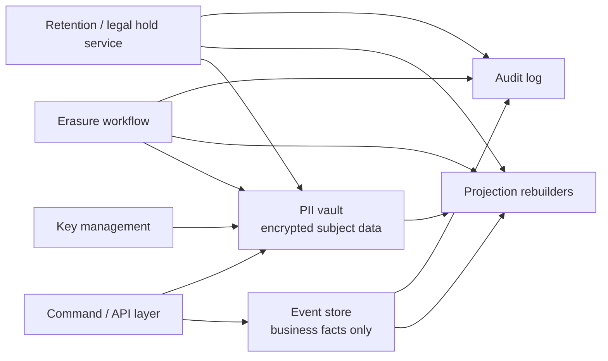

# 규제 환경의 Go 시스템

가장 어려운 프로덕션 Go 시스템은 단지 빠르거나 concurrent한 시스템이 아닙니다.

규제를 받는 시스템입니다.

이런 질문에 답해야 합니다.

- canonical event log에는 어떤 데이터를 넣어도 되는가
- 지워야 하는 데이터와 남겨야 하는 비즈니스 기록을 어떻게 분리할 것인가
- 데이터는 얼마나 오래 보관해야 하는가
- backup, cache, search index는 어떻게 정리할 것인가
- erase나 purge workflow가 실제로 끝났다는 사실을 어떻게 증명할 것인가

:::warning 법률 자문이 아닙니다
이 페이지는 privacy / audit-sensitive 시스템을 위한 엔지니어링 패턴 문서입니다. 실제 retention, disclosure, erasure 의무는 관할권, 계약, 산업 규정에 따라 달라집니다.
:::

## 왜 이 주제가 중요한가

긴장은 분명합니다.

- event sourcing은 durable한 append-only history를 원하고
- GDPR 같은 privacy 체계는 data minimization, storage limitation, erasure pressure를 만들며
- NIST SP 800-88 같은 보안 가이드는 key handling이 맞다면 cryptographic erase를 실질적 sanitization 기법으로 인정합니다

즉, "그냥 immutable event에 다 넣고 영원히 보관하자"는 건 프로덕션 설계가 아니라 나중에 compliance review에서 터질 구조입니다.

## 가장 중요한 엔지니어링 규칙

나중에 철회되거나 지워질 수 있는 개인 데이터를, 영원히 보존하고 싶은 경계에 직접 넣지 마십시오.

기본 구조는 이렇습니다.

1. canonical event log는 business fact 중심으로 유지하고
2. 민감한 개인정보는 별도 boundary 뒤에 두고
3. 그 민감 데이터는 explicit key ownership 하에 암호화하며
4. erasure / retention workflow를 1급 background job으로 만들고
5. audit trail에는 지워진 payload가 아니라 workflow 완료 사실만 남깁니다

## 규제가 시스템 설계를 어떻게 바꾸는가

GDPR 원문은 최종 해석은 법무가 하더라도 시스템 설계에 직접 영향을 줍니다.

- Article 5는 data minimization과 storage limitation을 요구하고
- Article 17은 erasure pressure를 만들며
- Article 25는 privacy by design / by default를 요구합니다

이건 policy 문서만의 문제가 아니라 architecture 문제입니다.

Go 서비스가 direct identifier를 immutable stream, hot projection, cache, log, object storage에 모두 흩뿌린다면, erase path는 이미 필요 이상으로 어려워집니다.

## 규제가 달라도 요구사항 패턴은 자주 반복된다

규정 이름이 꼭 GDPR이 아니더라도, 엔지니어링 압력은 비슷한 경우가 많습니다.

- subject에 연결된 일부 데이터는 erase 또는 anonymize되어야 하고
- 일부 business record는 정해진 기간 동안 retention되어야 하며
- legal hold나 조사 상태에서는 deletion이 멈춰야 하고
- 보안 검토에서는 방어 가능한 sanitization 설명이 필요하며
- audit / risk 팀은 workflow가 실제로 실행됐다는 증거를 원합니다

그래서 이 페이지의 패턴은 privacy law, 산업별 retention 정책, 내부 governance control에도 꽤 잘 일반화됩니다.

## 실전 아키텍처 형태



이 구조가 해결하는 건 분명합니다.

- event store는 business history를 유지하고
- PII vault는 delete, redact, cryptographic erase가 가능하며
- projection은 삭제된 subject 데이터를 다시 살려내지 않게 rebuild할 수 있고
- retention / legal hold는 tribal knowledge가 아니라 explicit workflow가 됩니다

## 규제 환경에서의 event sourcing

event sourcing은 여전히 쓸 수 있습니다. 다만 boundary를 엄격하게 잡아야 합니다.

### 좋은 event 형태

```go
type OrderPlaced struct {
	EventID         string
	AggregateID     string
	SubjectRef      string
	PlacedAt        time.Time
	TotalCents      int64
	Currency        string
	ShippingZone    string
	CustomerTier    string
	EncryptedPIIRef string
}
```

중요한 점은:

- `SubjectRef`는 email이나 주민번호가 아니라 내부 참조값이고
- `EncryptedPIIRef`는 다른 저장 경계를 가리키며
- canonical event는 여전히 state rebuild에 필요한 business meaning을 유지한다는 점입니다

### 나쁜 event 형태

```go
type OrderPlaced struct {
	EventID      string
	AggregateID  string
	Email        string
	Phone        string
	Street       string
	PassportNo   string
	CardLastFour string
}
```

이건 한 번은 편하고 그 뒤로는 계속 비쌉니다.

직접적인 personal data를 immutable append-only stream에 넣는 순간, replay, replica, backup, analytics export, incident dump까지 모두 cleanup burden을 떠안게 됩니다.

## "Crypto-shredding"의 실체는 cryptographic erase

실무에서는 흔히 crypto-shredding이라고 부르지만, 더 공식적인 표현은 cryptographic erase입니다.

아이디어는 단순합니다.

- 민감 payload를 data encryption key로 암호화하고
- 그 key를 명시적인 계층과 ownership 아래 두고
- 해당 payload를 복구 불가능하게 해야 할 때 관련 key material을 파기합니다

이 패턴은 key boundary가 정확할 때만 의미가 있습니다.

### 단순화한 Go 스케치

```go
type PersonalRecord struct {
	SubjectRef string
	KeyID      string
	Ciphertext []byte
}

type Vault interface {
	Store(ctx context.Context, r PersonalRecord) error
	DeleteMetadata(ctx context.Context, subjectRef string) error
	ListBySubject(ctx context.Context, subjectRef string) ([]PersonalRecord, error)
}

type KeyManager interface {
	DestroyKey(ctx context.Context, keyID string) error
}

func CryptographicallyEraseSubject(ctx context.Context, vault Vault, km KeyManager, subjectRef string) error {
	records, err := vault.ListBySubject(ctx, subjectRef)
	if err != nil {
		return err
	}

	for _, record := range records {
		if err := km.DestroyKey(ctx, record.KeyID); err != nil {
			return err
		}
	}

	return vault.DeleteMetadata(ctx, subjectRef)
}
```

여기서 중요한 건 syntax가 아니라, 파기 가능한 key boundary가 설계 안에 실제로 존재하느냐입니다.

### cryptographic erase가 약해지는 경우

단순히 "암호화했음"으로는 부족합니다.

다음 경우 이 패턴은 약해지거나 의미가 거의 없어집니다.

- 하나의 장수 master key가 너무 많은 unrelated data를 보호하는 경우
- plaintext copy가 projection, log, cache, data lake, support dump에 이미 퍼진 경우
- backup에 같은 live key가 그대로 남아 있는 경우
- 어떤 subject가 어떤 key로 보호됐는지 증명할 수 없는 경우
- erase 중에도 application이 해당 subject에 대한 새 쓰기를 계속 받는 경우

## Retention과 legal hold는 workflow 문제다

대부분의 규제 시스템은 erase만 하지 않습니다. 일정 기간 retention을 요구하고, legal hold가 걸리면 삭제를 멈추고, 어떤 policy가 적용됐는지 감사 가능해야 합니다.

즉, retention은 문서 없는 cron job이 아니라 state machine이어야 합니다.

```go
type RetentionClass string

const (
	RetentionCustomerPII RetentionClass = "customer_pii"
	RetentionInvoice     RetentionClass = "invoice"
)

type RetentionPolicy struct {
	Class       RetentionClass
	KeepFor     time.Duration
	LegalHold   bool
	ArchiveOnly bool
}

func ShouldPurge(now, createdAt time.Time, p RetentionPolicy) bool {
	if p.LegalHold {
		return false
	}
	return now.Sub(createdAt) >= p.KeepFor
}
```

프로덕션 규칙은 간단합니다.

- policy는 typed여야 하고
- policy decision은 inspection 가능해야 하며
- legal hold는 일반 purge보다 우선하고
- purge는 idempotent하며 restart-safe해야 합니다

## Go 서비스에서의 erasure workflow

실전에서 erasure는 거의 항상 단일 SQL `DELETE`가 아닙니다.

보통은 이런 흐름에 가깝습니다.

```go
func HandleEraseRequest(ctx context.Context, subjectRef string) error {
	if err := admission.StopNewWrites(ctx, subjectRef); err != nil {
		return err
	}

	if err := vault.CryptographicallyErase(ctx, subjectRef); err != nil {
		return err
	}

	if err := projections.RedactSubject(ctx, subjectRef); err != nil {
		return err
	}

	if err := search.RemoveSubject(ctx, subjectRef); err != nil {
		return err
	}

	return audit.Append(ctx, AuditEvent{
		Kind:       "subject_erasure_completed",
		SubjectRef: subjectRef,
		At:         time.Now(),
	})
}
```

이 구조가 좋은 이유는:

- 먼저 admission boundary를 닫고
- vault, projection, search를 각각 별도 cleanup target으로 다루며
- 민감 payload를 다시 저장하지 않고도 workflow completion을 기록하기 때문입니다

## Event sourcing과 erasure의 진짜 tradeoff

질문은 "event sourcing이 erasure를 절대 만족시킬 수 있나?"가 아닙니다.

올바른 질문은 이것입니다.

> immutable history가 revocable personal payload 없이도 business truth를 유지할 수 있는가?

그렇다면 event sourcing은 여전히 강한 선택지입니다.

그렇지 않다면 다음 중 하나가 필요합니다.

- indirection이 들어간 다른 event model
- personal payload를 redactable side store에 두는 split history
- 해당 record에 대해서는 완전한 append-only가 아닌 시스템
- 혹은 아예 다른 architecture

## 실패 패턴

### email, address, ID를 immutable event에 바로 넣는 것

가장 흔한 구조적 실수입니다.

### projection만 지우면 끝이라고 생각하는 것

PII는 보통 한 군데에만 있지 않습니다. search index, cache, analytics export도 같이 봐야 합니다.

### 모든 tenant나 subject가 같은 key hierarchy를 공유하는 것

키 하나의 blast radius가 넓을수록 erase boundary는 약해집니다.

### erasure를 best effort로 만드는 것

resume, retry, audit가 안 되는 workflow는 꼭 필요할 때 실패합니다.

### audit log에 민감 payload를 다시 남기는 것

audit trail은 workflow가 일어났음을 증명해야지, 삭제된 데이터를 복원할 수 있게 만들면 안 됩니다.

## 왜 Go가 잘 맞는가

이 문제 형태는 Go와 잘 맞습니다.

- `context.Context`로 request / job lifetime을 명시하고
- implicit script 대신 typed policy를 만들 수 있으며
- retention, redaction, reconciliation을 background worker로 운영하고
- SQL, Kafka, Redis, object storage 경계를 비교적 명확하게 감쌀 수 있고
- 긴 workflow를 관측하고 테스트하기 쉽기 때문입니다

Go가 data modeling을 대신해주지는 않습니다. 하지만 그 모델을 강제하는 control-plane 서비스를 만들기에는 매우 좋은 언어입니다.

## 실전 판단 기준

다음이면 regulated system에서도 event sourcing을 쓸 만합니다.

- immutable log가 대부분 business fact 중심이고
- 민감 payload가 indirection 뒤에 있으며
- key ownership이 명시적이고
- retention / erasure가 1급 workflow이며
- rebuild / replay가 삭제된 personal data를 조용히 되살리지 않는 경우

다음이면 조심하거나 다른 architecture를 택하는 편이 낫습니다.

- 핵심 business event 자체가 대부분 personal data인 경우
- downstream 시스템이 raw payload를 사방에 복제하는 경우
- key destruction boundary를 보장할 수 없는 경우
- compliance가 canonical history 자체의 in-place rewrite를 요구하는 경우

## 공식 자료

- [GDPR Article 5](https://eur-lex.europa.eu/eli/reg/2016/679/oj/eng)
- [GDPR Article 17](https://eur-lex.europa.eu/eli/reg/2016/679/oj/eng)
- [EDPB: Data protection by design and by default](https://www.edpb.europa.eu/sme-data-protection-guide/respect-individuals-rights/data-protection-design-and-default_en)
- [NIST SP 800-88 Rev. 1](https://csrc.nist.gov/pubs/sp/800/88/r1/final)

## Practical takeaway

프로덕션 답은 "event sourcing이냐 regulation이냐"가 아닙니다.

durable business history는 남기고, revocable personal data는 분리하고, erasure / retention workflow를 explicit하게 만들고, 그 workflow를 코드와 audit trail로 증명하는 것입니다.
