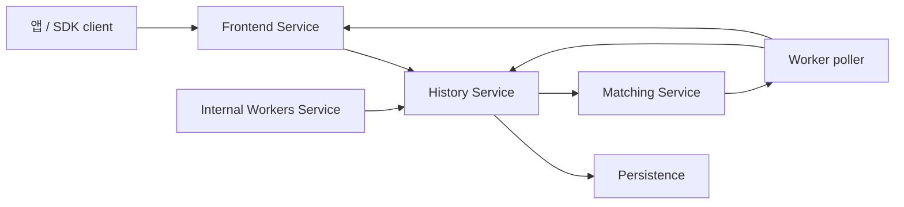

# Temporal과 Durable Execution

Temporal은 "Go로 아주 큰 시스템을 어디까지 만들 수 있는가?"라는 질문에 대한 가장 현대적인 답 중 하나입니다.

이건 단순 queue도 아니고, 단순 workflow DSL도 아니고, 단순 retry 엔진도 아닙니다.

Temporal은 아래를 조합한 durable execution 시스템입니다.

- gRPC 서비스들
- history shard
- task queue
- worker polling
- deterministic workflow replay
- persistence-backed event log

여기서 중요한 교훈은 "Go는 고루틴을 30일 재울 수 있다"가 아닙니다.

진짜 교훈은:

Go는 상태 기계, RPC, queue processor, background work를 ownership boundary와 함께 조정하는 장기 실행 control-plane 서비스를 만들기에 아주 잘 맞는다는 점입니다.

## Temporal이 스스로 요구하는 시스템 조건

Temporal 공식 아키텍처 문서는 핵심 요구사항을 이렇게 설명합니다.

- workflow는 지원되는 SDK 언어의 코드로 정의되고
- durable execution은 transient failure를 견뎌야 하며
- 시스템은 arbitrarily many concurrent workflow execution으로 확장 가능해야 하고
- 사용자 코드는 core server 안이 아니라 user-owned worker process에서 실행됩니다.

이 조건 조합은 자연스럽게 boundary가 분명한 multi-service Go 시스템으로 이어집니다.

## 전체 구조



이 그림만 봐도 Go가 왜 잘 맞는지 감이 옵니다.

- 장기 실행 RPC 서비스가 많고
- concurrent request handling이 많고
- background queue processor가 분명하고
- 거대한 별도 런타임 모델 없이 practical server binary로 배포하기 좋기 때문입니다.

## 왜 Go가 이 문제에 맞는가

Temporal이 Go로 가능하다고 해서 Go가 마법이라는 뜻은 아닙니다.
문제의 형태가 Go의 강점과 잘 맞는다는 뜻입니다.

### 1. 여러 네트워크 서비스, 하나의 코드베이스

Temporal server 저장소는 분명한 서비스 축을 드러냅니다.

- `frontend`
- `history`
- `matching`
- `worker`

이건 전형적인 Go의 지형입니다.

- protobuf + gRPC 통합
- 단순한 서비스 바이너리
- 분명한 패키지 경계
- 언어 차원의 async state machine 대신 goroutine, context, queue, lock으로 표현되는 동시성

### 2. ownership이 분명한 background processor

Temporal 안에는 다음 종류의 loop가 매우 많습니다.

- poll
- state append
- follow-up work enqueue
- queue progress checkpoint
- ack / retry

Go는 hot loop를 하나의 goroutine 또는 하나의 컴포넌트가 소유하고, 나머지 시스템이 explicit API나 queue로 말 거는 구조에 매우 강합니다.

### 3. 운영 단순성이 중요하다

Temporal은 인프라 소프트웨어입니다. 클러스터로 운영됩니다.

즉 build/deploy ergonomics가 중요합니다.

- static binary
- 예측 가능한 toolchain
- 직접 profiling / tracing 하기 쉬움
- 표준 라이브러리의 networking / TLS
- 컨테이너 패키징 단순성

### 4. 진짜 어려운 건 coordination이다

Temporal의 어려움은 수동 메모리 최적화가 아닙니다.
어려운 건:

- correctness boundary
- persistence ordering
- replay semantics
- queue ownership
- sharding
- backpressure

입니다.

이건 Go가 역사적으로 가장 생산적이었던 문제군과 정확히 겹칩니다.

## 핵심: durable execution은 "goroutine + timer"가 아니다

workflow가 프로세스 crash, 머신 재시작, worker 교체를 견뎌야 한다면 그 workflow는 서버 메모리에만 살아 있으면 안 됩니다.

Temporal의 아키텍처 문서는 이를 아주 분명하게 말합니다.

- workflow history는 append-only이고
- mutable state는 persisted 되고
- worker는 task를 poll하고
- workflow 코드는 history에서 deterministic하게 replay 됩니다.

즉 Temporal 같은 시스템이 Go로 가능한 이유는 런타임이 durable해서가 아니라,
durability boundary를 persistence와 history replay에 두기 때문입니다.

## 진짜 correctness core는 History Service다

Temporal의 History Service는 하나의 workflow execution에 연결된 요청을 받아서 다음으로 바꿉니다.

- 새 history event
- mutable-state update
- future work를 위한 transfer task
- delayed work를 위한 timer task

공식 History Service 문서는 이 서비스가:

- workflow history를 소유하고
- history shard로 분할하고
- queue progress를 persisted 하고
- queue processor를 통해 후속 작업을 dispatch 한다고 설명합니다.

### 단순화한 멘탈 모델

```go
func handleWorkerCompletion(req Completion) {
	state := loadMutableState(req.WorkflowKey)

	events, commands := applyDeterministicTransition(state, req)
	appendHistory(events)
	persistMutableState(state)

	for _, cmd := range commands {
		switch cmd.Kind {
		case ScheduleActivity:
			enqueueTransferTask(cmd)
		case StartTimer:
			enqueueTimerTask(cmd)
		case ContinueWorkflow:
			enqueueTransferTask(cmd)
		}
	}
}
```

실제 코드는 훨씬 복잡하지만, 중요한 형태는 맞습니다.

- 먼저 상태 전이
- 먼저 durable record
- 그 다음 dispatch 가능한 follow-up work

이건 앞에서 본 `etcd/raft`의 `Ready` / `Advance`와도 닮아 있습니다.
통신 경계가 correctness boundary인 경우가 많다는 뜻입니다.

## History shard가 이 설계를 어떻게 스케일시키는가

Temporal은 모든 workflow execution 상태를 하나의 global lock이나 하나의 global loop 뒤에 두지 않습니다.

대신 history를 shard로 분할합니다.
각 shard owner는:

- 요청 처리
- 내부 queue
- checkpoint
- task execution plumbing

을 가집니다.

이 구조는 Go와 잘 맞습니다. 고루틴, queue processor, RPC handler를 많이 돌리더라도 전체 코드가 async/await 중심의 다른 프로그래밍 모델로 밀려나지 않기 때문입니다.

## Matching Service는 throughput shock absorber다

Matching Service는 worker가 poll하는 task queue를 소유합니다.
이 서비스의 역할은 workflow correctness를 결정하는 게 아니라, delivery와 throughput을 다루는 것입니다.

공식 문서가 강조하는 축은 이렇습니다.

- task queue
- long polling
- partition을 통한 throughput 확장
- 비어 있는 partition이나 poller가 없는 partition을 parent로 forward 하는 메커니즘

### 단순화한 멘탈 모델

```go
func pollTask(queue Partition) Task {
	for {
		if task := queue.LocalBacklog.Pop(); task != nil {
			return task
		}

		if task := queue.ParentForwarder.TryPoll(); task != nil {
			return task
		}

		queue.WaitForTaskOrPoller()
	}
}
```

여기서 유용한 핵심은 간단합니다.

- History는 무엇을 해야 하는지를 결정하고
- Matching은 그 task를 worker에게 어떻게 전달할지를 결정합니다.

이 분리가 있어야 core state machine이 transport mechanics와 뒤섞이지 않습니다.

## Frontend와 worker 경계도 중요하다

Frontend는 RPC edge입니다.
Worker는 core server 밖에서 workflow / activity task를 poll합니다.

이 분리는 Temporal이 durable하면서도 language-agnostic할 수 있는 핵심 이유 중 하나입니다.

- server는 history와 task routing을 소유하고
- 사용자 코드는 SDK worker에서 실행되고
- 시스템 경계는 explicit한 gRPC boundary가 됩니다.

이건 아주 Go다운 분해 방식입니다.

- boring service boundary
- explicit process ownership
- 분명한 responsibility split

이건 약점이 아니라, 시스템이 이해 가능하게 유지되는 이유입니다.

## 더 작은 시스템을 만들 때 가져갈 것

대부분의 팀은 Temporal 자체를 만들 필요는 없습니다.
하지만 Temporal의 설계 감각은 가져올 가치가 있습니다.

### correctness state와 throughput plumbing을 분리하라

다음을 분리하세요.

- state transition engine
- persistence boundary
- dispatch queue

### durable follow-up work를 명시하라

요청이 future work를 의미한다면, 그걸 fire-and-forget goroutine에 숨기지 말고 real task와 real lifecycle로 만들세요.

### 모든 걸 중앙집중시키지 말고 shard ownership으로 풀어라

workload가 본질적으로 많은 독립 key나 workflow라면, shard별 책임과 수명을 분명히 두는 편이 낫습니다.

### user code를 control plane 안에 넣지 마라

Temporal은 workflow/activity 실행을 worker process에 둡니다.
이건 safety와 operability 측면에서 아주 강한 경계입니다.

## 피해야 할 실패 패턴

### "workflow state는 메모리에만 두면 되지"

그건 durable execution이 아니라 in-memory orchestrator입니다.

### "모든 poller가 workflow state를 직접 바꾸면 되지"

이건 state ownership 경계를 깨뜨립니다.

### "잠든 goroutine은 persisted timer와 같다"

같지 않습니다. 프로세스 crash가 나면 전자는 사라지고 후자는 남습니다.

### "queue와 state machine을 한 덩어리로 둬도 된다"

Temporal을 읽을 가치가 있는 이유는 정확히 이 경계를 분리하기 때문입니다.

## 소스 맵

- [Temporal server README](https://github.com/temporalio/temporal/blob/main/README.md)
- [Temporal architecture overview](https://github.com/temporalio/temporal/blob/main/docs/architecture/README.md)
- [History Service architecture](https://github.com/temporalio/temporal/blob/main/docs/architecture/history-service.md)
- [Matching Service architecture](https://github.com/temporalio/temporal/blob/main/docs/architecture/matching-service.md)
- [Frontend service code](https://github.com/temporalio/temporal/tree/main/service/frontend)
- [History service code](https://github.com/temporalio/temporal/tree/main/service/history)
- [Matching service code](https://github.com/temporalio/temporal/tree/main/service/matching)
- [Worker service code](https://github.com/temporalio/temporal/tree/main/service/worker)

## Practical takeaway

Temporal은 Go가 진짜 잘하는 시스템의 예시입니다.

- distributed control plane
- stateful orchestrator
- task-queue 기반 시스템
- raw low-level memory control보다 correctness, scale, operability가 더 어려운 multi-service backend

그래서 이 정도로 야심찬 시스템도 여전히 아주 "Go답게" 보입니다.
