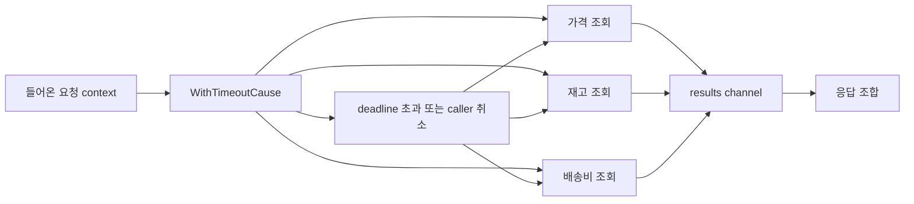

# context 패키지 내부

많은 Go 동시성 실패는 goroutine 자체 때문에 생기지 않습니다.

유효한 소유자가 없어졌는데도 일이 계속 돌아가는 것이 더 큰 문제입니다.

`context` 패키지는 그 문제에 대한 Go의 기본 해법입니다.

## 왜 이 패키지가 존재하는가

`context`는 하나의 operation tree에 공통 lifetime을 부여합니다.

- 요청이 만료될 수 있고,
- 부모가 자식 작업을 취소할 수 있고,
- deadline이 I/O나 DB 대기를 멈출 수 있고,
- request-scoped metadata가 call graph를 따라 흐를 수 있습니다.

공통 lifetime이 없으면 동시성 코드는 쉽게 detached work와 cleanup bug로 무너집니다.

## 예제 시나리오



## 실전 코드 스케치

```go
func (svc CheckoutService) Quote(ctx context.Context, sku string) (Quote, error) {
	ctx, cancel := context.WithTimeoutCause(ctx, 150*time.Millisecond, ErrQuoteTimeout)
	defer cancel()

	results := make(chan quoteResult, 3)

	go func() { results <- svc.fetchPrice(ctx, sku) }()
	go func() { results <- svc.fetchInventory(ctx, sku) }()
	go func() { results <- svc.fetchShipping(ctx, sku) }()

	var quote Quote

	for range 3 {
		select {
		case <-ctx.Done():
			return Quote{}, context.Cause(ctx)
		case result := <-results:
			if result.err != nil {
				cancel()
				return Quote{}, result.err
			}
			quote.Merge(result.partial)
		}
	}

	return quote, nil
}
```

여기서 중요한 건 문법이 아니라 소유권 모델입니다.

- 부모 lifetime 하나,
- 여러 자식 작업,
- 전체 subtree를 언제 멈출지 결정하는 지점 하나.

## Mental model

`context`는 스케줄러가 아니고, 전역 값을 넣는 가방도 아닙니다.

이 패키지는 파생된 노드들의 트리입니다.

- `cancelCtx`: cancellation 추가
- `timerCtx`: timer 기반 deadline 추가
- `valueCtx`: key-value 하나 추가
- `withoutCancelCtx`: value는 유지하고 cancellation은 제거

즉:

- cancellation은 아래로 흐르고,
- value 조회는 위로 거슬러 올라가며,
- deadline은 결국 timed cancellation이고,
- `Done()`은 shared stop signal이지 work queue가 아닙니다.

## 단순화한 내부 코드 예시

정확한 원문은 아니지만 구조를 이해하기엔 충분합니다.

```go
type cancelCtx struct {
	parent   context.Context
	mu       sync.Mutex
	done     chan struct{}
	children map[canceler]struct{}
	err      error
	cause    error
}

func (c *cancelCtx) cancel(err error, cause error) {
	c.mu.Lock()
	defer c.mu.Unlock()

	if c.err != nil {
		return
	}

	c.err = err
	c.cause = cause

	if c.done == nil {
		c.done = closedChan
	} else {
		close(c.done)
	}

	for child := range c.children {
		child.cancel(err, cause)
	}
	c.children = nil
}

type timerCtx struct {
	cancelCtx
	timer    *time.Timer
	deadline time.Time
}

type valueCtx struct {
	parent context.Context
	key    any
	value  any
}
```

실제 구현은 atomic, lazy channel 생성, fast path가 더 들어가지만 핵심 흐름은 위와 같습니다.

## 런타임/소스 코드 관점에서 보면

Go 1.26 소스에서 특히 중요한 부분은 이렇습니다.

- `cancelCtx`는 lazy `done` channel, `children` set, 첫 cancellation error/cause를 가집니다.
- `Err()`는 hot loop에서도 자주 불릴 수 있어서 atomic fast path를 씁니다.
- `propagateCancel`은 가능하면 helper goroutine을 만들지 않고 부모 `cancelCtx`에 직접 child를 연결합니다.
- `timerCtx`는 `cancelCtx`를 embed하고, cancel 시 timer를 멈춥니다.
- `valueCtx`는 linked chain이라서 깊어질수록 `Value` lookup은 선형 비용이 듭니다.
- `WithoutCancel`은 `Done() == nil`, `Err() == nil`이지만 value는 계속 전달합니다.

실제 읽을 만한 지점:

- [`context.go` `cancelCtx`](https://github.com/golang/go/blob/go1.26.0/src/context/context.go#L431)
- [`context.go` `propagateCancel`](https://github.com/golang/go/blob/go1.26.0/src/context/context.go#L469)
- [`context.go` `WithoutCancel`](https://github.com/golang/go/blob/go1.26.0/src/context/context.go#L585)
- [`context.go` `timerCtx`](https://github.com/golang/go/blob/go1.26.0/src/context/context.go#L662)
- [`context.go` `valueCtx`](https://github.com/golang/go/blob/go1.26.0/src/context/context.go#L742)

## 최근 API 중 특히 중요한 것

### `Cause`와 `WithCancelCause`

취소 이유가 business logic에 중요하다면 `context.Cause`는 `context.Canceled` 하나로 뭉개는 것보다 훨씬 낫습니다.

예를 들어:

- client disconnect,
- 내부 budget 초과,
- upstream timeout,
- 수동 shutdown

을 구분할 수 있어야 합니다.

### `AfterFunc`

`AfterFunc`는 cancellation이 발생했을 때 cleanup이나 보상 작업을 연결할 수 있게 해줍니다.

```go
stopRollback := context.AfterFunc(ctx, func() {
	_ = tx.Rollback()
})
defer stopRollback()
```

유용하지만 과용하기도 쉽습니다. cleanup은 가급적 local하고 명확하게 두는 편이 낫습니다.

### `WithoutCancel`

`WithoutCancel`은 좁은 용도의 도구입니다.

request의 value는 유지하되 request cancellation에서는 분리하고 싶을 때만 쓰는 게 맞습니다. 예를 들어 graceful handoff 중 audit log를 마저 남기는 경우입니다. 습관처럼 쓰면 lifetime ownership을 거짓으로 만들 가능성이 큽니다.

## 실패 패턴

### `cancel`을 호출하지 않음

```go
ctx, cancel := context.WithTimeout(parent, 200*time.Millisecond)
_ = cancel // bug: timer와 child reference가 parent 취소 전까지 남음
```

leak되는 건 timer만이 아닙니다. parent가 child를 계속 붙잡고 있게 됩니다.

### request tree를 `context.Background()`로 바꿔버림

```go
go svc.writeAuditLog(context.Background(), event) // caller와 shutdown에서 분리됨
```

이렇게 하면 request lifetime, shutdown propagation, budget control이 조용히 사라집니다.

### value를 optional parameter처럼 사용

```go
ctx = context.WithValue(ctx, "retries", 3)
ctx = context.WithValue(ctx, "region", "eu-west-1")
ctx = context.WithValue(ctx, "debug", true)
```

weakly typed이고 남용하기 쉽고, 함수 계약이 더 읽기 어려워집니다.

### hot path에서 깊은 value chain 만들기

`WithValue`를 쓸 때마다 노드가 하나 더 생깁니다. `Value`는 체인을 따라가며 찾습니다. 한두 번은 괜찮지만, middleware나 RPC hot path에 과도하게 쌓이면 공짜가 아닙니다.

### cancellation이 모든 작업을 즉시 멈춘다고 착각

cancellation은 `Done()`을 닫을 뿐입니다. CPU loop를 선점하거나 context를 무시하는 라이브러리를 강제로 멈추지는 못합니다.

## 프로덕션에서의 의미

- request마다 context tree를 만드는 건 충분히 싸지만, ownership 없이 뿌릴 정도로 공짜는 아닙니다.
- `cancel()` 누락은 timer retention, child retention, shutdown 혼란으로 이어집니다.
- `Cause`는 `ctx.Err()`보다 세부 정보를 보존해서 observability에 유리합니다.
- `context.Context`는 거의 항상 함수의 첫 번째 인자여야 하고, struct field가 되면 안 됩니다.

## 어떻게 테스트/관측할까

- 짧은 deadline으로 테스트하고 `context.DeadlineExceeded` 또는 `context.Cause`를 검증합니다.
- return value만 보지 말고 child goroutine이 실제로 종료되는지 확인합니다.
- request abort, timeout, shutdown 경로에 leak test를 붙입니다.
- 많은 작업이 하나의 budget에 묶인다면 timeout cause별 trace/metric을 남깁니다.

## 공식 자료

- [`context` 패키지 문서](https://pkg.go.dev/context)
- [Go blog: Context](https://go.dev/blog/context)
- [Go blog: Contexts and structs](https://go.dev/blog/context-and-structs)
- [Go 1.26 `context` 소스](https://github.com/golang/go/blob/go1.26.0/src/context/context.go)

## Practical takeaway

`context`를 단순한 API 인자가 아니라 lifetime tree로 이해하면, 많은 goroutine leak와 shutdown bug를 훨씬 명확하게 다룰 수 있습니다.
