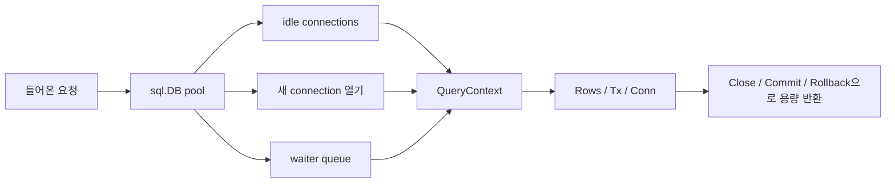

# database/sql 풀 내부

`database/sql`에서 가장 흔한 오해는 간단합니다.

`sql.DB`는 하나의 connection이 아니라 concurrent pool manager입니다.

이 점을 놓치면 풀 크기를 잘못 잡고, 잘못된 시점에 닫고, query 압력을 시스템 전체 지연으로 바꿔버리게 됩니다.

## 왜 이 패키지가 중요한가

프로덕션에서 데이터베이스 동시성은 대개 goroutine 수로 제한되지 않습니다.

보통은:

- 풀 크기,
- 드라이버 동작,
- transaction lifetime,
- query duration,
- cancellation 지원,
- rows와 statement cleanup discipline

에 의해 제한됩니다.

`database/sql`은 그 문제를 한데 모아 다루는 지점입니다.

## 예제 시나리오



## 실전 코드 스케치

```go
db, err := sql.Open("pgx", dsn)
if err != nil {
	return err
}

db.SetMaxOpenConns(64)
db.SetMaxIdleConns(16)
db.SetConnMaxIdleTime(5 * time.Minute)
db.SetConnMaxLifetime(30 * time.Minute)

ctx, cancel := context.WithTimeout(r.Context(), 200*time.Millisecond)
defer cancel()

rows, err := db.QueryContext(ctx, query, tenantID)
if err != nil {
	return err
}
defer rows.Close()
```

여기서 바로 드러나는 두 가지 규칙이 있습니다.

- `sql.Open`은 보통 프로세스 전체에서 오래 살아야 하는 pool handle을 반환합니다.
- query lifetime은 request마다 다시 제한해야 합니다.

## Mental model

`sql.DB`는 몇 가지 움직이는 부품을 같이 관리합니다.

- idle connection,
- 열려 있거나 열리는 중인 connection 수,
- 풀이 가득 찼을 때 기다리는 waiter,
- opener goroutine,
- idle time과 lifetime 만료를 정리하는 cleaner goroutine.

`Conn`, `Tx`, `Rows`, `Stmt`는 소유권을 더 좁힙니다.

- `Conn`은 하나의 physical connection을 pin하고,
- `Tx`는 transaction 동안 connection을 붙잡고,
- `Rows`는 반드시 닫혀야 자원이 풀리며,
- `Stmt`는 concurrent하게 쓸 수 있어도 driver-side state를 가집니다.

## 단순화한 내부 코드 예시

```go
type DB struct {
	mu           sync.Mutex
	freeConn     []*driverConn
	numOpen      int
	maxOpen      int
	maxIdleCount int
	openerCh     chan struct{}
	waitCount    int64
	maxLifetime  time.Duration
	maxIdleTime  time.Duration
}

func (db *DB) conn(ctx context.Context) (*driverConn, error) {
	if c := takeIdle(db.freeConn); c != nil {
		return c, nil
	}
	if db.maxOpen > 0 && db.numOpen >= db.maxOpen {
		return waitForReturnedConnOrContext(ctx)
	}
	return openNewConn(ctx)
}

func (db *DB) putConn(c *driverConn, err error) {
	if bad(err) || expired(c) {
		c.Close()
		return
	}
	if waiter := takeWaitingRequest(); waiter != nil {
		waiter <- c
		return
	}
	db.freeConn = append(db.freeConn, c)
}
```

핵심 모양은 단순합니다. 가능하면 재사용하고, cap에 걸리면 기다리고, 열 수 있으면 열고, 반환은 신중하게 처리합니다.

## 소스 코드에서 봐야 할 지점

Go 1.26 소스에서:

- `DB`는 idle connection, waiter 상태, open count, pool limit을 저장합니다.
- `OpenDB`는 즉시 `connectionOpener` goroutine을 띄웁니다.
- `conn`은 idle reuse를 우선하고, 아니면 기다리거나 새로 엽니다.
- `putConn`은 waiter를 깨우거나 idle pool에 돌려보내거나, bad/expired connection을 닫습니다.
- `connectionCleaner`는 idle time과 max lifetime 기준으로 정리합니다.

핵심 진입점:

- [`sql.go` `DB`](https://github.com/golang/go/blob/go1.26.0/src/database/sql/sql.go#L507)
- [`sql.go` `Open`](https://github.com/golang/go/blob/go1.26.0/src/database/sql/sql.go#L863)
- [`sql.go` `connectionOpener`](https://github.com/golang/go/blob/go1.26.0/src/database/sql/sql.go#L1259)
- [`sql.go` `conn`](https://github.com/golang/go/blob/go1.26.0/src/database/sql/sql.go#L1316)
- [`sql.go` `putConn`](https://github.com/golang/go/blob/go1.26.0/src/database/sql/sql.go#L1481)
- [`sql.go` `Tx`](https://github.com/golang/go/blob/go1.26.0/src/database/sql/sql.go#L2166)
- [`sql.go` `Rows`](https://github.com/golang/go/blob/go1.26.0/src/database/sql/sql.go#L2929)

## pool 설정이 실제로 의미하는 것

### `SetMaxOpenConns`

데이터베이스를 향한 hard parallelism cap입니다.

너무 낮으면 애플리케이션에서 요청이 줄 서고, 너무 높으면 데이터베이스가 병목이 됩니다.

### `SetMaxIdleConns`

얼마나 많은 warm capacity를 유지할지 정합니다.

너무 낮으면 자주 재연결하고, 너무 높으면 필요 이상으로 서버 자원을 붙잡습니다.

### `SetConnMaxLifetime`, `SetConnMaxIdleTime`

이건 throughput 기능이 아니라 hygiene 기능입니다.

- 너무 오래 사는 connection을 재순환시키고,
- stale server-side state 위험을 줄이고,
- idle retention을 무한정 늘리지 않게 합니다.

## 실패 패턴

### 요청마다 새 `sql.DB` 생성

```go
func handle(w http.ResponseWriter, r *http.Request) {
	db, _ := sql.Open("pgx", dsn) // bug: 요청 하나를 위한 새 pool
	defer db.Close()
}
```

pooling을 망가뜨리고, 불필요한 connection churn을 만듭니다.

### rows를 닫지 않음

```go
rows, err := db.QueryContext(ctx, query)
if err != nil {
	return err
}
return scanAll(rows) // rows를 닫지 않음
```

`Rows.Close`를 호출하거나 iteration을 끝까지 비우기 전까지 connection이 예상보다 오래 pin될 수 있습니다.

### transaction 안에서 느린 외부 작업 수행

```go
tx, _ := db.BeginTx(ctx, nil)
defer tx.Rollback()

callSlowExternalAPI()
```

transaction은 대개 connection 하나를 pin합니다. transaction 내부에 느린 작업을 넣으면 풀의 실효 용량이 줄어듭니다.

### context cancellation이 항상 서버 쿼리를 중단한다고 가정

드라이버가 context cancellation을 지원하지 않으면 쿼리가 끝날 때까지 돌아오지 않을 수 있습니다. 패키지 문서도 이 점을 명시합니다.

### `DB.Stats`를 보지 않음

`WaitCount`, `WaitDuration`, `OpenConnections`, `InUse`, `Idle`를 한 번도 안 본다면, 풀 압력을 추측으로만 판단하고 있는 셈입니다.

## 프로덕션에서의 의미

- 보통 프로세스마다 DSN과 policy boundary별로 long-lived `*sql.DB` 하나가 필요합니다.
- query context는 바깥 request budget보다 짧거나 같아야지 더 길면 안 됩니다.
- transaction scope는 가능한 한 좁게 유지합니다.
- pool 설정은 애플리케이션 단독 결정이 아니라 데이터베이스 용량과의 조율 문제입니다.

## 어떻게 테스트/관측할까

- handler가 `Rows`를 닫고 실패한 transaction을 rollback하는지 검증합니다.
- 아주 작은 `MaxOpenConns`로 integration test를 돌려 waiter behavior를 강제로 드러냅니다.
- load test 중 `DB.Stats()`를 확인해 latency가 pool wait인지 query execution time인지 구분합니다.
- 드라이버별 cancellation 동작은 추측하지 말고 직접 테스트합니다.

## 공식 자료

- [`database/sql` 패키지 문서](https://pkg.go.dev/database/sql)
- [Go SQL drivers overview](https://golang.org/s/sqldrivers)
- [Go wiki: SQLInterface](https://tip.golang.org/wiki/SQLInterface)
- [Go 1.26 `database/sql` 소스](https://github.com/golang/go/blob/go1.26.0/src/database/sql/sql.go)

## Practical takeaway

`sql.DB`를 convenience handle이 아니라 shared concurrency governor로 취급하면, 많은 데이터베이스 지연 문제를 프로덕션 전에 더 일찍 볼 수 있습니다.
