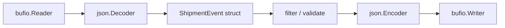

# 프로덕션에서의 encoding/json

`encoding/json`은 편하고, 널리 쓰이고, 잘못 쓰기 쉽습니다.

진짜 비용은 CPU만이 아닙니다. 사람들이 조용히 가정하는 다음도 문제입니다.

- strictness
- duplicate key
- number handling
- buffered stream boundary
- schema drift

## 왜 이 패키지가 중요한가

엄청난 양의 Go 프로덕션 코드가 서비스 경계에서 JSON을 읽고 씁니다.

즉, 이 패키지는 종종:

- request decoding,
- response encoding,
- NDJSON streaming,
- audit/event log,
- config snapshot,
- 오래된/새로운 client 간 compatibility

를 책임집니다.

## 예제 시나리오

`examples/ndjsonstream` 패키지는 `json.Decoder`, `json.Encoder`를 써서 NDJSON shipment event를 메모리에 전부 올리지 않고 filtering합니다.



## 실전 코드 스케치

```go
decoder := json.NewDecoder(req.Body)
decoder.DisallowUnknownFields()
decoder.UseNumber()

var payload CreateOrderRequest
if err := decoder.Decode(&payload); err != nil {
	return err
}

encoder := json.NewEncoder(w)
encoder.SetEscapeHTML(false)
return encoder.Encode(response)
```

작은 코드지만, 각 줄이 계약을 바꿉니다.

- `DisallowUnknownFields`는 무시되던 drift를 명시적 실패로 바꾸고,
- `UseNumber`는 interface-heavy path에서 숫자를 float로 조용히 바꾸지 않게 하며,
- `SetEscapeHTML(false)`는 출력 가독성과 escaping behavior를 바꿉니다.

## Mental model

이 패키지에는 크게 두 모드가 있습니다.

| API | 가장 잘 맞는 용도 |
| --- | --- |
| `Marshal` / `Unmarshal` | 이미 메모리에 있는 whole value encode/decode |
| `Encoder` / `Decoder` | stream-oriented I/O boundary |

중요한 caveat 두 가지:

1. `Decoder`는 자체 buffering을 하며 현재 value보다 더 읽을 수 있습니다.
2. 이 패키지는 “엄격한 JSON schema parser”와는 다른 compatibility behavior를 의도적으로 유지합니다.

## 단순화한 내부 코드 예시

streaming decoder는 대략 이런 모양입니다.

```go
type Decoder struct {
	r     io.Reader
	buf   []byte
	scanp int
	scan  scanner
}

func (dec *Decoder) Decode(v any) error {
	n := dec.readValue()
	state := dec.buf[dec.scanp : dec.scanp+n]
	return unmarshalInto(v, state)
}
```

핵심은 decoder가 하나의 완전한 JSON value를 내부 buffer에서 찾은 다음, 그 버퍼 조각을 대상으로 unmarshal한다는 점입니다. 그래서 `Buffered()`가 있고, 밑단 reader가 정확히 “value 하나씩만 읽힌다”고 가정하면 안 됩니다.

## 꼭 알아야 할 compatibility behavior

패키지 문서가 직접 강조하는 부분입니다.

- duplicate object key는 허용되며, 나중 값이 이전 값을 replace하거나 merge합니다. 목적지 타입에 따라 달라집니다.
- struct field match는 case-insensitive입니다.
- plain `Unmarshal`이나 기본 `Decoder`에서는 unknown key를 무시합니다. `DisallowUnknownFields`를 켜야 거부합니다.
- 문자열 안의 invalid UTF-8은 replacement character로 바뀝니다.
- 큰 정수는 float 대상에 decode되면 정밀도를 잃을 수 있습니다.

이건 incidental bug가 아니라 compatibility surface입니다.

## Stream decoding에서 중요한 점

`Encoder.Encode`는 trailing newline을 붙입니다. log나 NDJSON 스타일 출력에는 오히려 유리합니다.

`Decoder.Token`, `Decoder.More`는 array/object를 token 단위로 걸을 수 있게 해줘서, whole-struct decode보다 더 세밀한 streaming control이 필요할 때 유용합니다.

`json.RawMessage`는 envelope은 지금 검증하되 nested payload는 나중에 parse하고 싶을 때 좋습니다.

## 런타임/소스 코드 워크

Go 1.26 기본 구현에서 읽을 만한 지점:

- [`encoding/json/stream.go` `Decoder`](https://github.com/golang/go/blob/go1.26.0/src/encoding/json/stream.go#L16)
- [`encoding/json/stream.go` `NewDecoder`](https://github.com/golang/go/blob/go1.26.0/src/encoding/json/stream.go#L33)
- [`encoding/json/stream.go` `Decode`](https://github.com/golang/go/blob/go1.26.0/src/encoding/json/stream.go#L51)
- [`encoding/json/stream.go` `Encode`](https://github.com/golang/go/blob/go1.26.0/src/encoding/json/stream.go#L204)
- [`encoding/json/decode.go`](https://github.com/golang/go/blob/go1.26.0/src/encoding/json/decode.go)
- [`encoding/json/encode.go`](https://github.com/golang/go/blob/go1.26.0/src/encoding/json/encode.go)

트리 안에는 `jsonv2` experiment 파일도 있지만, build tag를 켜지 않은 기본 동작은 여전히 classic implementation입니다.

## 실패 패턴

### `map[string]any`를 공짜 추상화처럼 사용

```go
var payload map[string]any
if err := json.Unmarshal(body, &payload); err != nil {
	return err
}
```

유연하긴 하지만 type check, number coercion, field validation을 뒤쪽 코드로 미뤄버립니다.

### unknown field가 기본으로 거부된다고 가정

plain `Unmarshal`이나 기본 `Decoder`는 그렇지 않습니다.

### duplicate key가 에러라고 가정

아닙니다. interoperability나 security가 duplicate-key rejection에 의존한다면 기본 `encoding/json`보다 더 강한 validation이 필요합니다.

### 큰 NDJSON record를 `Scanner`로 처리

JSON layer 자체는 요구하지 않았던 token-size limit를 숨겨 넣는 흔한 방법입니다.

### `Decoder`가 read-ahead 하지 않는다고 생각

하나의 underlying stream 위에 여러 protocol이 공존한다면, 이 특성이 중요해집니다.

## 프로덕션에서의 의미

- 서비스 경계에서는 typed struct를 우선합니다.
- stream 처리에는 `Decoder`를 쓰고, strict schema가 중요하면 `DisallowUnknownFields`를 켭니다.
- generic decoding에서 숫자 의미를 보존해야 하면 `UseNumber`를 씁니다.
- `RawMessage`는 delayed decoding에 쓰고, 영구적인 “나중에 타입 붙이자” 탈출구로 두지 않습니다.
- JSON이 신뢰 경계를 넘는다면 compatibility behavior를 설계 문서 수준에서 검토해야 합니다.

## 예제와 테스트

- 예제: `examples/ndjsonstream`
- 예제는 `Decoder`, `Encoder`, buffered I/O, strict field handling을 함께 보여줍니다.

## 공식 자료

- [`encoding/json` 패키지 문서](https://pkg.go.dev/encoding/json)
- [JSON and Go](https://go.dev/blog/json)

## Practical takeaway

`encoding/json`은 대체로 프로덕션에 충분합니다. 위험한 건 패키지 존재가 아니라, strictness, number handling, stream boundary를 명시하지 않은 채 쓰는 것입니다.
