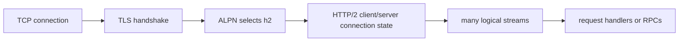

# HTTP/2, ALPN, 그리고 Stream Multiplexing

HTTP/2는 많은 Go 엔지니어가 “연결 하나”가 더 이상 “한 번에 요청 하나”가 아니라는 사실을 체감하는 지점입니다.

강력하지만, 동시에 connection reuse의 의미와 backpressure의 모양, gRPC가 어디에 서 있는지를 바꿉니다.

## Mental model



HTTP/1.1에서 connection reuse는 흔히 keep-alive socket 위에서 요청을 순차 재사용하는 뜻입니다.

HTTP/2에서 reuse는 socket 재사용뿐 아니라 multiplexed stream 재사용이라는 뜻까지 포함합니다.

운영상 이 둘은 같은 개념이 아닙니다.

## ALPN이 프로토콜 전환점이다

ALPN은 TLS handshake 중에 일어납니다.

Go에서 중요한 설정 지점은 여전히 `tls.Config.NextProtos`입니다.

즉 HTTP/2는 `net/http` 안쪽의 독립 기능이 아니라:

- TCP connection
- TLS handshake
- negotiated protocol selection
- `net/http`의 HTTP/2 connection state

가 합쳐진 결과입니다.

ALPN에서 `h2`가 선택되지 않았다면, 나머지 코드가 기대해도 HTTP/2는 아닙니다.

## 실전 코드 스케치

```go
transport := &http.Transport{
	MaxIdleConns:      256,
	MaxConnsPerHost:   128,
	ForceAttemptHTTP2: true,
	TLSClientConfig: &tls.Config{
		MinVersion: tls.VersionTLS12,
		NextProtos: []string{"h2", "http/1.1"},
	},
}

client := &http.Client{Transport: transport}
```

핵심 포인트는 다음입니다.

- custom dial/TLS hook이 있을 때는 `ForceAttemptHTTP2`가 중요하고
- `NextProtos` 안에 `h2`가 있어야 하며
- 여러 request가 한 connection을 공유하더라도 per-request context는 여전히 필요합니다

## Stream reuse는 무한 동시성이 아니다

한 TCP connection 위에 많은 stream을 올리면 dial churn은 줄어들 수 있지만, 여전히 한계가 있습니다.

- connection-level flow control
- stream-level flow control
- application handler 내부의 head-of-line
- 서버 쪽 concurrency limit
- connection reset이나 misconfiguration 시 shared fate

잘못된 mental model은:

“HTTP/2면 한 connection에 무한히 실어도 된다”

입니다.

올바른 mental model은:

“HTTP/2는 일부 reuse를 socket 개수에서 stream scheduling으로 옮길 뿐이고, budget과 backpressure는 여전히 필요하다”

입니다.

## 왜 gRPC가 여기 놓이는가

Go의 gRPC는 HTTP/2 semantics 위에 올라갑니다.

- long-lived channel
- 여러 RPC stream
- 그 아래의 ALPN과 TLS policy
- 그 위의 flow control과 cancellation

그래서 [grpc-go 실전 플레이북](/ko/playbooks/grpc-go-production-playbook)과 이 문서는 같이 읽어야 합니다. HTTP/2 mental model이 틀리면 gRPC mental model도 흔들립니다.

## 런타임/표준 라이브러리 소스 포인터

Go 1.26에서 볼 만한 진입점:

- [`net/http/h2_bundle.go`](https://github.com/golang/go/blob/go1.26.0/src/net/http/h2_bundle.go)
- [`net/http/transport.go` `Transport`](https://github.com/golang/go/blob/go1.26.0/src/net/http/transport.go#L97)
- [`net/http/server.go` `Server`](https://github.com/golang/go/blob/go1.26.0/src/net/http/server.go#L2964)
- [`net/http/doc.go`](https://github.com/golang/go/blob/go1.26.0/src/net/http/doc.go#L102)

다음 질문을 기준으로 읽으면 좋습니다.

1. protocol selection은 어디서 일어나는가
2. per-connection state는 어디에 있는가
3. 여러 logical stream이 어디서 ordinary request handler로 바뀌는가

## 실패 패턴

### HTTP/2 connection 하나면 예산이 필요 없다고 생각

하나의 busy connection도 server concurrency, flow-control window, downstream dependency를 충분히 포화시킬 수 있습니다.

### response body ownership을 느슨하게 생각

HTTP/2라도 body를 정확히 읽고 닫아야 stream reuse와 connection health가 유지됩니다.

### custom TLS/dial hook이 HTTP/2를 꺼버린 걸 모름

transport를 커스터마이즈했으면 HTTP/2 시도와 협상이 여전히 살아 있는지 확인해야 합니다.

### socket count만 봄

socket 수가 적다고 건강한 게 아닙니다. stream saturation이나 flow-control stall은 socket 수로 바로 드러나지 않습니다.

## 어떻게 관측하고 디버깅할까

- `httptrace`로 dial, TLS, reuse 단계를 봅니다.
- `GODEBUG=http2debug=1` 또는 `2`로 frame-level visibility를 얻습니다.
- handshake latency, stream concurrency, connection churn을 분리해서 봅니다.
- gRPC incident에서는 channel/connect/TLS/stream을 따로 분해해서 봅니다.

## 프로덕션에서의 의미

HTTP/2는 reuse의 단위를 “socket만”에서 “socket + stream”으로 바꿉니다. 모니터링과 mental model이 여전히 HTTP/1.1에 머물러 있으면 실제 병목을 놓치게 됩니다.

## Practical takeaway

ALPN이 HTTP/2의 존재를 결정하고, 그다음 `net/http`가 그것을 multiplexed request stream으로 바꿉니다. 올바른 레벨에서 관측하고, HTTP/1.1 때만큼 엄격하게 body ownership을 관리해야 합니다.
