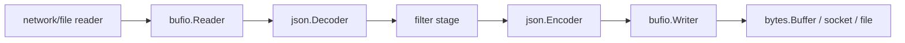

# io, bufio, bytes

Go의 I/O 스택이 강력한 이유는 interface-driven이기 때문이지, 복잡함을 숨기기 때문이 아닙니다.

같은 `io.Reader` 모양이:

- socket,
- file,
- decompressor,
- bytes buffer,
- goroutine 사이의 pipe

를 모두 표현할 수 있습니다.

이 유연함은 fast path와 ownership rule을 이해할 때만 진짜 힘이 됩니다.

## 왜 이 패키지들이 중요한가

프로덕션에서 I/O 동작은:

- 실제로 stream하는지 아니면 전부 메모리에 올리는지,
- write가 coalesce되는지 잘게 쪼개지는지,
- mutable byte storage에 alias를 오래 들고 있는지,
- 무심코 쓴 helper가 memory bomb가 되는지

를 결정합니다.

## 예제 시나리오

`examples/ndjsonstream` 패키지는 `bufio`, `io`, `bytes`, `encoding/json`을 써서 NDJSON을 읽고 다시 내보냅니다.



## 실전 코드 스케치

```go
reader := bufio.NewReaderSize(src, 16*1024)
writer := bufio.NewWriterSize(dst, 16*1024)
defer writer.Flush()

limited := io.LimitReader(reader, 1<<20)
written, err := io.Copy(writer, limited)
```

핵심은 함수 이름이 아니라, 각 함수가 resource boundary를 어떻게 바꾸는지입니다.

- `bufio`는 buffering behavior를 바꾸고,
- `LimitReader`는 노출 범위를 제한하고,
- `io.Copy`는 가능하면 더 빠른 복사 경로를 선택합니다.

## Mental model

핵심 규칙은 이렇습니다.

- `io`는 동작을 인터페이스 뒤에 숨기고,
- `bufio`는 buffer와 token helper를 얹고,
- `bytes`는 in-memory byte container를 명시적 aliasing 규칙과 함께 제공합니다.

즉:

- 어떤 인터페이스를 구현했느냐에 따라 fast path가 열리고,
- buffering은 syscall 패턴을 바꾸지만 ownership 자체를 바꾸지는 않으며,
- `bytes.Buffer.Bytes()`가 돌려준 slice는 이후 mutation 전까지 live storage를 가리킵니다.

## 단순화한 내부 코드 예시

`io.Copy`는 interface-driven optimization의 대표적인 예입니다.

```go
func Copy(dst Writer, src Reader) (int64, error) {
	if wt, ok := src.(WriterTo); ok {
		return wt.WriteTo(dst)
	}
	if rf, ok := dst.(ReaderFrom); ok {
		return rf.ReadFrom(src)
	}
	return copyWithTemporaryBuffer(dst, src)
}
```

`bufio.Scanner`는 convenience와 제한된 안전 범위를 동시에 보여주는 예입니다.

```go
type Scanner struct {
	r            io.Reader
	buf          []byte
	maxTokenSize int
}
```

token이 limit을 넘으면 scanning은 실패합니다. 우연이 아니라 의도된 설계입니다.

## 각 패키지가 특히 잘하는 일

### `io`

`io`는 composable streaming behavior가 필요할 때 씁니다.

- `LimitReader`로 입력 제한
- `TeeReader`로 logging/hashing 복제
- `MultiWriter`, `MultiReader`로 흐름 조합
- `Pipe`로 goroutine 사이 직접 byte stream 연결

단, 구체 타입이 명시적으로 보장하지 않는 한 `Reader`나 `Writer`가 concurrent use에 안전하다고 가정하면 안 됩니다.

### `bufio`

`bufio.Reader`, `bufio.Writer`는 밑단의 reader/writer가 너무 많은 작은 호출로 손해를 볼 때 씁니다.

`Scanner`는 token size가 bounded하고 convenience가 그 tradeoff를 정당화할 때만 쓰는 게 맞습니다. 다음이 필요하면:

- unbounded line,
- partial token control,
- exact unread handling이 있는 sequential scan

보통 `bufio.Reader`가 더 낫습니다.

### `bytes`

`bytes.Buffer`는 mutable byte accumulation과 `ReadFrom`/`WriteTo` 같은 streaming helper에 잘 맞습니다.

`bytes.Reader`는 read-only in-memory `io.Reader`/`io.ReaderAt`/`io.Seeker`가 필요할 때 적합합니다.

aliasing discipline도 중요합니다. `Bytes()`는 durable copy가 아니라 live storage view입니다.

## 런타임/소스 코드 워크

읽을 만한 진입점:

- [`io/io.go` `Copy`](https://github.com/golang/go/blob/go1.26.0/src/io/io.go#L387)
- [`io/pipe.go` `Pipe`](https://github.com/golang/go/blob/go1.26.0/src/io/pipe.go#L195)
- [`bufio/scan.go` `Scanner`](https://github.com/golang/go/blob/go1.26.0/src/bufio/scan.go#L29)
- [`bufio/scan.go` `Scan`](https://github.com/golang/go/blob/go1.26.0/src/bufio/scan.go#L139)
- [`bytes/buffer.go` `Buffer`](https://github.com/golang/go/blob/go1.26.0/src/bytes/buffer.go#L20)
- [`bytes/buffer.go` `ReadFrom`](https://github.com/golang/go/blob/go1.26.0/src/bytes/buffer.go#L224)

특히 기억할 만한 디테일:

- `io.Copy`는 staging buffer로 가기 전에 `WriterTo`, `ReaderFrom`을 먼저 시도합니다.
- `Scanner`는 oversize token에서 unrecoverable하게 멈추고, 마지막 정상 token보다 더 많이 소비했을 수도 있습니다.
- `bytes.Buffer`는 가능하면 기존 capacity를 재사용하고, unread bytes를 앞으로 당긴 뒤에야 allocation을 시도합니다.

## 실패 패턴

### interface 기반 I/O가 자동으로 concurrent-safe하다고 가정

```go
go func() { _, _ = reader.Read(bufA) }()
go func() { _, _ = reader.Read(bufB) }()
```

이게 안전한지는 `io.Reader` 인터페이스가 아니라 concrete type이 결정합니다.

### buffered writer를 flush하지 않음

```go
writer := bufio.NewWriter(dst)
_, _ = writer.Write(payload)
return nil // bug: 바이트가 아직 메모리에 남아 있을 수 있음
```

### unbounded token에 `Scanner` 사용

`Scanner`의 기본 `MaxScanTokenSize`는 64 KiB입니다. 많은 로그에는 좋지만, arbitrarily large line이나 document에는 나쁜 기본값일 수 있습니다.

### `Buffer.Bytes()`를 이후 write와 함께 오래 들고 있음

```go
view := buf.Bytes()
buf.WriteString("more") // view가 가리키는 내용이 바뀔 수 있음
```

안정적인 바이트가 필요하면 복사해야 합니다.

### unbounded input에 `io.ReadAll` 사용

이건 이름만 예쁠 뿐, 메모리 문제를 뒤로 미루는 경우가 많습니다.

## 프로덕션에서의 의미

- hand-written copy loop보다 먼저 `io.Copy`와 fast path를 활용합니다.
- network/file boundary에서는 작은 read/write가 문제일 때 `bufio.Reader`/`Writer`를 먼저 고려합니다.
- `Scanner`는 token size 계약이 명확할 때만 씁니다.
- `bytes.Buffer`는 owned mutable object로 다루고, 데이터 수명이 길어지면 복사합니다.

## 예제와 테스트

- 예제: `examples/ndjsonstream`
- 테스트는 NDJSON streaming output, strict filtering, `io.LimitReader` 기반 bounded preview copy를 검증합니다.

## 공식 자료

- [`io` 패키지 문서](https://pkg.go.dev/io)
- [`bufio` 패키지 문서](https://pkg.go.dev/bufio)
- [`bytes` 패키지 문서](https://pkg.go.dev/bytes)

## Practical takeaway

좋은 Go I/O 코드는 교묘한 loop보다도, 명확한 ownership, bounded input, 그리고 표준 인터페이스가 제공하는 fast path를 올바르게 활용하는 데서 나옵니다.
